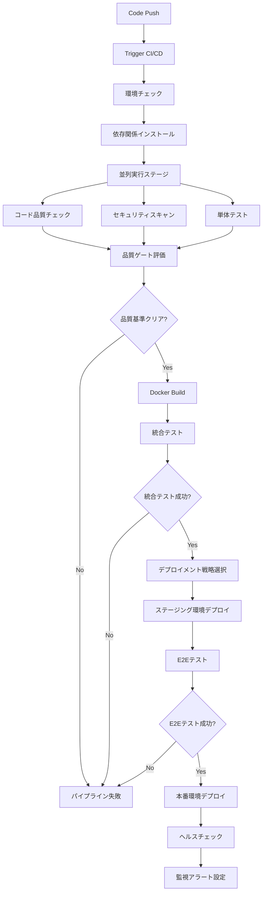

# Phase 3-Full 本格運用向け CI/CD パイプライン設計

## 概要

本ドキュメントでは、Sado Restaurant Map プロジェクトの Phase 3-Full 本格運用に向けた包括的な CI/CD パイプライン設計を定義します。

## アーキテクチャ概要

### 対象環境

- **開発環境**: Docker Compose (Development)
- **統合テスト環境**: Docker Compose (Integration)
- **本格運用環境**: Docker Compose (Phase3) + Nginx Load Balancer + Redis Cluster

### 技術スタック

- **CI/CD Platform**: GitHub Actions
- **コンテナ化**: Docker + Docker Compose
- **品質管理**: SonarQube + ESLint + Vitest
- **セキュリティ**: Bandit + npm audit + Docker Scout
- **監視**: Prometheus + Grafana
- **負荷分散**: Nginx
- **データストア**: Redis Cluster (3 Master + 3 Replica)

## CI/CD パイプライン設計

### 1. パイプライン概要



### 2. ステージ詳細設計

#### Stage 1: 環境セットアップ

```yaml
# 環境情報収集
environment_setup:
  strategy:
    matrix:
      os: [ubuntu-latest]
      node: [20, 22]
      python: [3.11, 3.12]
  steps:
    - checkout_code
    - setup_node_python
    - cache_dependencies
    - install_system_dependencies
```

#### Stage 2: 品質チェック (並列実行)

```yaml
quality_checks:
  parallel:
    - linting:
        - eslint (TypeScript/JavaScript)
        - markdownlint (Documentation)
        - dockerfile_lint (Docker files)
    - security_scanning:
        - npm_audit (Node.js dependencies)
        - bandit (Python security)
        - docker_scout (Container security)
    - code_analysis:
        - sonarqube_analysis
        - complexity_analysis
        - dependency_vulnerability_check
```

#### Stage 3: テスト実行

```yaml
testing:
  unit_tests:
    - frontend: vitest
    - backend: pytest
    - coverage_threshold: 80%
  integration_tests:
    - docker_compose_integration
    - redis_cluster_tests
    - api_integration_tests
  performance_tests:
    - load_testing
    - stress_testing
    - memory_leak_detection
```

#### Stage 4: ビルド & パッケージング

```yaml
build_and_package:
  docker_images:
    - app_server (Dockerfile.app)
    - test_runner (Dockerfile.test)
    - worker (Dockerfile.worker)
  optimizations:
    - multi_stage_builds
    - security_hardening
    - size_optimization
  registry:
    - push_to_registry
    - vulnerability_scanning
    - signature_verification
```

### 3. デプロイメント戦略

#### 3.1 ブルー・グリーンデプロイメント (推奨)

```yaml
blue_green_deployment:
  phases:
    1_preparation:
      - green_environment_provisioning
      - database_migration_validation
      - configuration_verification
    2_deployment:
      - deploy_to_green
      - warm_up_services
      - health_check_validation
    3_traffic_switch:
      - nginx_config_update
      - traffic_routing_switch
      - blue_environment_monitoring
    4_verification:
      - post_deployment_tests
      - performance_validation
      - rollback_readiness_check
    5_cleanup:
      - blue_environment_shutdown
      - resource_cleanup
      - monitoring_update
```

#### 3.2 カナリアデプロイメント (A/B テスト用)

```yaml
canary_deployment:
  strategy:
    traffic_split: [95%, 5%] # Production vs Canary
    duration: 30min
    success_criteria:
      - error_rate_threshold: <1%
      - response_time_p95: <500ms
      - user_satisfaction_score: >4.0
  monitoring:
    - real_user_monitoring
    - application_performance_monitoring
    - business_metrics_tracking
```

### 4. 品質ゲート設定

#### 4.1 必須品質基準

```yaml
quality_gates:
  code_coverage:
    minimum: 80%
    target: 90%
  security:
    vulnerability_severity: NONE_HIGH_OR_CRITICAL
    dependency_audit: PASS
  performance:
    build_time: <10min
    test_execution: <15min
  code_quality:
    sonarqube_quality_gate: PASS
    complexity_threshold: <10
    duplication: <3%
```

#### 4.2 段階的品質チェック

```yaml
staged_quality_checks:
  pre_build:
    - syntax_validation
    - basic_linting
    - dependency_security_check
  post_build:
    - comprehensive_testing
    - security_scanning
    - performance_benchmarking
  pre_deployment:
    - integration_validation
    - configuration_verification
    - rollback_plan_validation
```

### 5. 環境固有設定

#### 5.1 Docker Phase3 環境

```yaml
phase3_environment:
  services:
    redis_cluster:
      masters: 3
      replicas: 3
      configuration: ./config/redis/
    application_servers:
      instances: 2
      load_balancer: nginx
      health_check: enabled
    monitoring:
      prometheus: enabled
      grafana: enabled
      alerting: configured
  scaling:
    horizontal: supported
    vertical: configurable
  backup:
    redis_data: automated
    configuration: versioned
```

#### 5.2 セキュリティ強化

```yaml
security_hardening:
  container_security:
    - non_root_user
    - minimal_base_images
    - secret_management
    - network_policies
  runtime_security:
    - resource_limits
    - security_contexts
    - pod_security_standards
  monitoring:
    - security_event_logging
    - anomaly_detection
    - compliance_reporting
```

## 実装プラン

### フェーズ 1: 基盤構築 (Week 1-2)

1. **CI/CD パイプライン設定**

   - GitHub Actions ワークフロー作成
   - 環境変数とシークレット設定
   - ブランチ保護ルール設定

2. **品質ゲート実装**
   - SonarQube 統合
   - セキュリティスキャン設定
   - テストカバレッジ設定

### フェーズ 2: テスト自動化 (Week 3-4)

1. **テスト環境構築**

   - Docker 統合テスト環境
   - E2E テストフレームワーク
   - パフォーマンステスト設定

2. **監視システム統合**
   - Prometheus/Grafana 設定
   - アラート設定
   - ダッシュボード作成

### フェーズ 3: デプロイメント自動化 (Week 5-6)

1. **デプロイメント戦略実装**

   - ブルー・グリーンデプロイ設定
   - ロールバック機構実装
   - ヘルスチェック自動化

2. **運用監視強化**
   - ログ集約システム
   - パフォーマンス監視
   - セキュリティ監視

### フェーズ 4: 最適化・運用開始 (Week 7-8)

1. **パフォーマンス最適化**

   - ビルド時間短縮
   - デプロイ時間最適化
   - リソース使用量最適化

2. **運用手順書作成**
   - 障害対応手順
   - メンテナンス手順
   - スケーリング手順

## 運用・保守

### 1. 定期メンテナンス

```yaml
maintenance_schedule:
  daily:
    - dependency_vulnerability_scan
    - log_rotation
    - backup_verification
  weekly:
    - performance_report_generation
    - security_audit
    - capacity_planning_review
  monthly:
    - dependency_updates
    - security_patch_application
    - disaster_recovery_test
```

### 2. 監視・アラート

```yaml
monitoring_alerts:
  infrastructure:
    - cpu_usage: >80%
    - memory_usage: >85%
    - disk_usage: >90%
  application:
    - error_rate: >1%
    - response_time_p95: >500ms
    - availability: <99.9%
  security:
    - failed_auth_attempts: >10/min
    - suspicious_activities: immediate
    - vulnerability_detection: immediate
```

### 3. SLA 定義

```yaml
service_level_agreement:
  availability:
    target: 99.9%
    measurement: monthly
  performance:
    response_time_p95: <500ms
    throughput: >1000 req/min
  recovery:
    rto: <15min # Recovery Time Objective
    rpo: <5min  # Recovery Point Objective
```

## 結論

本 CI/CD パイプライン設計により、以下を実現します：

1. **自動化された品質保証**: コード品質、セキュリティ、パフォーマンスの自動チェック
2. **迅速で安全なデプロイメント**: ブルー・グリーンデプロイによるゼロダウンタイム更新
3. **包括的な監視**: インフラ、アプリケーション、セキュリティの統合監視
4. **スケーラブルな運用**: Phase3 環境での高可用性・高性能運用

次のステップでは、各種設定ファイルの具体的な実装を行います。
