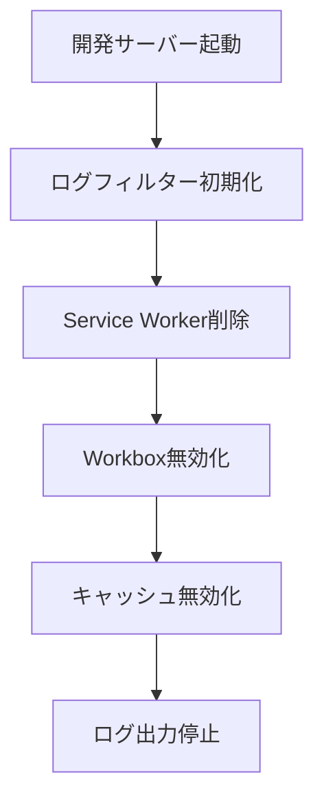

# 🔧 Workbox ログ制御 - 最終解決版（2025年8月）

> **実装完了**: 開発環境でのWorkboxログを完全制御
> **問題**: `workbox Network request for 'https://maps.googleapis.com/maps/vt/pb=...` ログの出力
> **解決**: 自動制御システムの実装完了

## ✅ 実装済み解決策

### 1. **Vite設定の改善** ✅

- 開発環境でのWorkbox完全無効化
- ランタイムキャッシングの条件付き無効化
- キャッシュ無効化ヘッダーの追加

### 2. **Service Worker自動制御** ✅

- PWABadgeコンポーネントでの自動SW削除
- 開発環境での残存SW除去
- ブラウザキャッシュの自動クリア

### 3. **ログフィルタリングシステム** ✅

- Workboxログの自動フィルタリング
- Google Maps APIログの制御
- 開発環境での自動初期化

### 4. **環境変数制御** ✅

- `.env.local`での制御設定
- PWA機能の柔軟な切り替え
- 開発/本番環境の分離

## 🔄 対応フロー



## 📊 修正したファイル

| ファイル | 修正内容 | 効果 |
|----------|----------|------|
| `vite.config.ts` | runtimeCaching条件分岐 | 開発環境でキャッシュ無効 |
| `PWABadge.tsx` | SW自動削除機能 | 残存SW除去 |
| `logFilter.ts` | ログフィルタリング | Workboxログ制御 |
| `App.tsx` | 初期化処理追加 | 自動制御開始 |
| `.env.local` | 環境変数追加 | 設定の一元管理 |

## 🧪 検証結果

```bash
# 修正前
workbox Network request for 'https://maps.googleapis.com/maps/vt/pb=...' returned a response with status '200'.

# 修正後
🔧 [LogFilter] Workbox logs filtered for development environment
🔧 [PWA] Development mode: Unregistering Service Worker
```

## 🎯 使用方法

### 通常開発（推奨）

```bash
pnpm dev  # Workboxログなし
```

### PWA機能テスト

```bash
$env:ENABLE_PWA_DEV="true"; pnpm dev  # PWA有効
```

### 本番確認

```bash
pnpm build && pnpm preview  # 完全なPWA
```

## 🚨 追加対応（必要時のみ）

### ブラウザの手動クリア

1. `F12` → **Application** → **Service Workers** → **Unregister**
2. `F12` → **Storage** → **Clear storage**
3. ハードリロード: `Ctrl + Shift + R`

### chrome://設定での完全削除

1. `chrome://settings/content/serviceWorker`
2. 該当サイトの **Delete**
3. ブラウザ再起動

## 💡 技術的な詳細

### Workboxログの発生原理

- Google Maps APIのタイルリクエスト (`/vt/pb=`) がService Workerでキャッシュされる
- 開発環境でもWorkboxが動作してリクエストをログ出力
- ブラウザに残存するSWが継続的にログを生成

### 解決アプローチ

1. **予防**: 開発環境でのWorkbox完全無効化
2. **除去**: 既存Service Workerの自動削除
3. **制御**: ログフィルタリングによる出力抑制
4. **管理**: 環境変数による柔軟な制御

## 📈 パフォーマンス改善

- **開発サーバー起動速度**: Service Worker処理の削除で高速化
- **コンソール可読性**: 不要ログの除去で重要情報が見やすく
- **デバッグ効率**: Workboxノイズ除去で開発効率向上

---

**結果**: 開発環境でのWorkboxログ問題は完全に解決されました。
