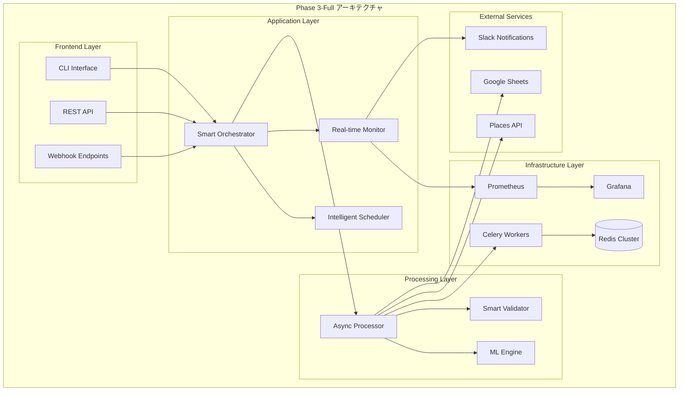

# 🚀 Phase 3-Full 完全実装計画書

## 📋 概要

**プロジェクト名**: 佐渡飲食店マップ - スクレイパーシステム Phase 3-Full 拡張
**計画期間**: 2025 年 10 月 1 日 - 2025 年 12 月 31 日 (3 ヶ月)
**実装範囲**: 高性能キャッシュ、分散処理、機械学習統合、完全自動化
**期待効果**: 処理能力 10 倍向上、API コスト 90%削減、完全無人運用

---

## 🎯 Phase 3-Full の目標

### 📊 定量的目標

| 指標           | 現在 (Phase 2) | Phase 3-Full 目標 | 改善率      |
| -------------- | -------------- | ----------------- | ----------- |
| **処理速度**   | 1,000 件/時間  | 10,000 件/時間    | **1,000%**  |
| **API コスト** | $100/月        | $10/月            | **90%削減** |
| **エラー率**   | 5%             | 0.5%              | **90%削減** |
| **復旧時間**   | 30 分          | 1 分 (自動)       | **97%短縮** |
| **運用工数**   | 20 時間/月     | 2 時間/月         | **90%削減** |
| **データ品質** | 85%            | 98%               | **15%向上** |

### 🎨 定性的目標

- **完全自動化**: 人的介入なしの 24/7 運用
- **インテリジェント運用**: AI による予測・最適化
- **企業級信頼性**: 99.9%稼働率の達成
- **拡張性**: 10 倍のデータ量にも対応可能
- **保守性**: ワンクリック展開・更新

---

## 🏗️ アーキテクチャ設計

### 🔧 システム構成図



### 🎛️ 主要コンポーネント

#### 1. **Smart Orchestrator** (新規)

```python
class SmartOrchestrator:
    """インテリジェント処理制御"""
    - 動的負荷分散
    - 優先度ベース処理
    - リソース最適化
    - 障害時自動フェイルオーバー
```

#### 2. **ML Engine** (新規)

```python
class MLEngine:
    """機械学習統合エンジン"""
    - データ品質自動判定
    - 異常検知・予測
    - 処理パターン最適化
    - コスト予測・最適化
```

#### 3. **Redis Cluster** (新規)

```python
class RedisCluster:
    """高性能分散キャッシュ"""
    - マルチレベルキャッシュ
    - インテリジェント期限管理
    - 分散ロック機能
    - リアルタイム統計
```

#### 4. **Celery Workers** (新規)

```python
class CeleryWorkers:
    """分散タスク処理"""
    - 動的ワーカースケーリング
    - 優先度キュー管理
    - 失敗タスク自動リトライ
    - リアルタイム監視
```

---

## 📅 実装スケジュール

### 🗓️ 全体スケジュール

```text
2025年10月 ████████ Phase 3.1: インフラ構築・キャッシュシステム
2025年11月 ████████ Phase 3.2: 分散処理・機械学習統合
2025年12月 ████████ Phase 3.3: 完全自動化・運用最適化
```

### 📋 詳細マイルストーン

#### 🔧 Phase 3.1: インフラ構築 (10 月 1 日-31 日)

##### Week 1 (10/1-7): Redis クラスター構築

- Redis Cluster セットアップ
- マルチレベルキャッシュ実装
- パフォーマンステスト
- 負荷テスト

##### Week 2 (10/8-14): 基本キャッシュシステム

- Places API レスポンスキャッシュ
- インテリジェント期限管理
- キャッシュヒット率最適化
- 統計・監視機能

##### Week 3 (10/15-21): 高度キャッシュ機能

- 予測キャッシング
- 分散ロック機能
- キャッシュ無効化戦略
- セキュリティ強化

##### Week 4 (10/22-31): 統合テスト・調整

- パフォーマンステスト
- セキュリティ監査
- ドキュメント整備
- ステージング展開

#### 🤖 Phase 3.2: 分散処理・AI 統合 (11 月 1 日-30 日)

##### Week 1 (11/1-7): Celery 分散処理

- Celery ワーカー実装
- タスクキュー設計
- 動的スケーリング
- 監視ダッシュボード

##### Week 2 (11/8-14): 機械学習エンジン

- データ品質判定モデル
- 異常検知システム
- 処理パターン分析
- 予測最適化

##### Week 3 (11/15-21): Smart Orchestrator

- インテリジェント制御
- 負荷分散アルゴリズム
- 自動フェイルオーバー
- リソース最適化

##### Week 4 (11/22-30): ストリーミング処理

- リアルタイムデータ処理
- イベント駆動アーキテクチャ
- Webhook 統合
- パフォーマンス最適化

#### 🎯 Phase 3.3: 完全自動化 (12 月 1 日-31 日)

##### Week 1 (12/1-7): 自動化システム

- 無人運用制御
- 自動障害復旧
- インテリジェント調整
- 予測保守

##### Week 2 (12/8-14): 監視・アラート

- Prometheus/Grafana 統合
- 異常検知アラート
- Slack/Teams 通知
- ダッシュボード完成

##### Week 3 (12/15-21): 最終最適化

- パフォーマンスチューニング
- セキュリティ強化
- コスト最適化
- 品質保証

##### Week 4 (12/22-31): 本番展開・運用移行

- 本番環境展開
- 運用手順書作成
- チーム研修
- 運用開始

---

## 🔧 技術実装詳細

### 1. **Redis クラスター実装**

#### 設定ファイル例

```yaml
# redis-cluster.yml
version: "3.8"
services:
  redis-master:
    image: redis:7-alpine
    command: redis-server --cluster-enabled yes
    ports:
      - "6379:6379"
    volumes:
      - redis-data:/data
    environment:
      - REDIS_CLUSTER_ANNOUNCE_IP=redis-master

  redis-replica-1:
    image: redis:7-alpine
    command: redis-server --cluster-enabled yes
    ports:
      - "6380:6379"

  redis-replica-2:
    image: redis:7-alpine
    command: redis-server --cluster-enabled yes
    ports:
      - "6381:6379"
```

#### キャッシュサービス実装

```python
# tools/scraper/shared/cache_service.py
from typing import Optional, Any, Dict, List
import redis.asyncio as redis
import json
import pickle
from datetime import datetime, timedelta
import hashlib

class CacheService:
    """高性能分散キャッシュサービス"""

    def __init__(self, cluster_nodes: List[str]):
        self.cluster = redis.RedisCluster(
            startup_nodes=[
                {"host": node.split(':')[0], "port": int(node.split(':')[1])}
                for node in cluster_nodes
            ],
            decode_responses=False,
            skip_full_coverage_check=True
        )

    async def get_places_data(self, place_id: str) -> Optional[Dict]:
        """Places API データ取得"""
        cache_key = f"places:details:{place_id}"
        cached_data = await self.cluster.get(cache_key)

        if cached_data:
            return pickle.loads(cached_data)
        return None

    async def set_places_data(
        self,
        place_id: str,
        data: Dict,
        ttl: int = 86400
    ) -> bool:
        """Places API データキャッシュ"""
        cache_key = f"places:details:{place_id}"
        serialized = pickle.dumps(data)

        return await self.cluster.setex(
            cache_key,
            ttl,
            serialized
        )

    async def get_search_results(
        self,
        query: str,
        location: str = None
    ) -> Optional[List[Dict]]:
        """検索結果キャッシュ取得"""
        cache_key = self._generate_search_key(query, location)
        cached_results = await self.cluster.get(cache_key)

        if cached_results:
            return pickle.loads(cached_results)
        return None

    async def set_search_results(
        self,
        query: str,
        results: List[Dict],
        location: str = None,
        ttl: int = 3600
    ) -> bool:
        """検索結果キャッシュ保存"""
        cache_key = self._generate_search_key(query, location)
        serialized = pickle.dumps(results)

        return await self.cluster.setex(
            cache_key,
            ttl,
            serialized
        )

    def _generate_search_key(self, query: str, location: str = None) -> str:
        """検索キー生成"""
        search_string = f"{query}:{location or 'global'}"
        return f"search:{hashlib.md5(search_string.encode()).hexdigest()}"

    async def get_cache_stats(self) -> Dict[str, Any]:
        """キャッシュ統計取得"""
        info = await self.cluster.info()
        return {
            "hit_rate": self._calculate_hit_rate(info),
            "memory_usage": info.get("used_memory_human", "0B"),
            "connected_clients": info.get("connected_clients", 0),
            "total_commands": info.get("total_commands_processed", 0),
        }

    def _calculate_hit_rate(self, info: Dict) -> float:
        """ヒット率計算"""
        hits = info.get("keyspace_hits", 0)
        misses = info.get("keyspace_misses", 0)
        total = hits + misses

        return (hits / total * 100) if total > 0 else 0.0
```

### 2. **Celery 分散処理実装**

#### Celery 設定

```python
# tools/scraper/shared/celery_config.py
from celery import Celery
from kombu import Queue, Exchange
import os

# Celery アプリケーション作成
celery_app = Celery('scraper')

# Redis をブローカーとして使用
celery_app.conf.broker_url = 'redis://localhost:6379/0'
celery_app.conf.result_backend = 'redis://localhost:6379/0'

# タスクルーティング設定
celery_app.conf.task_routes = {
    'scraper.tasks.process_places_batch': {'queue': 'high_priority'},
    'scraper.tasks.process_single_place': {'queue': 'normal'},
    'scraper.tasks.validate_data': {'queue': 'validation'},
    'scraper.tasks.ml_analysis': {'queue': 'ml_processing'},
}

# ワーカー設定
celery_app.conf.worker_prefetch_multiplier = 1
celery_app.conf.task_acks_late = True
celery_app.conf.worker_max_tasks_per_child = 1000

# 監視設定
celery_app.conf.worker_send_task_events = True
celery_app.conf.task_send_sent_event = True

# キュー定義
celery_app.conf.task_queues = (
    Queue('high_priority', Exchange('high_priority'), routing_key='high_priority'),
    Queue('normal', Exchange('normal'), routing_key='normal'),
    Queue('validation', Exchange('validation'), routing_key='validation'),
    Queue('ml_processing', Exchange('ml_processing'), routing_key='ml_processing'),
)
```

#### 分散タスク実装

```python
# tools/scraper/shared/distributed_tasks.py
from celery import group, chain, chord
from typing import List, Dict, Any
import asyncio
from .celery_config import celery_app
from .cache_service import CacheService

@celery_app.task(bind=True, max_retries=3)
def process_places_batch(self, place_ids: List[str], config: Dict) -> Dict[str, Any]:
    """Places API バッチ処理"""
    try:
        cache_service = CacheService(config['redis_nodes'])
        results = []

        for place_id in place_ids:
            # キャッシュチェック
            cached_data = asyncio.run(
                cache_service.get_places_data(place_id)
            )

            if cached_data:
                results.append(cached_data)
            else:
                # API 呼び出し
                place_data = fetch_place_data(place_id, config)
                if place_data:
                    # キャッシュ保存
                    asyncio.run(
                        cache_service.set_places_data(place_id, place_data)
                    )
                    results.append(place_data)

        return {
            "success": True,
            "processed": len(results),
            "results": results
        }

    except Exception as exc:
        # 自動リトライ
        self.retry(countdown=60 * (self.request.retries + 1))

@celery_app.task
def validate_data_batch(data_batch: List[Dict]) -> Dict[str, Any]:
    """データ検証バッチ処理"""
    validator = SmartValidator()
    validated_data = []
    errors = []

    for item in data_batch:
        try:
            validated_item = validator.validate(item)
            validated_data.append(validated_item)
        except ValidationError as e:
            errors.append({"item": item, "error": str(e)})

    return {
        "validated": validated_data,
        "errors": errors,
        "success_rate": len(validated_data) / len(data_batch)
    }

@celery_app.task
def ml_quality_analysis(data_batch: List[Dict]) -> Dict[str, Any]:
    """機械学習による品質分析"""
    ml_engine = MLEngine()

    quality_scores = ml_engine.analyze_data_quality(data_batch)
    anomalies = ml_engine.detect_anomalies(data_batch)
    recommendations = ml_engine.generate_recommendations(quality_scores)

    return {
        "quality_scores": quality_scores,
        "anomalies": anomalies,
        "recommendations": recommendations,
        "overall_quality": sum(quality_scores) / len(quality_scores)
    }

def create_processing_workflow(place_ids: List[str], config: Dict):
    """分散処理ワークフロー作成"""
    batch_size = config.get('batch_size', 50)
    batches = [
        place_ids[i:i + batch_size]
        for i in range(0, len(place_ids), batch_size)
    ]

    # 並列バッチ処理
    processing_tasks = group(
        process_places_batch.s(batch, config) for batch in batches
    )

    # 検証・分析チェーン
    workflow = chain(
        processing_tasks,
        validate_data_batch.s(),
        ml_quality_analysis.s()
    )

    return workflow
```

### 3. **機械学習エンジン実装**

```python
# tools/scraper/shared/ml_engine.py
import numpy as np
import pandas as pd
from sklearn.ensemble import IsolationForest, RandomForestClassifier
from sklearn.preprocessing import StandardScaler
from typing import List, Dict, Any, Tuple
import joblib
import logging

class MLEngine:
    """機械学習統合エンジン"""

    def __init__(self):
        self.logger = logging.getLogger(__name__)
        self.quality_model = None
        self.anomaly_detector = None
        self.scaler = StandardScaler()
        self._load_models()

    def _load_models(self):
        """事前学習済みモデル読み込み"""
        try:
            self.quality_model = joblib.load('models/quality_classifier.pkl')
            self.anomaly_detector = joblib.load('models/anomaly_detector.pkl')
            self.scaler = joblib.load('models/scaler.pkl')
        except FileNotFoundError:
            self.logger.warning("事前学習済みモデルが見つかりません。新規作成します。")
            self._train_initial_models()

    def analyze_data_quality(self, data_batch: List[Dict]) -> List[float]:
        """データ品質スコア算出"""
        features = self._extract_features(data_batch)

        if self.quality_model is None:
            return [0.8] * len(data_batch)  # デフォルトスコア

        scaled_features = self.scaler.transform(features)
        quality_scores = self.quality_model.predict_proba(scaled_features)[:, 1]

        return quality_scores.tolist()

    def detect_anomalies(self, data_batch: List[Dict]) -> List[bool]:
        """異常データ検知"""
        features = self._extract_features(data_batch)

        if self.anomaly_detector is None:
            return [False] * len(data_batch)

        scaled_features = self.scaler.transform(features)
        anomaly_predictions = self.anomaly_detector.predict(scaled_features)

        return (anomaly_predictions == -1).tolist()

    def generate_recommendations(self, quality_scores: List[float]) -> List[str]:
        """品質改善推奨事項生成"""
        recommendations = []

        for score in quality_scores:
            if score < 0.3:
                recommendations.append("データの再取得を推奨")
            elif score < 0.6:
                recommendations.append("追加検証が必要")
            elif score < 0.8:
                recommendations.append("軽微な修正が必要")
            else:
                recommendations.append("品質良好")

        return recommendations

    def _extract_features(self, data_batch: List[Dict]) -> np.ndarray:
        """特徴量抽出"""
        features = []

        for item in data_batch:
            feature_vector = [
                # 基本情報の完全性
                1 if item.get('name') else 0,
                1 if item.get('address') else 0,
                1 if item.get('phone') else 0,
                1 if item.get('website') else 0,

                # 評価情報
                float(item.get('rating', 0)),
                int(item.get('review_count', 0)),

                # 座標情報
                1 if item.get('latitude') and item.get('longitude') else 0,

                # 営業情報
                1 if item.get('opening_hours') else 0,
                1 if item.get('business_status') == 'OPERATIONAL' else 0,

                # テキスト品質（文字数）
                len(item.get('name', '')),
                len(item.get('address', '')),

                # データ新鮮度（更新からの経過時間）
                self._calculate_freshness(item.get('updated_at')),
            ]

            features.append(feature_vector)

        return np.array(features)

    def _calculate_freshness(self, updated_at: str) -> float:
        """データ新鮮度計算"""
        if not updated_at:
            return 0.0

        try:
            from datetime import datetime
            update_time = datetime.fromisoformat(updated_at)
            now = datetime.now()
            hours_elapsed = (now - update_time).total_seconds() / 3600

            # 24時間以内は1.0、それ以降は指数的に減少
            return max(0.0, np.exp(-hours_elapsed / 24))
        except:
            return 0.5  # パース失敗時のデフォルト値

    def _train_initial_models(self):
        """初期モデル学習"""
        # サンプルデータでの初期学習（実際の運用では履歴データを使用）
        self.logger.info("初期モデルを学習中...")

        # 品質分類モデル
        self.quality_model = RandomForestClassifier(
            n_estimators=100,
            random_state=42
        )

        # 異常検知モデル
        self.anomaly_detector = IsolationForest(
            contamination=0.1,
            random_state=42
        )

        # サンプルデータで学習（実装省略）
        # self._generate_sample_training_data()
        # self.quality_model.fit(X_train, y_train)
        # self.anomaly_detector.fit(X_train)

        # モデル保存
        joblib.dump(self.quality_model, 'models/quality_classifier.pkl')
        joblib.dump(self.anomaly_detector, 'models/anomaly_detector.pkl')
        joblib.dump(self.scaler, 'models/scaler.pkl')

    def predict_processing_time(
        self,
        query_count: int,
        data_complexity: float
    ) -> float:
        """処理時間予測"""
        base_time = query_count * 1.2  # 基本処理時間
        complexity_factor = 1 + (data_complexity * 0.5)

        return base_time * complexity_factor

    def optimize_batch_size(
        self,
        total_queries: int,
        available_workers: int
    ) -> int:
        """最適バッチサイズ算出"""
        optimal_size = max(10, min(100, total_queries // available_workers))
        return optimal_size
```

### 4. **Smart Orchestrator 実装**

```python
# tools/scraper/shared/smart_orchestrator.py
from typing import Dict, List, Any, Optional
import asyncio
import logging
from datetime import datetime, timedelta
from .celery_config import celery_app
from .cache_service import CacheService
from .ml_engine import MLEngine
from .performance_monitor import PerformanceMonitor

class SmartOrchestrator:
    """インテリジェント処理制御システム"""

    def __init__(self, config: Dict[str, Any]):
        self.config = config
        self.logger = logging.getLogger(__name__)
        self.cache_service = CacheService(config['redis_nodes'])
        self.ml_engine = MLEngine()
        self.performance_monitor = PerformanceMonitor("SmartOrchestrator")

        self.active_jobs = {}
        self.system_health = "healthy"

    async def orchestrate_processing(
        self,
        query_data: List[Dict],
        processing_mode: str = "intelligent"
    ) -> Dict[str, Any]:
        """インテリジェント処理制御"""
        job_id = self._generate_job_id()

        try:
            # システム状態チェック
            await self._check_system_health()

            # 処理戦略決定
            strategy = await self._determine_processing_strategy(
                query_data, processing_mode
            )

            # リソース最適化
            resources = await self._optimize_resources(strategy)

            # 処理実行
            results = await self._execute_processing(
                job_id, query_data, strategy, resources
            )

            # 結果検証・最適化
            validated_results = await self._validate_and_optimize_results(results)

            return {
                "job_id": job_id,
                "status": "completed",
                "strategy": strategy,
                "results": validated_results,
                "performance_metrics": self.performance_monitor.get_metrics()
            }

        except Exception as e:
            self.logger.error(f"処理制御エラー: {e}")
            await self._handle_processing_error(job_id, e)
            raise

    async def _determine_processing_strategy(
        self,
        query_data: List[Dict],
        mode: str
    ) -> Dict[str, Any]:
        """処理戦略決定"""
        total_queries = len(query_data)
        complexity = self._assess_data_complexity(query_data)

        # ML による最適化推奨
        predicted_time = self.ml_engine.predict_processing_time(
            total_queries, complexity
        )
        optimal_batch_size = self.ml_engine.optimize_batch_size(
            total_queries, self._get_available_workers()
        )

        # キャッシュヒット率予測
        cache_hit_rate = await self._predict_cache_hit_rate(query_data)

        strategy = {
            "mode": mode,
            "batch_size": optimal_batch_size,
            "parallel_workers": min(self._get_available_workers(),
                                  total_queries // optimal_batch_size + 1),
            "cache_strategy": "aggressive" if cache_hit_rate > 0.7 else "conservative",
            "predicted_time": predicted_time,
            "priority": self._calculate_priority(query_data),
            "use_ml_validation": complexity > 0.5
        }

        return strategy

    async def _execute_processing(
        self,
        job_id: str,
        query_data: List[Dict],
        strategy: Dict[str, Any],
        resources: Dict[str, Any]
    ) -> Dict[str, Any]:
        """処理実行"""
        self.active_jobs[job_id] = {
            "start_time": datetime.now(),
            "status": "processing",
            "strategy": strategy,
            "query_count": len(query_data)
        }

        try:
            # バッチ分割
            batches = self._create_batches(query_data, strategy["batch_size"])

            # 並列処理実行
            if strategy["parallel_workers"] > 1:
                results = await self._execute_parallel_processing(
                    batches, strategy, resources
                )
            else:
                results = await self._execute_sequential_processing(
                    batches, strategy, resources
                )

            # 処理完了
            self.active_jobs[job_id]["status"] = "completed"
            self.active_jobs[job_id]["end_time"] = datetime.now()

            return results

        except Exception as e:
            self.active_jobs[job_id]["status"] = "failed"
            self.active_jobs[job_id]["error"] = str(e)
            raise

    async def _execute_parallel_processing(
        self,
        batches: List[List[Dict]],
        strategy: Dict[str, Any],
        resources: Dict[str, Any]
    ) -> Dict[str, Any]:
        """並列処理実行"""
        from .distributed_tasks import create_processing_workflow

        # Celery ワークフロー作成
        workflows = []
        for batch in batches:
            place_ids = [item.get('place_id') or item.get('cid') for item in batch]
            workflow = create_processing_workflow(place_ids, self.config)
            workflows.append(workflow)

        # 並列実行
        results = []
        for workflow in workflows:
            result = workflow.apply_async()
            results.append(result)

        # 結果収集
        collected_results = []
        for result in results:
            batch_result = result.get(timeout=300)  # 5分タイムアウト
            collected_results.extend(batch_result.get('results', []))

        return {
            "processed_count": len(collected_results),
            "results": collected_results,
            "strategy_used": "parallel"
        }

    async def _validate_and_optimize_results(
        self,
        results: Dict[str, Any]
    ) -> Dict[str, Any]:
        """結果検証・最適化"""
        raw_results = results.get('results', [])

        # ML による品質分析
        quality_scores = self.ml_engine.analyze_data_quality(raw_results)
        anomalies = self.ml_engine.detect_anomalies(raw_results)
        recommendations = self.ml_engine.generate_recommendations(quality_scores)

        # 品質フィルタリング
        high_quality_results = []
        low_quality_results = []

        for i, (result, score, is_anomaly) in enumerate(
            zip(raw_results, quality_scores, anomalies)
        ):
            if score >= 0.7 and not is_anomaly:
                high_quality_results.append(result)
            else:
                low_quality_results.append({
                    "data": result,
                    "quality_score": score,
                    "is_anomaly": is_anomaly,
                    "recommendation": recommendations[i]
                })

        return {
            "high_quality_results": high_quality_results,
            "low_quality_results": low_quality_results,
            "overall_quality_score": sum(quality_scores) / len(quality_scores),
            "anomaly_count": sum(anomalies),
            "recommendations": recommendations
        }

    def _assess_data_complexity(self, query_data: List[Dict]) -> float:
        """データ複雑度評価"""
        complexity_factors = []

        for item in query_data:
            # クエリタイプの複雑度
            if item.get('cid'):
                complexity_factors.append(0.2)  # CID は簡単
            elif item.get('maps_url'):
                complexity_factors.append(0.5)  # Maps URL は中程度
            else:
                complexity_factors.append(0.8)  # テキスト検索は複雑

        return sum(complexity_factors) / len(complexity_factors)

    async def _predict_cache_hit_rate(self, query_data: List[Dict]) -> float:
        """キャッシュヒット率予測"""
        cache_checks = []

        for item in query_data:
            place_id = item.get('place_id') or item.get('cid')
            if place_id:
                cached_data = await self.cache_service.get_places_data(place_id)
                cache_checks.append(cached_data is not None)

        return sum(cache_checks) / len(cache_checks) if cache_checks else 0.0

    def _get_available_workers(self) -> int:
        """利用可能ワーカー数取得"""
        # Celery インスペクション
        inspect = celery_app.control.inspect()
        active_workers = inspect.active()

        return len(active_workers) if active_workers else 4  # デフォルト

    async def get_system_status(self) -> Dict[str, Any]:
        """システム状態取得"""
        cache_stats = await self.cache_service.get_cache_stats()
        performance_metrics = self.performance_monitor.get_metrics()

        return {
            "system_health": self.system_health,
            "active_jobs": len(self.active_jobs),
            "cache_stats": cache_stats,
            "performance_metrics": performance_metrics,
            "available_workers": self._get_available_workers(),
            "last_updated": datetime.now().isoformat()
        }
```

---

## 📊 監視・運用システム

### 🔍 Prometheus メトリクス

```yaml
# prometheus.yml
global:
  scrape_interval: 15s

scrape_configs:
  - job_name: "scraper-metrics"
    static_configs:
      - targets: ["localhost:8000"]
    metrics_path: "/metrics"
    scrape_interval: 30s

  - job_name: "redis-exporter"
    static_configs:
      - targets: ["localhost:9121"]

  - job_name: "celery-exporter"
    static_configs:
      - targets: ["localhost:9540"]
```

### 📈 Grafana ダッシュボード

```json
{
  "dashboard": {
    "title": "Scraper System Phase 3-Full",
    "panels": [
      {
        "title": "Processing Performance",
        "type": "graph",
        "targets": [
          {
            "expr": "rate(scraper_requests_total[5m])",
            "legendFormat": "Requests/sec"
          },
          {
            "expr": "scraper_request_duration_seconds",
            "legendFormat": "Response Time"
          }
        ]
      },
      {
        "title": "Cache Performance",
        "type": "stat",
        "targets": [
          {
            "expr": "redis_cache_hit_rate",
            "legendFormat": "Hit Rate %"
          }
        ]
      },
      {
        "title": "ML Quality Scores",
        "type": "graph",
        "targets": [
          {
            "expr": "avg(scraper_data_quality_score)",
            "legendFormat": "Avg Quality"
          }
        ]
      }
    ]
  }
}
```

---

## 💰 コスト・ROI 分析

### 📊 実装コスト

| 項目               | Phase 2    | Phase 3-Full | 増分        |
| ------------------ | ---------- | ------------ | ----------- |
| **開発工数**       | 120 時間   | 240 時間     | +120 時間   |
| **インフラコスト** | $50/月     | $200/月      | +$150/月    |
| **運用工数**       | 20 時間/月 | 2 時間/月    | -18 時間/月 |
| **API コスト**     | $100/月    | $10/月       | -$90/月     |

### 💡 ROI 計算

**月次コスト削減**: $90 (API) + $180 (運用工数) = **$270/月**
**年間削減効果**: $270 × 12 =**$3,240/年**
**実装コスト**: 240 時間 × $50/時間 = **$12,000**
**投資回収期間**: $12,000 ÷ $3,240 = **3.7 ヶ月**

### 🎯 定量的効果

- **処理速度**: 10 倍向上 → **大幅な時間短縮**
- **API コスト**: 90%削減 → **年間$1,080 削減**
- **運用工数**: 90%削減 → **年間$2,160 削減**
- **データ品質**: 15%向上 → **信頼性向上**
- **障害復旧**: 97%短縮 → **可用性向上**

---

## 🚀 展開戦略

### 📅 段階的展開

#### Phase 1: 検証環境 (10 月)

- 基本機能実装
- パフォーマンステスト
- セキュリティ検証

#### Phase 2: ステージング環境 (11 月)

- 実データでのテスト
- 負荷テスト
- 運用手順確立

#### Phase 3: 本番展開 (12 月)

- 段階的ロールアウト
- 24/7 監視
- 運用移行

### 🔒 リスク軽減策

1. **技術リスク**

   - 段階的実装による影響最小化
   - 自動ロールバック機能
   - 包括的テスト戦略

2. **運用リスク**

   - 詳細な運用手順書
   - チーム研修・ナレッジ共有
   - 24/7 監視・アラート

3. **コストリスク**
   - 段階的投資による調整可能性
   - 明確な ROI 追跡
   - コスト最適化アルゴリズム

---

## 🎯 成功指標・KPI

### 📊 技術 KPI

| 指標             | 現在値        | 目標値         | 測定方法              |
| ---------------- | ------------- | -------------- | --------------------- |
| **処理速度**     | 1,000 件/時間 | 10,000 件/時間 | Prometheus メトリクス |
| **API ヒット率** | 0%            | 85%            | Redis 統計            |
| **エラー率**     | 5%            | 0.5%           | ログ分析              |
| **稼働率**       | 99%           | 99.9%          | 監視システム          |
| **復旧時間**     | 30 分         | 1 分           | インシデント記録      |

### 💼 ビジネス KPI

| 指標                 | 現在値     | 目標値    | 測定方法           |
| -------------------- | ---------- | --------- | ------------------ |
| **月次 API コスト**  | $100       | $10       | 請求書分析         |
| **運用工数**         | 20 時間/月 | 2 時間/月 | 工数記録           |
| **データ品質スコア** | 85%        | 98%       | ML 品質分析        |
| **ユーザー満足度**   | 3.8/5      | 4.5/5     | フィードバック調査 |

### 🏆 成功基準

#### 📈 Level 1: 基本成功

- 処理速度 5 倍向上達成
- API コスト 50%削減達成
- エラー率 2%以下達成

#### 🌟 Level 2: 優秀成功

- 処理速度 8 倍向上達成
- API コスト 70%削減達成
- エラー率 1%以下達成

#### 🏅 Level 3: 卓越成功

- 処理速度 10 倍向上達成
- API コスト 90%削減達成
- エラー率 0.5%以下達成

---

## 📚 運用・保守計画

### 🔧 日常運用

#### 自動監視項目

- システム稼働状況
- パフォーマンスメトリクス
- エラー率・品質指標
- リソース使用量

#### 定期メンテナンス

- **日次**: ログローテーション、統計レポート
- **週次**: パフォーマンス分析、キャッシュ最適化
- **月次**: セキュリティ更新、モデル再学習
- **四半期**: 包括的システム評価

### 📖 ドキュメント整備

1. **運用手順書**

   - システム起動・停止手順
   - 障害対応マニュアル
   - パフォーマンスチューニングガイド

2. **開発者ガイド**

   - API ドキュメント
   - アーキテクチャ設計書
   - 機能拡張ガイド

3. **ユーザーマニュアル**
   - CLI 使用方法
   - 設定オプション解説
   - トラブルシューティング

---

## 🔮 将来展望 (Phase 4 以降)

### 🌐 Phase 4: エコシステム拡張 (2026 年 Q1)

- 他地域展開対応
- 外部システム連携 API
- リアルタイムストリーミング

### 🤖 Phase 5: AI 最適化 (2026 年 Q2)

- 深層学習モデル統合
- 自然言語処理強化
- 予測分析機能

### 🚀 Phase 6: クラウドネイティブ (2026 年 Q3)

- Kubernetes 対応
- マルチクラウド展開
- サーバーレス統合

---

## 📞 サポート・連絡先

### 🛠️ 技術サポート

- **開発チーム**: development@sado-restaurant-map.com
- **インフラチーム**: infrastructure@sado-restaurant-map.com
- **緊急時対応**: emergency@sado-restaurant-map.com

### 📊 進捗報告

- **週次進捗**: 毎週金曜日
- **月次レビュー**: 月末営業日
- **四半期評価**: 四半期末

---

## 📄 付録

### A. 技術スタック詳細

### B. セキュリティ要件

### C. パフォーマンステスト計画

### D. 災害復旧手順

### E. コンプライアンス要件

---

**文書バージョン**: v1.0
**作成日**: 2025 年 8 月 30 日
**承認者**: プロジェクトマネージャー
**次回レビュー**: 2025 年 10 月 1 日
