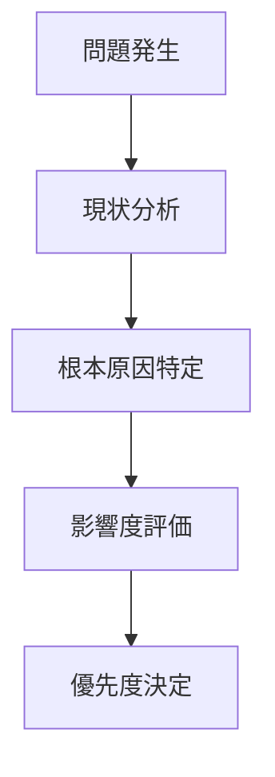

# 📋 Planning Docume### 🔄 Scraper システム改善（実行中）

- 🚀 **[Scraper Clean Architecture 移行計画](./SCRAPER_MIGRATION_PLAN_EXECUTIVE_SUMMARY.md)** - 実行可能な 7 日間移行計画
- 📋 **[詳細技術仕様](./SCRAPER_CLEAN_ARCHITECTURE_MIGRATION_PLAN.md)** - 包括的実装計画書
- 📊 データ品質管理システム構築
- 📊 API 効率化・コスト最適化 on

プロジェクト計画・ロードマップ・改善計画の管理

## 📁 ドキュメント一覧

### マーカー・UI 改善

- **[MARKER_IMPROVEMENT_ROADMAP.md](./MARKER_IMPROVEMENT_ROADMAP.md)** - マーカー機能改善ロードマップ
- **[MARKER_IMPROVEMENT_INVESTIGATION.md](./MARKER_IMPROVEMENT_INVESTIGATION.md)** - マーカー改善調査報告
- **[ICON_SELECTION_GUIDELINES.md](./ICON_SELECTION_GUIDELINES.md)** - アイコン選択ガイドライン

## 🎯 プロジェクト改善状況

### Phase 1: 基盤整備（完了）

- ✅ フロントエンドアーキテクチャ設計
- ✅ Google Maps API 統合
- ✅ PWA 対応・パフォーマンス最適化

### Phase 2: データシステム改善（計画中）

- � **Scraper システム改善** - アーキテクチャ再設計・品質向上
- 📋 データ品質管理システム構築
- 📋 API 効率化・コスト最適化

### Phase 3: 機能拡張（計画中）

- 📋 Advanced Markers v2 完全移行
- 📋 多言語対応・国際化
- 📋 リアルタイム更新システム

## 🔧 改善プロセス

### 1. 問題特定・分析

### 2. 計画策定

- **リファクタリング計画**: 技術的改善・品質向上
- **機能改善計画**: UX・パフォーマンス向上
- **ロードマップ**: 中長期戦略・目標設定

### 3. 実装・検証

- **段階的実装**: リスク分散・品質確保
- **継続的検証**: テスト・監視・フィードバック
- **ドキュメント更新**: 知識共有・ナレッジ蓄積

## 📊 品質指標・KPI

### 技術品質

| 指標             | 現在値 | 目標値 | 期限    |
| ---------------- | ------ | ------ | ------- |
| テストカバレッジ | 60%    | 80%    | Phase 2 |
| 型安全性         | 70%    | 95%    | Phase 2 |
| コード重複率     | 15%    | 5%     | Phase 2 |
| 技術的負債       | High   | Low    | Phase 3 |

### ユーザー体験

| 指標             | 現在値 | 目標値    | 期限    |
| ---------------- | ------ | --------- | ------- |
| 初期読み込み時間 | 2.5s   | 1.5s      | Phase 2 |
| Core Web Vitals  | Good   | Excellent | Phase 3 |
| モバイル体験     | 85%    | 95%       | Phase 2 |
| アクセシビリティ | AA     | AAA       | Phase 3 |

## 🚀 実装優先度

### 🔴 Critical (即座に対応)

- データシステム改善
- セキュリティ脆弱性対応
- パフォーマンス劣化修正

### 🟡 High (2 週間以内)

- API 効率化・コスト削減
- データ品質向上
- エラーハンドリング強化

### 🟢 Medium (1 ヶ月以内)

- UI/UX 改善
- テストカバレッジ向上
- ドキュメント整備

### 🔵 Low (長期計画)

- 新機能追加
- 多言語対応
- 高度な分析機能

## 📈 成功指標

### 短期的成果（1-2 週間）

- コード品質の定量的改善
- 開発者体験の向上
- バグ発生率の削減

### 中期的成果（1-2 ヶ月）

- ユーザー体験の向上
- システム安定性の確保
- 新機能開発速度の向上

### 長期的成果（3-6 ヶ月）

- プロダクト価値の最大化
- 技術的負債の完全解消
- スケーラブルなシステム構築

## 🔗 関連ドキュメント

### アーキテクチャ

- [ADR-001-frontend-architecture.md](../architecture/ADR-001-frontend-architecture.md)
- [ADR-002-google-maps-integration.md](../architecture/ADR-002-google-maps-integration.md)
- [ADR-003-scraper-architecture-redesign.md](../architecture/ADR-003-scraper-architecture-redesign.md)

### 開発ガイド

- [environment-setup-guide.md](../development/environment-setup-guide.md)
- [google-maps-api-setup.md](../development/google-maps-api-setup.md)
- [copilot-instructions.md](../development/copilot-instructions.md)

### 実装レポート

- [MARKER_ENHANCEMENT_PHASE1_REPORT.md](../reports/MARKER_ENHANCEMENT_PHASE1_REPORT.md)

---

**継続的な改善により、プロジェクト全体の品質・価値を最大化していきます。**
