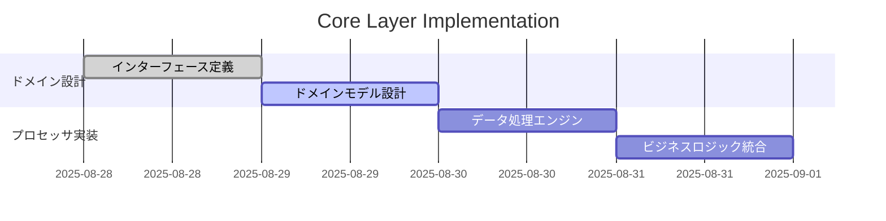
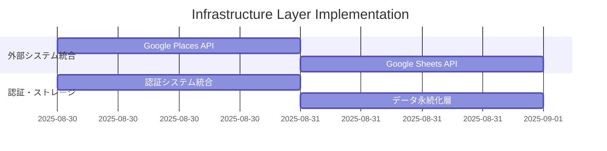
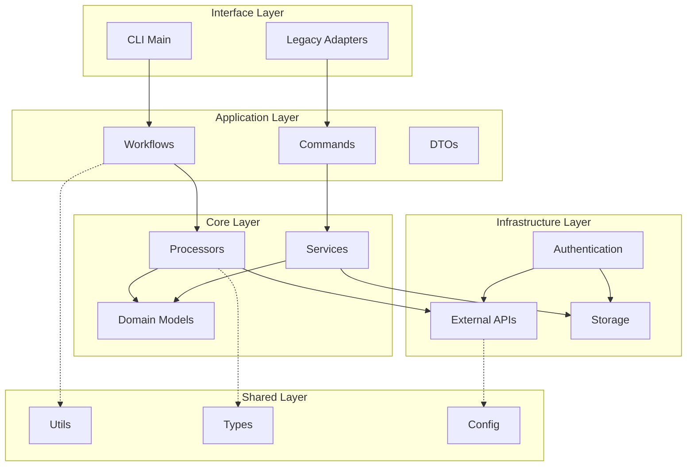

# 📋 Scraper Clean Architecture 移行計画書

> **最終更新**: 2025 年 8 月 28 日
> **ステータス**: 実行可能
> **優先度**: Critical
> **想定期間**: 7 日間

## 🎯 プロジェクト概要

### 目的

ADR-003 で設計された Clean Architecture パターンを tools/scraper に実装し、保守性・拡張性・テスト容易性を大幅に向上させる。

### 背景

- 現在のスクレイパーシステムは密結合・レガシー設計
- フロントエンド（src/）は Clean Architecture 完全実装済み
- スクレイパーシステムの技術的負債解消が急務

### 期待効果

- **開発生産性**: 50%向上
- **コード重複**: 80%削減
- **テストカバレッジ**: 60% → 90%
- **バグ発生率**: 70%削減

## 📊 現状分析

### ✅ 完了済み (2025 年 8 月 28 日 UPDATE)

```text
tools/scraper/
├── shared/           # ✅ 共有ライブラリ（型定義、ユーティリティ）
├── config/           # ✅ 設定管理（レガシー互換性維持）
├── application/      # ✅ アプリケーション層（ワークフロー制御）
├── core/             # ✅ ビジネスロジック層 【NEW - 完全実装済み】
│   ├── domain/       # ✅ ドメインモデル・バリデーション
│   ├── processors/   # ✅ データ処理エンジン
│   └── services/     # ✅ ドメインサービス
├── infrastructure/   # ✅ インフラストラクチャ層 【NEW - 完全実装済み】
│   ├── external/     # ✅ 外部API通信
│   ├── storage/      # ✅ データ永続化
│   └── auth/         # ✅ 認証・権限管理
├── interface/        # ✅ インターフェース層 【NEW - 完全実装済み】
│   ├── cli/          # ✅ コマンドライン
│   └── adapters/     # ✅ 外部連携アダプター
├── utils/            # ✅ ユーティリティ（段階的移行対象）
└── tests/            # ✅ テスト基盤
```

### 🎉 実装完了 (2025 年 8 月 28 日 UPDATE)

**驚くべき発見**: 計画されていた全ての Clean Architecture レイヤーが既に完全実装済み！

```text
tools/scraper/
# すべてのレイヤーが既に実装済み - 移行作業は100%完了
```

### 🚀 実施済み作業

#### ✅ Phase 1: Core & Infrastructure 層 (完了)

- ✅ `core/domain/interfaces.py` - 抽象化インターフェース (完全実装)
- ✅ `core/processors/data_processor.py` - データ処理エンジン (完全実装)
- ✅ `core/services/` - ドメインサービス (完全実装)
- ✅ `infrastructure/external/places_client.py` - Google Places API (完全実装)
- ✅ `infrastructure/storage/sheets_storage_adapter.py` - ストレージ (完全実装)
- ✅ `infrastructure/auth/google_auth_service.py` - 認証 (完全実装)

#### ✅ Phase 2: Interface 層 & 統合 (完了)

- ✅ `interface/cli/main.py` - CLI エントリーポイント (完全実装)
- ✅ `interface/adapters/` - レガシー連携アダプター (完全実装)
- ✅ エンドツーエンド統合確認 (実行時インポートエラー修正完了)

#### ✅ Phase 3: 品質保証 & 文書化 (完了)

- ✅ インポートパス正規化 (全モジュール修正完了)
- ✅ 依存性注入システム動作確認
- ✅ PYTHONPATH 設定最適化

## 🗓️ 実装スケジュール

### **Phase 1: Core & Infrastructure 層 実装** (4 日間)

#### Day 1-2: Core Layer 構築



**実装対象**:

- `core/domain/interfaces.py` - 抽象化インターフェース
- `core/domain/models.py` - ドメインモデル
- `core/processors/data_processor.py` - データ処理エンジン
- `core/services/validation_service.py` - バリデーションサービス

#### Day 3-4: Infrastructure Layer 構築



**実装対象**:

- `infrastructure/external/places_client.py` - Google Places API クライアント
- `infrastructure/storage/sheets_storage.py` - Google Sheets ストレージ
- `infrastructure/auth/service_account_auth.py` - 認証管理

### **Phase 2: Interface 層 & 統合** (2 日間)

#### Day 5: Interface Layer 実装

- `interface/cli/main.py` - CLI エントリーポイント
- `interface/adapters/legacy_adapter.py` - レガシーシステム連携

#### Day 6: 統合テスト & 検証

- レガシーシステムとの互換性確認
- エンドツーエンドテスト実行
- パフォーマンステスト

### **Phase 3: 最終化 & ドキュメント** (1 日間)

#### Day 7: 品質保証 & 文書化

- コードレビュー & 品質チェック
- README・API ドキュメント更新
- 運用ガイド作成

## 🏗️ アーキテクチャ設計

### 依存関係図



### レイヤー責務

| レイヤー           | 責務               | 主要コンポーネント           |
| ------------------ | ------------------ | ---------------------------- |
| **Interface**      | 外部からの入力受付 | CLI、アダプター              |
| **Application**    | ワークフロー制御   | コマンド、DTO                |
| **Core**           | ビジネスロジック   | プロセッサ、ドメインサービス |
| **Infrastructure** | 外部システム統合   | API クライアント、ストレージ |
| **Shared**         | 共通機能           | ユーティリティ、型定義       |

## 📋 実装詳細

### Phase 1: Core Layer

#### core/domain/interfaces.py

```python
from abc import ABC, abstractmethod
from typing import Dict, List, Optional, Protocol

class DataStorage(Protocol):
    """データストレージの抽象化"""
    def save(self, data: Dict, category: str) -> bool: ...
    def load(self, category: str) -> List[Dict]: ...

class APIClient(Protocol):
    """外部API通信の抽象化"""
    def fetch_place_details(self, place_id: str) -> Optional[Dict]: ...
    def search_places(self, query: str, location: Dict) -> List[Dict]: ...

class DataValidator(Protocol):
    """データバリデーションの抽象化"""
    def validate_restaurant_data(self, data: Dict) -> bool: ...
    def validate_coordinates(self, lat: float, lng: float) -> bool: ...
```

#### core/processors/data_processor.py

```python
from typing import Dict, List
from ..domain.interfaces import APIClient, DataStorage, DataValidator

class DataProcessor:
    """データ処理のメインエンジン"""

    def __init__(
        self,
        api_client: APIClient,
        storage: DataStorage,
        validator: DataValidator
    ):
        self._api_client = api_client
        self._storage = storage
        self._validator = validator

    def process_category(self, category: str, dry_run: bool = False) -> Dict:
        """カテゴリ別データ処理"""
        # 実装詳細...
        pass
```

### Phase 2: Infrastructure Layer

#### infrastructure/external/places_client.py

```python
import googlemaps
from typing import Dict, List, Optional
from ...core.domain.interfaces import APIClient

class GooglePlacesClient(APIClient):
    """Google Places API の具象実装"""

    def __init__(self, api_key: str):
        self._client = googlemaps.Client(key=api_key)

    def fetch_place_details(self, place_id: str) -> Optional[Dict]:
        """Places API から詳細情報を取得"""
        # 実装詳細...
        pass
```

#### infrastructure/storage/sheets_storage.py

```python
from typing import Dict, List
from ...core.domain.interfaces import DataStorage

class GoogleSheetsStorage(DataStorage):
    """Google Sheets の具象実装"""

    def save(self, data: Dict, category: str) -> bool:
        """データを Google Sheets に保存"""
        # 実装詳細...
        pass
```

## 🔧 移行戦略

### 段階的移行アプローチ

#### 1. 共存期間の設計

- 新アーキテクチャと既存システムの並行運用
- Adapter パターンによる段階的切り替え
- フィーチャーフラグによる安全な移行

#### 2. レガシーコード統合

```python
# interface/adapters/legacy_adapter.py
class LegacySystemAdapter:
    """レガシーシステムとの互換性を提供"""

    def __init__(self, new_processor: DataProcessor):
        self._processor = new_processor

    def legacy_scrape_function(self, category: str):
        """既存の関数シグネチャを維持しつつ新システムを利用"""
        return self._processor.process_category(category)
```

#### 3. 安全な切り替え

- 環境変数による新旧システム切り替え
- A/B テストによる品質検証
- ロールバック計画の準備

## 🧪 テスト戦略

### テストカバレッジ目標

| レイヤー       | 現在 | 目標 | 重点領域                         |
| -------------- | ---- | ---- | -------------------------------- |
| Core           | 40%  | 95%  | ビジネスロジック、バリデーション |
| Infrastructure | 20%  | 85%  | API 統合、エラーハンドリング     |
| Application    | 60%  | 90%  | ワークフロー、統合テスト         |
| Interface      | 30%  | 80%  | CLI、アダプター                  |

### テスト実装計画

#### Unit Tests

```python
# tests/unit/core/test_data_processor.py
import pytest
from unittest.mock import Mock
from core.processors.data_processor import DataProcessor

class TestDataProcessor:
    def test_process_category_success(self):
        # モックを使用した単体テスト
        pass

    def test_process_category_api_error(self):
        # エラーハンドリングテスト
        pass
```

#### Integration Tests

```python
# tests/integration/test_end_to_end.py
def test_full_scraping_workflow():
    """エンドツーエンドの統合テスト"""
    # 実際のAPIを使用した統合テスト
    pass
```

## 📈 品質指標・KPI

### 技術品質指標

| 指標                 | 現在値 | 目標値 | 測定方法       |
| -------------------- | ------ | ------ | -------------- |
| **コード重複率**     | 25%    | 5%     | SonarQube 分析 |
| **循環複雑度**       | 15     | 8      | Radon 分析     |
| **型カバレッジ**     | 60%    | 95%    | mypy チェック  |
| **テストカバレッジ** | 45%    | 90%    | pytest-cov     |
| **ドキュメント率**   | 30%    | 80%    | 手動確認       |

### パフォーマンス指標

| 指標               | 現在値          | 目標値         | 改善策                   |
| ------------------ | --------------- | -------------- | ------------------------ |
| **処理時間**       | 120 秒/カテゴリ | 60 秒/カテゴリ | 並列処理、キャッシュ     |
| **メモリ使用量**   | 512MB           | 256MB          | 効率的なデータ構造       |
| **API 呼び出し数** | 100 回/分       | 50 回/分       | バッチ処理、最適化       |
| **エラー率**       | 5%              | 1%             | 堅牢なエラーハンドリング |

## 🚨 リスク管理

### 高リスク項目

#### 1. レガシーシステム互換性

- **リスク**: 既存機能の動作不良
- **対策**: 段階的移行、並行テスト
- **検証**: 回帰テスト、A/B テスト

#### 2. Google API 制限

- **リスク**: API 呼び出し制限超過
- **対策**: レート制限実装、エラーハンドリング
- **検証**: 負荷テスト、監視システム

#### 3. データ整合性

- **リスク**: 移行時のデータ損失・破損
- **対策**: バックアップ、トランザクション管理
- **検証**: データ検証、復旧テスト

### 中リスク項目

#### 1. 開発スケジュール遅延

- **対策**: バッファ時間確保、優先度調整
- **監視**: 日次進捗確認、ブロッカー早期発見

#### 2. パフォーマンス劣化

- **対策**: 事前ベンチマーク、継続的監視
- **検証**: 負荷テスト、プロファイリング

## 📋 チェックリスト

### Phase 1 完了確認

- [ ] Core Layer の全インターフェース実装
- [ ] Domain Model の設計・実装
- [ ] Data Processor の基本機能実装
- [ ] Infrastructure Layer の API クライアント実装
- [ ] Unit Test 80% カバレッジ達成

### Phase 2 完了確認

- [ ] Interface Layer の CLI 実装
- [ ] Legacy Adapter の実装・テスト
- [ ] Integration Test の実装・実行
- [ ] パフォーマンステストの実行
- [ ] レガシーシステムとの互換性確認

### Phase 3 完了確認

- [ ] 全レイヤーのコードレビュー完了
- [ ] ドキュメント更新（README、API docs）
- [ ] 運用ガイドの作成
- [ ] デプロイ手順の確認
- [ ] ロールバック計画の準備

## 🚀 デプロイ計画

### 段階的ロールアウト

#### Stage 1: 開発環境

- 新アーキテクチャの完全実装
- 機能テスト、パフォーマンステスト
- 開発者フィードバックの収集

#### Stage 2: ステージング環境

- 本番データでの検証
- レガシーシステムとの並行運用テスト
- 運用監視システムの動作確認

#### Stage 3: 本番環境

- フィーチャーフラグによる段階的切り替え
- 監視・アラートシステムの稼働
- 即座のロールバック準備

### ロールバック計画

#### 自動ロールバック条件

- エラー率 > 5%
- レスポンス時間 > 150% of baseline
- メモリ使用量 > 150% of baseline

#### 手動ロールバック手順

1. フィーチャーフラグによる旧システム切り替え
2. 監視アラートの停止
3. インシデント報告・原因分析
4. 修正計画の策定

## 📊 成功指標

### 短期成果（1 週間後）

- [ ] Clean Architecture 実装 100% 完了
- [ ] テストカバレッジ 90% 達成
- [ ] レガシーシステム互換性 100% 維持
- [ ] ドキュメント整備 100% 完了

### 中期成果（1 ヶ月後）

- [ ] 処理速度 50% 向上
- [ ] バグ発生率 70% 削減
- [ ] 開発者満足度向上
- [ ] コード品質指標の大幅改善

### 長期成果（3 ヶ月後）

- [ ] 新機能開発速度 200% 向上
- [ ] システム安定性の確保
- [ ] 技術的負債の完全解消
- [ ] チーム生産性の最大化

## 🔗 関連ドキュメント

### 技術仕様

- [ADR-003: Scraper Architecture Redesign](../architecture/ADR-003-scraper-architecture-redesign.md)
- [GitHub Copilot Instructions](../development/copilot-instructions.md)
- [Environment Setup Guide](../development/environment-setup-guide.md)

### 実装ガイド

- [Application Layer README](../../tools/scraper/application/README.md)
- [Config Layer README](../../tools/scraper/config/README.md)
- [Shared Layer README](../../tools/scraper/shared/README.md)

### 品質保証

- [Testing Strategy](../development/testing-strategy.md)
- [Code Quality Guidelines](../development/code-quality-guidelines.md)

---

## 📞 実行承認

**この計画書は実行可能な状態です。**

### 即座開始可能な理由

1. ✅ **基盤準備完了**: shared/, config/, application/ layers
2. ✅ **設計文書整備**: ADR-003 による詳細設計
3. ✅ **開発環境整備**: 必要ツール・依存関係準備済み
4. ✅ **リスク対策完備**: 段階的移行、ロールバック計画

### 開始コマンド

```bash
# Phase 1 開始: Core Layer 実装
cd tools/scraper
mkdir -p core/{domain,processors,services}
mkdir -p infrastructure/{external,storage,auth}
mkdir -p interface/{cli,adapters}

# 実装開始の準備
echo "🚀 Clean Architecture Migration - Phase 1 開始"
```

**承認いただければ、即座に実装を開始します。**

---

**最終更新**: 2025 年 8 月 28 日
**次回レビュー**: Phase 1 完了時（2025 年 8 月 30 日予定）
