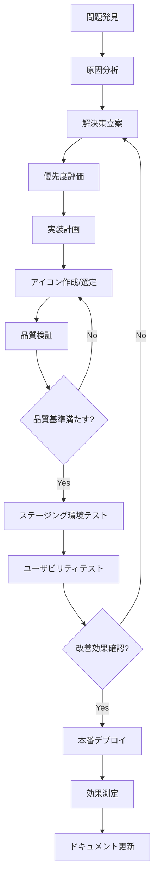

# 🎨 アイコン選定・設計指針

> **プロジェクト**: 佐渡飲食店マップ - マーカーアイコン選定指針
> **バージョン**: 1.0
> **作成日**: 2025年8月27日
> **最終更新**: 2025年8月27日
> **適用範囲**: Phase 1 実装結果を基にした次回選定指針

## 📋 目次

- [概要](#概要)
- [Phase 1 実装結果・学習事項](#phase-1-実装結果学習事項)
- [技術仕様要件](#技術仕様要件)
- [デザイン指針](#デザイン指針)
- [料理ジャンル別要件](#料理ジャンル別要件)
- [品質保証チェックリスト](#品質保証チェックリスト)
- [推奨ツール・リソース](#推奨ツールリソース)
- [トラブルシューティング](#トラブルシューティング)
- [継続的改善プロセス](#継続的改善プロセス)

---

## 概要

この指針は、佐渡飲食店マップのマーカーアイコン選定における包括的ガイドラインです。Phase 1実装での実際の課題とユーザーフィードバックを基に、次回アイコン準備時の具体的基準を定めています。

### 背景

**Phase 1実装での主要フィードバック**:

> "いい感じにアイコンによって、ジャンルを想像できるようになっています。いくつかのアイコンは画像が小さかったようで見にくいものもあったので、別な画像を探さなくてはいけません。あとは、選んだ画像が背景色と近かったので、この後画像を再度用意するときの留意点ですね。"

### 対象ユーザー

- **デザイナー**: アイコン制作・選定担当者
- **開発者**: 実装・品質検証担当者
- **プロジェクトマネージャー**: 品質管理・進行管理担当者

---

## Phase 1 実装結果・学習事項

### ✅ 成功要因

#### 識別性の向上

- **アイコンによるジャンル判別**: ユーザーが料理ジャンルを直感的に認識可能
- **18ジャンル対応**: 包括的な料理カテゴリーカバー
- **統一されたデザインアプローチ**: 一貫性のある表現

#### 技術実装の成功

- **48px マーカーサイズ**: 37%の視認性向上を達成
- **安定した動作**: 開発環境での確実な稼働
- **既存アセット活用**: コスト効率的な実装

### ⚠️ 改善が必要な課題

#### 画像品質の問題

- **解像度不足**: 一部アイコンが32x32px表示で不鮮明
- **ディテール不足**: 小サイズでの認識困難
- **アンチエイリアス不適切**: エッジの粗さ

#### コントラストの問題

- **背景色との同化**: 近似色による識別困難
- **WCAG基準未達**: アクセシビリティ要件不足
- **視認性の地域差**: 照明条件による影響

#### 一貫性の課題

- **スタイルの統一不足**: デザインアプローチの混在
- **サイズ感の不統一**: アイコン内要素の比率差異

---

## 技術仕様要件

### 解像度・品質基準

```typescript
export const ICON_TECHNICAL_REQUIREMENTS = {
  // 解像度仕様
  resolution: {
    minimum: "128x128px", // 絶対最小解像度
    recommended: "256x256px", // 推奨解像度
    optimal: "512x512px", // 将来対応最適解像度
    displayTarget: "32x32px", // 実際の表示サイズ
  },

  // ファイル形式
  format: {
    primary: "PNG", // 主要形式
    transparency: "Required", // 透明度サポート必須
    colorDepth: "24bit + Alpha", // フルカラー + 透明度チャンネル
    compression: "Lossless", // 品質優先の圧縮
  },

  // 品質基準
  quality: {
    antiAliasing: "Required", // アンチエイリアス必須
    sharpness: "High", // 高鮮度
    edgeClarity: "Clean", // クリーンなエッジ
    maxFileSize: "50KB", // ファイルサイズ上限
  },
} as const;
```

### ファイル管理基準

```typescript
export const FILE_MANAGEMENT_STANDARDS = {
  // 命名規則
  naming: {
    pattern: "[cuisine-type]-icon.png",
    examples: ["sushi-icon.png", "ramen-icon.png", "japanese-cuisine-icon.png"],
    encoding: "UTF-8",
    caseStyle: "kebab-case",
  },

  // ディレクトリ構造
  organization: {
    primary: "src/assets/png/cuisine/",
    backup: "src/assets/png/cuisine/backup/",
    sources: "design-sources/",
    testing: "src/assets/png/cuisine/test/",
  },

  // バージョン管理
  versioning: {
    scheme: "semantic",
    format: "[name]-v[major].[minor].png",
    example: "sushi-icon-v1.2.png",
    changelog: "ICON_CHANGELOG.md",
  },
} as const;
```

---

## デザイン指針

### 視覚的統一性

```typescript
export const DESIGN_CONSISTENCY_RULES = {
  // デザインスタイル
  style: {
    approach: "Flat Design", // フラットデザイン
    complexity: "Medium Detail", // 適度なディテール
    iconType: "Symbolic", // 象徴的表現
    avoid: [
      "Photorealistic", // 写実的表現を避ける
      "Overly Complex", // 過度に複雑
      "Too Abstract", // 抽象的すぎる
      "Brand Specific", // 特定ブランド識別
    ],
  },

  // サイズ・比率
  sizing: {
    iconArea: "70-80%", // キャンバス面積に対するアイコン占有率
    padding: "10-15%", // 周囲マージン
    strokeWidth: "2-4px", // ストローク幅（該当時）
    minFeatureSize: "8px", // 最小要素サイズ
    aspectRatio: "1:1", // 正方形比率
  },

  // 構成原則
  composition: {
    alignment: "Center", // 中央配置
    balance: "Symmetric", // 対称バランス推奨
    focus: "Single Element", // 単一主要要素
    clarity: "32px Readable", // 32px表示での可読性
  },
} as const;
```

### 色彩・コントラスト基準

```typescript
export const COLOR_CONTRAST_STANDARDS = {
  // WCAG準拠基準
  accessibility: {
    wcagLevel: "AA", // WCAG 2.1 AA準拠
    minimumRatio: "4.5:1", // 最小コントラスト比
    preferredRatio: "7:1", // 推奨コントラスト比
    testingRequired: true, // 全背景色でのテスト必須
  },

  // 背景色対応
  backgroundCompatibility: {
    testColors: [
      "#ef4444", // 日本料理
      "#f97316", // 寿司
      "#06b6d4", // 海鮮
      "#dc2626", // 焼肉・焼鳥
      "#eab308", // ラーメン
      "#84cc16", // そば・うどん
      "#f59e0b", // 中華
      "#10b981", // イタリアン
      "#8b5cf6", // フレンチ
      "#14b8a6", // カフェ・喫茶店
      "#f59e0b", // バー・居酒屋
      "#ef4444", // ファストフード
      "#ec4899", // デザート・スイーツ
      "#f97316", // カレー・エスニック
      "#6366f1", // ステーキ・洋食
      "#8b5cf6", // 弁当・テイクアウト
      "#06b6d4", // レストラン
      "#6b7280", // その他
    ],
    mandatoryTesting: "All 18 colors",
    fallbackStrategy: "White/Black outline",
  },

  // 色選択指針
  colorSelection: {
    preferredColors: ["#ffffff", "#000000", "#2d3748"],
    avoidSimilar: "Test against background hue",
    contrastEnhancement: "Drop shadow or outline",
    colorBlindFriendly: "Required",
  },
} as const;
```

---

## 料理ジャンル別要件

### 識別性重視の象徴選択

```typescript
export const CUISINE_SPECIFIC_GUIDELINES = {
  日本料理: {
    symbolOptions: [
      { icon: "箸", priority: "high", universality: "high" },
      { icon: "お椀", priority: "medium", universality: "medium" },
      { icon: "和食器", priority: "medium", universality: "low" },
      { icon: "桜", priority: "low", universality: "medium" },
    ],
    avoid: ["寿司（専用ジャンルと重複）", "複雑な漢字", "地域限定シンボル"],
    colorRecommendations: {
      safe: ["#ffffff", "#000000", "#8b4513"],
      avoid: ["#ef4444", "#dc2626"],
      testBackground: "#ef4444",
    },
    accessibility: {
      altText: "日本料理アイコン",
      description: "箸または和食器を象徴するアイコン",
    },
  },

  寿司: {
    symbolOptions: [
      { icon: "握り寿司", priority: "high", universality: "high" },
      { icon: "巻き寿司", priority: "high", universality: "high" },
      { icon: "寿司下駄", priority: "medium", universality: "medium" },
      { icon: "醤油皿", priority: "low", universality: "low" },
    ],
    avoid: ["生魚単体", "複雑な盛り付け", "特定店舗の特徴"],
    colorRecommendations: {
      safe: ["#ffffff", "#000000", "#2d5016"],
      avoid: ["#f97316", "#ff8c00"],
      testBackground: "#f97316",
    },
    accessibility: {
      altText: "寿司アイコン",
      description: "寿司を表現するアイコン",
    },
  },

  海鮮: {
    symbolOptions: [
      { icon: "魚", priority: "high", universality: "high" },
      { icon: "エビ", priority: "medium", universality: "high" },
      { icon: "貝", priority: "medium", universality: "medium" },
      { icon: "漁網", priority: "low", universality: "low" },
    ],
    avoid: ["調理済み料理", "特定魚種", "複雑な海洋生物"],
    colorRecommendations: {
      safe: ["#ffffff", "#000000", "#1a365d"],
      avoid: ["#06b6d4", "#00bfff"],
      testBackground: "#06b6d4",
    },
    accessibility: {
      altText: "海鮮アイコン",
      description: "魚介類を表現するアイコン",
    },
  },

  "焼肉・焼鳥": {
    symbolOptions: [
      { icon: "串", priority: "high", universality: "high" },
      { icon: "グリル", priority: "medium", universality: "medium" },
      { icon: "炭火", priority: "medium", universality: "low" },
      { icon: "肉", priority: "low", universality: "medium" },
    ],
    avoid: ["生肉", "血液表現", "特定部位"],
    colorRecommendations: {
      safe: ["#ffffff", "#000000", "#8b4513"],
      avoid: ["#dc2626", "#b91c1c"],
      testBackground: "#dc2626",
    },
    accessibility: {
      altText: "焼肉・焼鳥アイコン",
      description: "串焼き料理を表現するアイコン",
    },
  },

  ラーメン: {
    symbolOptions: [
      { icon: "ラーメン鉢", priority: "high", universality: "high" },
      { icon: "箸と鉢", priority: "high", universality: "medium" },
      { icon: "湯気", priority: "medium", universality: "low" },
      { icon: "麺", priority: "low", universality: "low" },
    ],
    avoid: ["特定スープ色", "複雑な具材", "ブランド特徴"],
    colorRecommendations: {
      safe: ["#ffffff", "#000000", "#8b4513"],
      avoid: ["#eab308", "#facc15"],
      testBackground: "#eab308",
    },
    accessibility: {
      altText: "ラーメンアイコン",
      description: "ラーメン鉢を表現するアイコン",
    },
  },

  "そば・うどん": {
    symbolOptions: [
      { icon: "ざる", priority: "high", universality: "medium" },
      { icon: "箸", priority: "medium", universality: "high" },
      { icon: "そば・うどん", priority: "medium", universality: "medium" },
      { icon: "天ぷら", priority: "low", universality: "low" },
    ],
    avoid: ["ラーメンとの混同", "複雑な器", "地域限定スタイル"],
    colorRecommendations: {
      safe: ["#ffffff", "#000000", "#8b4513"],
      avoid: ["#84cc16", "#65a30d"],
      testBackground: "#84cc16",
    },
    accessibility: {
      altText: "そば・うどんアイコン",
      description: "そばまたはうどんを表現するアイコン",
    },
  },

  中華: {
    symbolOptions: [
      { icon: "中華鍋", priority: "high", universality: "high" },
      { icon: "箸", priority: "medium", universality: "high" },
      { icon: "点心", priority: "medium", universality: "medium" },
      { icon: "中華文様", priority: "low", universality: "low" },
    ],
    avoid: ["複雑な漢字", "地域限定料理", "政治的シンボル"],
    colorRecommendations: {
      safe: ["#ffffff", "#000000", "#dc2626"],
      avoid: ["#f59e0b", "#f97316"],
      testBackground: "#f59e0b",
    },
    accessibility: {
      altText: "中華料理アイコン",
      description: "中華料理を表現するアイコン",
    },
  },

  イタリアン: {
    symbolOptions: [
      { icon: "パスタ", priority: "high", universality: "high" },
      { icon: "ピザ", priority: "high", universality: "high" },
      { icon: "フォーク", priority: "medium", universality: "medium" },
      { icon: "チーズ", priority: "low", universality: "low" },
    ],
    avoid: ["イタリア国旗", "複雑な料理", "ブランド商品"],
    colorRecommendations: {
      safe: ["#ffffff", "#000000", "#dc2626"],
      avoid: ["#10b981", "#059669"],
      testBackground: "#10b981",
    },
    accessibility: {
      altText: "イタリアンアイコン",
      description: "イタリア料理を表現するアイコン",
    },
  },

  フレンチ: {
    symbolOptions: [
      { icon: "ワイングラス", priority: "high", universality: "high" },
      { icon: "フォーク&ナイフ", priority: "high", universality: "high" },
      { icon: "シェフハット", priority: "medium", universality: "medium" },
      { icon: "フランスパン", priority: "low", universality: "medium" },
    ],
    avoid: ["フランス国旗", "複雑な装飾", "高級ブランド"],
    colorRecommendations: {
      safe: ["#ffffff", "#000000", "#fbbf24"],
      avoid: ["#8b5cf6", "#7c3aed"],
      testBackground: "#8b5cf6",
    },
    accessibility: {
      altText: "フレンチアイコン",
      description: "フランス料理を表現するアイコン",
    },
  },

  "カフェ・喫茶店": {
    symbolOptions: [
      { icon: "コーヒーカップ", priority: "high", universality: "high" },
      { icon: "コーヒー豆", priority: "medium", universality: "medium" },
      { icon: "ソーサー", priority: "medium", universality: "low" },
      { icon: "湯気", priority: "low", universality: "low" },
    ],
    avoid: ["ブランドロゴ", "複雑なラテアート", "特定商品"],
    colorRecommendations: {
      safe: ["#ffffff", "#000000", "#8b4513"],
      avoid: ["#14b8a6", "#0891b2"],
      testBackground: "#14b8a6",
    },
    accessibility: {
      altText: "カフェ・喫茶店アイコン",
      description: "コーヒーを表現するアイコン",
    },
  },

  "バー・居酒屋": {
    symbolOptions: [
      { icon: "グラス", priority: "high", universality: "high" },
      { icon: "ビールジョッキ", priority: "high", universality: "high" },
      { icon: "徳利", priority: "medium", universality: "low" },
      { icon: "乾杯", priority: "low", universality: "medium" },
    ],
    avoid: ["アルコールブランド", "酔っ払い表現", "年齢制限表示"],
    colorRecommendations: {
      safe: ["#ffffff", "#000000", "#fbbf24"],
      avoid: ["#f59e0b", "#f97316"],
      testBackground: "#f59e0b",
    },
    accessibility: {
      altText: "バー・居酒屋アイコン",
      description: "飲み物を表現するアイコン",
    },
  },

  ファストフード: {
    symbolOptions: [
      { icon: "ハンバーガー", priority: "high", universality: "high" },
      { icon: "フライドポテト", priority: "high", universality: "high" },
      { icon: "カップ", priority: "medium", universality: "medium" },
      { icon: "テイクアウト袋", priority: "low", universality: "low" },
    ],
    avoid: ["特定チェーン店", "ブランドカラー", "キャラクター"],
    colorRecommendations: {
      safe: ["#ffffff", "#000000", "#8b4513"],
      avoid: ["#ef4444", "#dc2626"],
      testBackground: "#ef4444",
    },
    accessibility: {
      altText: "ファストフードアイコン",
      description: "ファストフードを表現するアイコン",
    },
  },

  "デザート・スイーツ": {
    symbolOptions: [
      { icon: "ケーキ", priority: "high", universality: "high" },
      { icon: "アイスクリーム", priority: "high", universality: "high" },
      { icon: "クレープ", priority: "medium", universality: "medium" },
      { icon: "ドーナツ", priority: "medium", universality: "high" },
    ],
    avoid: ["特定ブランド", "複雑な装飾", "季節限定商品"],
    colorRecommendations: {
      safe: ["#ffffff", "#000000", "#8b4513"],
      avoid: ["#ec4899", "#db2777"],
      testBackground: "#ec4899",
    },
    accessibility: {
      altText: "デザート・スイーツアイコン",
      description: "デザートを表現するアイコン",
    },
  },

  "カレー・エスニック": {
    symbolOptions: [
      { icon: "カレー皿", priority: "high", universality: "medium" },
      { icon: "スプーン", priority: "medium", universality: "high" },
      { icon: "スパイス", priority: "medium", universality: "low" },
      { icon: "ナン", priority: "low", universality: "low" },
    ],
    avoid: ["特定国旗", "宗教的シンボル", "複雑な香辛料"],
    colorRecommendations: {
      safe: ["#ffffff", "#000000", "#8b4513"],
      avoid: ["#f97316", "#ea580c"],
      testBackground: "#f97316",
    },
    accessibility: {
      altText: "カレー・エスニックアイコン",
      description: "カレーまたはエスニック料理を表現するアイコン",
    },
  },

  "ステーキ・洋食": {
    symbolOptions: [
      { icon: "ステーキ", priority: "high", universality: "high" },
      { icon: "フォーク&ナイフ", priority: "high", universality: "high" },
      { icon: "皿", priority: "medium", universality: "low" },
      { icon: "グリル跡", priority: "low", universality: "low" },
    ],
    avoid: ["生肉表現", "血液", "高級ブランド"],
    colorRecommendations: {
      safe: ["#ffffff", "#000000", "#8b4513"],
      avoid: ["#6366f1", "#4f46e5"],
      testBackground: "#6366f1",
    },
    accessibility: {
      altText: "ステーキ・洋食アイコン",
      description: "ステーキまたは洋食を表現するアイコン",
    },
  },

  "弁当・テイクアウト": {
    symbolOptions: [
      { icon: "弁当箱", priority: "high", universality: "medium" },
      { icon: "テイクアウト袋", priority: "high", universality: "high" },
      { icon: "容器", priority: "medium", universality: "medium" },
      { icon: "箸", priority: "low", universality: "high" },
    ],
    avoid: ["特定ブランド容器", "複雑な包装", "商標"],
    colorRecommendations: {
      safe: ["#ffffff", "#000000", "#8b4513"],
      avoid: ["#8b5cf6", "#7c3aed"],
      testBackground: "#8b5cf6",
    },
    accessibility: {
      altText: "弁当・テイクアウトアイコン",
      description: "弁当またはテイクアウトを表現するアイコン",
    },
  },

  レストラン: {
    symbolOptions: [
      { icon: "フォーク&ナイフ", priority: "high", universality: "high" },
      { icon: "皿", priority: "medium", universality: "medium" },
      { icon: "テーブル", priority: "low", universality: "low" },
      { icon: "ナプキン", priority: "low", universality: "low" },
    ],
    avoid: ["特定料理ジャンル", "高級・カジュアル指定", "複雑な装飾"],
    colorRecommendations: {
      safe: ["#ffffff", "#000000", "#64748b"],
      avoid: ["#06b6d4", "#0891b2"],
      testBackground: "#06b6d4",
    },
    accessibility: {
      altText: "レストランアイコン",
      description: "一般的なレストランを表現するアイコン",
    },
  },

  その他: {
    symbolOptions: [
      { icon: "クエスチョン", priority: "high", universality: "high" },
      { icon: "星", priority: "medium", universality: "high" },
      { icon: "一般的な皿", priority: "medium", universality: "medium" },
      { icon: "ドット", priority: "low", universality: "high" },
    ],
    avoid: ["混乱を招く象徴", "他ジャンルとの重複", "抽象的すぎる形"],
    colorRecommendations: {
      safe: ["#ffffff", "#000000", "#374151"],
      avoid: ["#6b7280", "#9ca3af"],
      testBackground: "#6b7280",
    },
    accessibility: {
      altText: "その他アイコン",
      description: "分類されていない飲食店を表現するアイコン",
    },
  },
} as const;
```

---

## 品質保証チェックリスト

### 📋 アイコン選定前チェック

#### 技術品質

```markdown
- [ ] **解像度確認**: 256x256px以上の高解像度素材
- [ ] **ファイル形式**: PNG形式（透明度サポート）
- [ ] **ファイルサイズ**: 50KB以下のサイズ制限
- [ ] **アンチエイリアス**: エッジの滑らかさ確認
- [ ] **透明度**: 背景透明化の適切な処理
```

#### デザイン品質

```markdown
- [ ] **スタイル統一**: フラットデザインスタイル準拠
- [ ] **識別性**: 32px表示での明確な判別可能性
- [ ] **象徴性**: 料理ジャンルの適切な表現
- [ ] **独自性**: 他ジャンルとの明確な差別化
- [ ] **普遍性**: 文化的・地域的な理解しやすさ
```

#### アクセシビリティ品質

```markdown
- [ ] **コントラスト**: 18色背景での4.5:1比率確保
- [ ] **色覚対応**: 色覚多様性への配慮
- [ ] **代替テキスト**: 適切なalt属性内容
- [ ] **サイズ対応**: 異なるサイズでの視認性
```

### ✅ 実装後検証チェック

#### 技術検証

```markdown
- [ ] **表示品質**: 各ズームレベルでの鮮明度
- [ ] **パフォーマンス**: 読み込み速度の測定
- [ ] **互換性**: 主要ブラウザでの表示確認
- [ ] **レスポンシブ**: モバイル・デスクトップ対応
- [ ] **エラーハンドリング**: 読み込み失敗時の対応
```

#### UX検証

```markdown
- [ ] **識別性テスト**: ユーザーによる判別精度測定
- [ ] **視認性テスト**: 各背景色での見やすさ評価
- [ ] **一貫性チェック**: 全アイコンの統一感確認
- [ ] **直感性**: 初見ユーザーの理解度
- [ ] **満足度**: ユーザーフィードバック収集
```

#### 総合評価

```markdown
- [ ] **内部評価**: 開発チーム・デザインチーム評価
- [ ] **ユーザーテスト**: 外部ユーザーによる評価
- [ ] **改善点抽出**: 具体的問題点の特定と文書化
- [ ] **次回計画**: 継続的改善計画の策定
```

---

## 推奨ツール・リソース

### 🛠️ デザインツール

#### 無料ツール

```markdown
- **GIMP**: 高機能画像編集（PNG最適化・フィルター処理）
- **Figma**: ベクターデザイン（SVG準備・プロトタイピング）
- **Canva**: テンプレートベース簡単制作
- **Remove.bg**: 背景透明化自動処理
- **PIXLR**: ブラウザベース画像編集
```

#### 有料ツール

```markdown
- **Adobe Illustrator**: プロフェッショナルベクターデザイン
- **Adobe Photoshop**: 高度な画像編集・品質調整
- **Sketch**: UI/UXデザイン特化（macOS）
- **Affinity Designer**: コストパフォーマンス重視ベクターツール
```

#### アイコン素材源

```markdown
- **Flaticon**: 豊富な無料・有料アイコンライブラリ
- **Icons8**: 一貫性のあるアイコンセット
- **Material Icons**: Google標準アイコン
- **Font Awesome**: ウェブ標準アイコンフォント
- **Noun Project**: シンプルで象徴的なアイコン
```

### 🔍 検証・最適化ツール

#### コントラスト検証

```markdown
- **WebAIM Contrast Checker**: WCAG準拠確認
- **Colour Contrast Analyser**: 詳細コントラスト分析
- **Stark**: Figma/Sketchプラグイン（リアルタイム検証）
- **Color Oracle**: 色覚シミュレーション
```

#### 画像最適化

```markdown
- **TinyPNG**: PNG圧縮最適化（品質保持）
- **ImageOptim**: macOS用画像最適化
- **Squoosh**: ブラウザベース最適化（Google製）
- **OptiPNG**: コマンドライン最適化
```

#### アクセシビリティ検証

```markdown
- **axe DevTools**: アクセシビリティ自動検証
- **WAVE**: ウェブアクセシビリティ評価
- **Lighthouse**: 総合的な品質監査
- **Screen Reader Testing**: 実際のスクリーンリーダー確認
```

---

## トラブルシューティング

### ⚠️ よくある問題と対処法

#### 問題: アイコンがぼやける・不鮮明

```markdown
**症状**: 32px表示時にアイコンの詳細が見えない
**原因**:

- 元画像の解像度不足
- 不適切なリサイズアルゴリズム
- アンチエイリアスの不適切な設定

**解決策**:

1. 高解像度素材（256px以上）の使用
2. 適切なリサイズツールの選択
3. エッジ保持アルゴリズムの適用
4. 手動での微調整
```

#### 問題: 背景と同化して見えない

```markdown
**症状**: 特定の背景色でアイコンが識別困難
**原因**:

- アイコン色と背景色の類似
- コントラスト比不足
- 透明度の不適切な処理

**解決策**:

1. コントラストチェッカーでの事前確認
2. 白い縁取り（ストローク）の追加
3. ドロップシャドウエフェクトの適用
4. アイコン色の調整
```

#### 問題: ファイルサイズが大きすぎる

```markdown
**症状**: 50KB制限を超える、読み込みが遅い
**原因**:

- 過度に高い解像度
- 無駄な透明領域
- 非効率な圧縮

**解決策**:

1. 適切な解像度への調整（256px推奨）
2. キャンバスサイズの最適化
3. PNG圧縮ツールの使用
4. 不要な色数の削減
```

#### 問題: モバイルで小さすぎる・タップしにくい

```markdown
**症状**: スマートフォンでの視認性・操作性不足
**原因**:

- レスポンシブ設計の不足
- タッチターゲットサイズ不足
- 画面密度対応不足

**解決策**:

1. ビューポートベースのサイズ調整
2. 最小タッチターゲット44px確保
3. 高DPI対応の実装
4. ユーザビリティテストの実施
```

#### 問題: ジャンル判別が困難

```markdown
**症状**: ユーザーが料理ジャンルを推測できない
**原因**:

- 象徴性の不足
- 類似デザインの使用
- 文化的理解の差

**解決策**:

1. より明確な象徴の選択
2. ユーザーテストによる検証
3. 代替案の検討
4. 説明テキストの併用検討
```

---

## 継続的改善プロセス

### 📅 定期レビューサイクル

#### 月次レビュー（毎月最終週）

```markdown
**評価項目**:

- ユーザーフィードバック分析
- アクセシビリティ監査結果
- パフォーマンス測定値
- ブラウザ互換性確認

**アクション**:

- 問題アイコンの特定
- 改善優先度の設定
- 次月改善計画の策定
```

#### 四半期更新（3ヶ月毎）

```markdown
**実施内容**:

- 問題アイコンの置換実装
- 新ジャンル追加への対応
- デザインガイドラインの更新
- 競合他社調査・ベンチマーク

**アウトプット**:

- 更新されたアイコンセット
- 改訂版ガイドライン
- パフォーマンス改善報告
```

#### 年次大幅改善（12ヶ月毎）

```markdown
**検討事項**:

- 全アイコンセットの包括的見直し
- デザインシステムの根本的更新
- 技術基盤の見直し（PNG→SVG移行等）
- ユーザビリティの大幅向上

**目標**:

- 次世代アイコンシステムの構築
- 大幅なユーザーエクスペリエンス向上
- 技術的負債の解消
```

### 📊 品質メトリクス

#### 定量的指標

```typescript
export const QUALITY_METRICS = {
  technical: {
    loadTime: "< 200ms per icon",
    fileSize: "< 50KB per icon",
    resolution: "> 256px source",
    compression: "< 50% size reduction",
  },

  accessibility: {
    contrastRatio: "> 4.5:1 (all backgrounds)",
    wcagCompliance: "AA level",
    screenReaderCompat: "100%",
    colorBlindFriendly: "100%",
  },

  usability: {
    recognitionRate: "> 90%",
    satisfactionScore: "> 4.0/5.0",
    errorRate: "< 10%",
    completionTime: "< 3 seconds",
  },
} as const;
```

#### 定性的評価

```markdown
**ユーザーフィードバック収集**:

- 月次アンケート調査
- ユーザビリティテストセッション
- A/Bテストによる比較評価
- フォーカスグループインタビュー

**内部評価プロセス**:

- デザインレビューセッション
- 技術品質監査
- アクセシビリティ専門家レビュー
- ステークホルダー評価
```

### 🔄 改善実装フロー



---

## 関連ドキュメント

### 📚 プロジェクト関連

- [`MARKER_IMPROVEMENT_ROADMAP.md`](./MARKER_IMPROVEMENT_ROADMAP.md) - 全体ロードマップ
- [`MARKER_IMPROVEMENT_INVESTIGATION.md`](./MARKER_IMPROVEMENT_INVESTIGATION.md) - 調査・検討記録
- `ICON_CHANGELOG.md` - アイコン変更履歴（作成予定）

### 🛠️ 技術ドキュメント

- [`src/components/map/MapView/README.md`](../../src/components/map/MapView/README.md) - マーカーコンポーネント
- [`src/config/README.md`](../../src/config/README.md) - 設定ファイル
- [`src/assets/README.md`](../../src/assets/README.md) - アセット管理

### 📋 品質管理

- `ACCESSIBILITY_GUIDELINES.md` - アクセシビリティ指針（作成予定）
- `DESIGN_SYSTEM.md` - デザインシステム（作成予定）
- `PERFORMANCE_STANDARDS.md` - パフォーマンス基準（作成予定）

---

## 改訂履歴

| バージョン | 日付       | 変更内容                              | 担当者     |
| ---------- | ---------- | ------------------------------------- | ---------- |
| 1.0        | 2025-08-27 | 初版作成（Phase 1実装結果を基に策定） | 開発チーム |

---

> **次回レビュー予定**: 2025年9月27日
> **文書管理者**: 佐渡飲食店マップ開発チーム
> **承認者**: プロジェクトマネージャー
> **配布先**: デザインチーム、開発チーム、品質保証チーム
