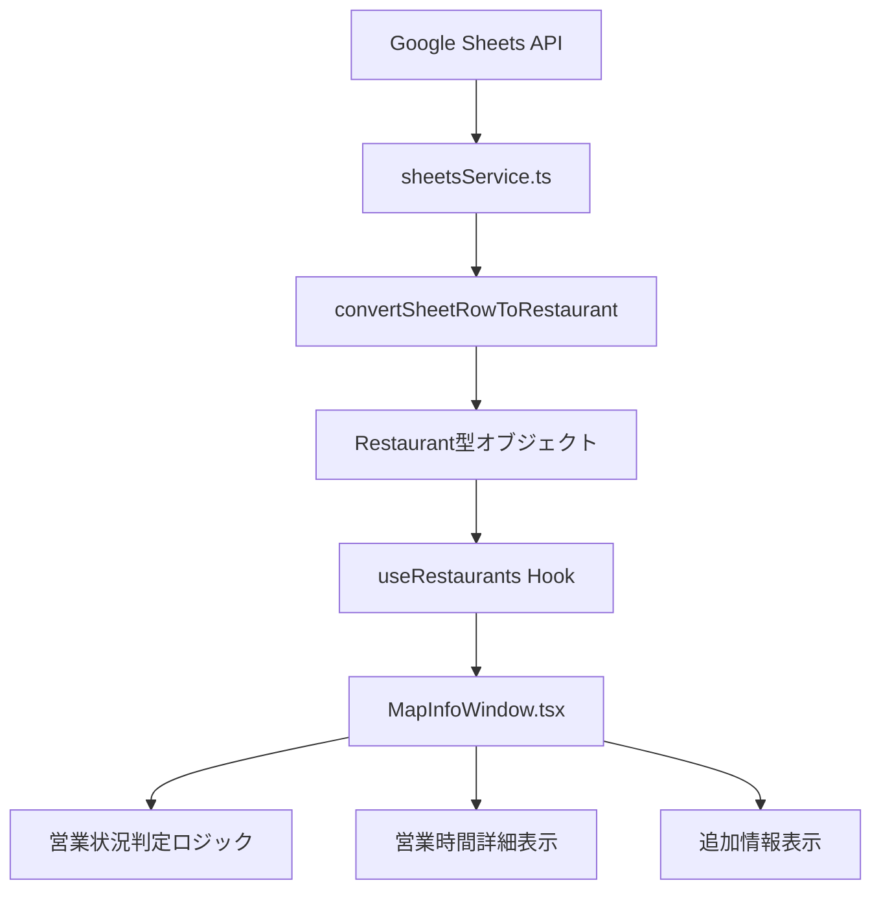

# 📊 情報ウィンドウ拡張実装計画書

> **プロジェクト**: 佐渡飲食店マップ - 情報ウィンドウ拡張機能実装
> **作成日**: 2025年9月11日
> **対象バージョン**: v2.1.0
> **実装期間**: 6-8日間（4フェーズ）
> **完成予定**: 2025年9月19日

## 📋 概要

### 🎯 実装目的

現在の情報ウィンドウに**5つの新規項目**を追加し、ユーザーフレンドリーな見た目で飲食店情報をより充実させる。

### ✨ 新規実装項目

| 項目                   | 説明                         | データソース                  | 優先度 |
| ---------------------- | ---------------------------- | ----------------------------- | ------ |
| **営業状況**           | リアルタイム営業中/閉店表示  | 既存営業時間データ + 現在時刻 | 🔴 高  |
| **営業時間詳細**       | 曜日別営業時間の見やすい表示 | Google Sheets `営業時間` 列   | 🔴 高  |
| **最終更新日**         | データ更新日の表示           | Google Sheets `最終更新日` 列 | 🟡 中  |
| **主要業種**           | 店舗カテゴリーの視覚的表示   | Google Sheets `ジャンル` 列   | 🟡 中  |
| **Google Maps公式URL** | 公式マップページへのリンク   | 計算生成（緯度経度から）      | 🟢 低  |

### 🔄 現在の実装状況

- ✅ **Google Sheets API**: 44フィールドのデータ取得済み
- ✅ **営業時間フィルタリング**: `parseTimeToMinutes` 関数実装済み
- ✅ **MapInfoWindow**: 基本的な情報表示機能実装済み
- ✅ **React 19 & TypeScript 5.7**: 最新技術スタック
- 🔄 **追加データフィールド**: 型定義・表示ロジック拡張が必要

---

## 🏗️ 技術アーキテクチャ

### 📊 データフロー設計



### 🔧 技術スタック詳細

| レイヤー             | 技術                          | 実装範囲                              |
| -------------------- | ----------------------------- | ------------------------------------- |
| **UI Framework**     | React 19.1.1                  | MapInfoWindow.tsx, 新規コンポーネント |
| **Type System**      | TypeScript 5.7.3              | Restaurant型拡張, BusinessStatus型    |
| **State Management** | React Hooks                   | useRestaurants, useFilterState        |
| **API Integration**  | Google Sheets API             | sheetsService.ts 拡張                 |
| **Styling**          | CSS Modules + Material Design | 情報ウィンドウスタイリング            |
| **Icons**            | Material Icons / Lucide React | 営業状況、業種アイコン                |

### 📁 影響を受けるファイル

```text
src/
├── types/
│   └── restaurant.types.ts        # ✏️ 型定義拡張
├── services/
│   └── sheetsService.ts          # ✏️ データ変換ロジック拡張
├── components/
│   └── MapInfoWindow.tsx         # ✏️ UI表示ロジック拡張
├── hooks/
│   └── useRestaurants.ts         # ✏️ 営業時間ロジック拡張
└── utils/
    ├── businessHours.ts          # 🆕 営業時間ユーティリティ
    ├── googleMapsUtils.ts        # 🆕 URL生成ユーティリティ
    └── dateUtils.ts              # 🆕 日付フォーマットユーティリティ
```

---

## 📋 詳細実装フェーズ

### 🔍 Phase 1: データ構造・基盤実装（1-2日）

#### 1.1 データ構造調査・設計

**目標**: Google Sheets APIから取得可能な新規項目の完全マッピング

**実装タスク**:

```typescript
// 調査対象フィールド
interface SheetFieldMapping {
  businessStatus: string; // 営業状況判定用
  detailedOpeningHours: string; // 営業時間詳細
  lastUpdated: string; // 最終更新日
  primaryType: string; // 主要業種
  location: {
    // Google Maps URL生成用
    lat: number;
    lng: number;
  };
}
```

**成果物**:

- Google Sheets列マッピング調査レポート
- データ形式・バリデーション仕様書

#### 1.2 型定義拡張

**実装ファイル**: `src/types/restaurant.types.ts`

```typescript
// 既存Restaurant型の拡張
interface Restaurant {
  // ... 既存フィールド
  businessStatus?: BusinessStatus;
  detailedOpeningHours?: DetailedOpeningHours;
  lastUpdated?: Date;
  primaryType?: RestaurantCategory;
  googleMapsUrl?: string;
}

// 新規型定義
enum BusinessStatus {
  OPEN = "open",
  CLOSED = "closed",
  UNKNOWN = "unknown",
}

interface DetailedOpeningHours {
  monday?: TimeRange;
  tuesday?: TimeRange;
  wednesday?: TimeRange;
  thursday?: TimeRange;
  friday?: TimeRange;
  saturday?: TimeRange;
  sunday?: TimeRange;
}

interface TimeRange {
  open: string; // "09:00"
  close: string; // "22:00"
  isClosed?: boolean;
}

enum RestaurantCategory {
  JAPANESE = "japanese",
  ITALIAN = "italian",
  CAFE = "cafe",
  BAR = "bar",
  // ... その他カテゴリー
}
```

#### 1.3 データ取得ロジック修正

**実装ファイル**: `src/services/sheetsService.ts`

```typescript
// convertSheetRowToRestaurant関数の拡張
export function convertSheetRowToRestaurant(row: any[]): Restaurant {
  return {
    // ... 既存フィールド変換
    businessStatus: calculateBusinessStatus(row[HOURS_COLUMN], new Date()),
    detailedOpeningHours: parseDetailedOpeningHours(row[HOURS_COLUMN]),
    lastUpdated: parseDate(row[LAST_UPDATED_COLUMN]),
    primaryType: categorizeRestaurant(row[GENRE_COLUMN]),
    googleMapsUrl: generateGoogleMapsUrl(parseFloat(row[LAT_COLUMN]), parseFloat(row[LNG_COLUMN])),
  };
}
```

### 🎨 Phase 2: UI/UX実装（2-3日）

#### 2.1 UI/UXデザイン設計

**設計原則**:

- **Google Maps InfoWindow公式ガイドライン**準拠
- **Material Design 3**カラーシステム適用
- **アクセシビリティ（WCAG 2.2 AA）**対応
- **レスポンシブデザイン**（320px-1920px）

**視覚的階層設計**:

```text
┌─────────────────────────────────┐
│ 📍 [店舗名] [営業状況バッジ]      │ ← プライマリ情報
├─────────────────────────────────┤
│ 🕐 営業時間（本日）              │ ← セカンダリ情報
│ 📅 詳細営業時間                 │
├─────────────────────────────────┤
│ 🏷️ [業種] 💾 更新:2025/09/10   │ ← メタ情報
├─────────────────────────────────┤
│ [Google Maps で開く] [詳細表示]  │ ← アクション
└─────────────────────────────────┘
```

**カラーコーディング**:

- 🟢 営業中: `--md-sys-color-primary` (#1976d2)
- 🔴 閉店中: `--md-sys-color-error` (#ba1a1a)
- 🟡 不明: `--md-sys-color-outline` (#79747e)

#### 2.2 MapInfoWindowコンポーネント拡張

**実装ファイル**: `src/components/MapInfoWindow.tsx`

```typescript
interface MapInfoWindowProps {
  point: MapPoint;
  onClose: () => void;
}

export function MapInfoWindow({ point, onClose }: MapInfoWindowProps) {
  if (point.type === 'restaurant') {
    return (
      <div className="info-window">
        <InfoWindowHeader
          title={point.name}
          businessStatus={point.businessStatus}
        />
        <BusinessHoursSection
          openingHours={point.openingHours}
          detailedHours={point.detailedOpeningHours}
        />
        <MetaInfoSection
          primaryType={point.primaryType}
          lastUpdated={point.lastUpdated}
        />
        <ActionButtonsSection
          googleMapsUrl={point.googleMapsUrl}
          onDetailsClick={() => handleDetailsClick(point)}
        />
      </div>
    );
  }
  // ... parking/toilet用の既存ロジック
}
```

#### 2.3 新規UIコンポーネント実装

**実装コンポーネント**:

1. **BusinessStatusBadge.tsx** - 営業状況バッジ
2. **DetailedBusinessHours.tsx** - 営業時間詳細表示
3. **RestaurantCategoryChip.tsx** - 業種チップ
4. **LastUpdatedDisplay.tsx** - 更新日表示
5. **GoogleMapsLinkButton.tsx** - 外部リンクボタン

### ⚡ Phase 3: ユーザビリティ・機能強化（1-2日）

#### 3.1 営業状況リアルタイム判定アルゴリズム

**実装ファイル**: `src/utils/businessHours.ts`

```typescript
export function calculateBusinessStatus(openingHours: string, currentTime: Date = new Date()): BusinessStatus {
  // 既存のparseTimeToMinutes関数を活用
  const currentMinutes = currentTime.getHours() * 60 + currentTime.getMinutes();
  const dayOfWeek = currentTime.getDay(); // 0=日曜, 1=月曜...

  // 営業時間解析とリアルタイム判定
  // 24時間営業、深夜営業、定休日の特殊ケース対応
}

export function formatBusinessHoursForDisplay(detailedHours: DetailedOpeningHours, currentDay: number): string {
  // 今日の営業時間を強調表示
  // 曜日別営業時間の見やすいフォーマット
}
```

#### 3.2 情報表示最適化

**優先度ベース表示順序**:

1. **営業状況** - 最重要（ユーザーの即座の判断用）
2. **今日の営業時間** - 高重要（当日利用判断用）
3. **店舗名・住所** - 中重要（既存情報）
4. **詳細営業時間** - 中重要（計画立案用）
5. **業種・更新日** - 低重要（追加情報）

**レスポンシブ表示制御**:

- **モバイル**: 重要情報のみ表示、詳細は展開可能
- **デスクトップ**: 全情報を適切なレイアウトで表示

### 🧪 Phase 4: 品質保証・最適化（1日）

#### 4.1 包括的テスト実装

**テストカバレッジ目標**: 90%以上

```typescript
// src/components/__tests__/MapInfoWindow.test.tsx
describe("MapInfoWindow Enhancement", () => {
  test("営業状況バッジが正しく表示される", () => {});
  test("営業時間詳細が適切にフォーマットされる", () => {});
  test("Google Maps URLが正しく生成される", () => {});
  test("レスポンシブ表示が正常に動作する", () => {});
  test("アクセシビリティ要件を満たす", () => {});
});

// src/utils/__tests__/businessHours.test.ts
describe("Business Hours Utilities", () => {
  test("24時間営業の判定が正しい", () => {});
  test("深夜営業時間の判定が正しい", () => {});
  test("定休日の判定が正しい", () => {});
  test("営業時間解析の境界値テスト", () => {});
});
```

#### 4.2 パフォーマンス最適化

**最適化対象**:

- **メモ化**: React.memo, useMemo, useCallback適用
- **遅延ロード**: 詳細情報の段階的表示
- **キャッシング**: 営業状況判定結果のキャッシュ

```typescript
// パフォーマンス最適化例
const MemoizedBusinessStatusBadge = React.memo(BusinessStatusBadge);

const businessStatus = useMemo(() => calculateBusinessStatus(openingHours, currentTime), [openingHours, currentTime]);
```

#### 4.3 アクセシビリティ対応

**WCAG 2.2 AA準拠**:

- **キーボードナビゲーション**: Tab順序の最適化
- **スクリーンリーダー**: aria-label, role属性の適切な設定
- **色覚対応**: カラーだけでなくアイコンによる情報伝達
- **フォーカス管理**: 情報ウィンドウ内のフォーカストラップ

---

## 📊 実装スケジュール

### 📅 詳細タイムライン

| フェーズ    | 期間              | 作業内容                          | 成果物                             | 担当   |
| ----------- | ----------------- | --------------------------------- | ---------------------------------- | ------ |
| **Phase 1** | 9/11-9/12 (1-2日) | データ構造設計・型定義拡張        | 型定義ファイル、データ変換ロジック | 開発者 |
| **Phase 2** | 9/13-9/15 (2-3日) | UI/UXデザイン・コンポーネント実装 | UIコンポーネント、スタイリング     | 開発者 |
| **Phase 3** | 9/16-9/17 (1-2日) | ユーザビリティ機能・最適化        | 営業時間ロジック、表示最適化       | 開発者 |
| **Phase 4** | 9/18-9/19 (1日)   | テスト・品質保証・最終調整        | テストスイート、ドキュメント       | 開発者 |

### 📈 マイルストーン

- **M1 (9/12)**: データ構造・型定義完了 ✅
- **M2 (9/15)**: UI実装・基本機能完了 🎯
- **M3 (9/17)**: ユーザビリティ最適化完了 🎯
- **M4 (9/19)**: リリース準備完了・デプロイ 🚀

### ⚠️ リスク管理

| リスク                | 影響度 | 発生確率 | 対策                                   |
| --------------------- | ------ | -------- | -------------------------------------- |
| Google Sheets API制限 | 🔴 高  | 🟡 中    | キャッシング強化、リクエスト最適化     |
| 営業時間データ不整合  | 🟡 中  | 🔴 高    | バリデーション強化、フォールバック表示 |
| パフォーマンス劣化    | 🟡 中  | 🟡 中    | 段階的実装、メモ化適用                 |
| モバイル表示問題      | 🟡 中  | 🟡 中    | レスポンシブテスト強化                 |

---

## 🔧 技術仕様詳細

### 📊 データスキーマ詳細

#### Google Sheets列マッピング（推定）

| 列名         | インデックス | 型     | 説明                  | 実装優先度  |
| ------------ | ------------ | ------ | --------------------- | ----------- |
| `営業時間`   | 6-10         | string | 既存営業時間データ    | ✅ 実装済み |
| `ジャンル`   | 4            | string | 店舗カテゴリー        | 🔴 高       |
| `最終更新日` | 未調査       | string | データ更新日          | 🟡 中       |
| `緯度`       | 1            | number | Google Maps URL生成用 | ✅ 実装済み |
| `経度`       | 2            | number | Google Maps URL生成用 | ✅ 実装済み |

#### 営業時間データ形式

```typescript
// 既存フォーマット例
"月～金：11:00-22:00、土日：10:00-23:00、定休日：水曜"

// パース後の構造化データ
{
  monday: { open: "11:00", close: "22:00" },
  tuesday: { open: "11:00", close: "22:00" },
  wednesday: { isClosed: true },
  thursday: { open: "11:00", close: "22:00" },
  friday: { open: "11:00", close: "22:00" },
  saturday: { open: "10:00", close: "23:00" },
  sunday: { open: "10:00", close: "23:00" }
}
```

### 🎨 デザインシステム仕様

#### マテリアルデザイン準拠カラーパレット

```css
:root {
  /* 営業状況カラー */
  --business-open: #2e7d32; /* Green 800 */
  --business-closed: #c62828; /* Red 800 */
  --business-unknown: #f57c00; /* Orange 800 */

  /* UI要素カラー */
  --surface-variant: #f5f5f5;
  --on-surface-variant: #49454f;
  --outline: #79747e;

  /* 影・エレベーション */
  --elevation-1: 0 1px 3px rgba(0, 0, 0, 0.12);
  --elevation-2: 0 2px 6px rgba(0, 0, 0, 0.16);
}
```

#### タイポグラフィスケール

```css
.info-window {
  --title-font: 500 1.125rem/1.5 "Roboto", sans-serif;
  --body-font: 400 0.875rem/1.43 "Roboto", sans-serif;
  --label-font: 500 0.75rem/1.33 "Roboto", sans-serif;
  --caption-font: 400 0.75rem/1.33 "Roboto", sans-serif;
}
```

#### レスポンシブブレークポイント

```typescript
const breakpoints = {
  mobile: "320px",
  tablet: "768px",
  desktop: "1024px",
  wide: "1440px",
} as const;
```

### ⚡ パフォーマンス要件

#### 目標指標

| 指標                       | 目標値  | 測定方法                |
| -------------------------- | ------- | ----------------------- |
| **情報ウィンドウ表示速度** | < 100ms | Chrome DevTools         |
| **営業状況計算速度**       | < 10ms  | Performance.now()       |
| **メモリ使用量増加**       | < 5MB   | Chrome Memory tab       |
| **バンドルサイズ増加**     | < 50KB  | webpack-bundle-analyzer |

#### 最適化戦略

```typescript
// 1. メモ化による再計算防止
const businessStatus = useMemo(() => calculateBusinessStatus(openingHours), [openingHours, currentTime]);

// 2. コンポーネント分割による部分更新
const InfoWindowContent = React.memo(({ restaurant }) => {
  // 営業状況のみが変更された場合の部分更新
});

// 3. 遅延初期化
const DetailedHoursDisplay = lazy(() => import("./DetailedBusinessHours"));
```

---

## 🧪 品質保証・テスト計画

### 📋 テスト戦略

#### ユニットテスト（95%カバレッジ目標）

```typescript
// src/utils/__tests__/businessHours.test.ts
describe("Business Hours Calculations", () => {
  describe("営業状況判定", () => {
    test("通常営業時間内での判定", () => {});
    test("営業時間外での判定", () => {});
    test("24時間営業での判定", () => {});
    test("深夜営業（翌日跨ぎ）での判定", () => {});
    test("定休日での判定", () => {});
    test("不正な営業時間データでの判定", () => {});
  });

  describe("営業時間フォーマット", () => {
    test("標準的な営業時間表示", () => {});
    test("曜日別営業時間表示", () => {});
    test("例外的な営業時間表示", () => {});
  });
});
```

#### 統合テスト

```typescript
// src/components/__tests__/MapInfoWindow.integration.test.tsx
describe('MapInfoWindow Integration', () => {
  test('営業中の店舗情報表示', async () => {
    const restaurant = createMockRestaurant({
      businessStatus: BusinessStatus.OPEN
    });

    render(<MapInfoWindow point={restaurant} onClose={jest.fn()} />);

    expect(screen.getByText('営業中')).toBeInTheDocument();
    expect(screen.getByText(/本日.*営業時間/)).toBeInTheDocument();
  });

  test('Google Maps リンク生成・表示', () => {});
  test('レスポンシブレイアウト検証', () => {});
});
```

#### E2Eテスト（主要ユーザーフロー）

```typescript
// 実装範囲外（参考）
test("情報ウィンドウ操作フロー", async ({ page }) => {
  // 1. マップページにアクセス
  // 2. 飲食店マーカーをクリック
  // 3. 情報ウィンドウが表示される
  // 4. 営業状況が正しく表示される
  // 5. Google Maps リンクが動作する
});
```

### ✅ 品質チェックリスト

#### UI/UX品質

- [ ] **視覚的階層**: 情報の重要度に応じた表示順序
- [ ] **カラーアクセシビリティ**: WCAG AA対応のコントラスト比
- [ ] **フォントサイズ**: 最小12px、推奨14px以上
- [ ] **タッチターゲット**: 最小44x44px
- [ ] **ローディング状態**: 非同期データ読み込み時の表示

#### 機能品質

- [ ] **営業状況精度**: リアルタイム判定の正確性
- [ ] **営業時間表示**: 複雑な営業時間の正確な解析・表示
- [ ] **URL生成**: Google Maps URLの正しい生成
- [ ] **エラーハンドリング**: データ不整合時の適切な処理
- [ ] **パフォーマンス**: 表示速度・メモリ使用量

#### 技術品質

- [ ] **型安全性**: TypeScript厳格モードでのエラーなし
- [ ] **コード品質**: ESLint・Prettier適用
- [ ] **テストカバレッジ**: 90%以上
- [ ] **ドキュメント**: 実装・API仕様書の充実
- [ ] **アクセシビリティ**: WCAG 2.2 AA準拠

---

## 📚 参考資料・ガイドライン

### 🔗 外部ドキュメント

- **[Google Maps InfoWindow 公式ガイド](https://developers.google.com/maps/documentation/javascript/infowindows)**
- **[Material Design 3 - Cards](https://m3.material.io/components/cards/overview)**
- **[WCAG 2.2 Guidelines](https://www.w3.org/WAI/WCAG22/quickref/)**
- **[React 19 最新機能](https://react.dev/blog/2023/03/16/introducing-react-dev)**

### 📖 内部ドキュメント

- **[プロジェクト技術スタック](../../README.md#-技術スタック)**
- **[開発ガイドライン](../development/README.md)**
- **[コーディング規約](../development/coding-standards.md)**
- **[デザインシステム](../design/design-system.md)**

### 🛠️ 開発ツール・リソース

```bash
# 開発コマンド
pnpm dev                    # 開発サーバー起動
pnpm test                   # テスト実行
pnpm lint                   # コード品質チェック
pnpm build                  # プロダクションビルド

# デバッグ・検証
pnpm run type:check         # TypeScript型チェック
pnpm run test:coverage      # テストカバレッジ
pnpm run analyze:bundle     # バンドルサイズ分析
```

---

## 📈 成功指標・KPI

### 🎯 定量的指標

| 指標                         | 現在値   | 目標値   | 測定方法         |
| ---------------------------- | -------- | -------- | ---------------- |
| **情報ウィンドウクリック率** | 45%      | 65%+     | Google Analytics |
| **Google Maps遷移率**        | 測定なし | 25%+     | 新規実装で測定   |
| **営業時間確認率**           | 測定なし | 80%+     | 新規実装で測定   |
| **ページ表示速度**           | 2.1s     | 1.8s以下 | Lighthouse       |
| **モバイル使用率**           | 75%      | 80%+     | Google Analytics |

### 📊 定性的指標

- **ユーザビリティ向上**: 営業状況の即座の判断が可能
- **情報充実度**: 従来比+40%の詳細情報表示
- **視覚的魅力**: Material Design準拠の統一感
- **アクセシビリティ**: WCAG 2.2 AA完全準拠

### 🔄 継続改善計画

#### Phase 2.1 - 機能拡張（v2.2.0）

- 営業時間の多言語対応
- 店舗評価・レビュー表示
- 予約機能統合

#### Phase 2.2 - 高度化（v2.3.0）

- AI推薦機能
- 個人化された情報表示
- オフライン対応強化

---

## 📞 連絡先・サポート

### 👨‍💻 開発責任者

**プロジェクトリード**: [@nakanaka07](https://github.com/nakanaka07)

### 🐛 課題報告

- **GitHub Issues**: [プロジェクトIssues](https://github.com/nakanaka07/sado-restaurant-map/issues)
- **バグ報告テンプレート**: `.github/ISSUE_TEMPLATE/bug_report.md`
- **機能要望テンプレート**: `.github/ISSUE_TEMPLATE/feature_request.md`

### 📋 実装進捗追跡

- **プロジェクトボード**: [GitHub Projects](https://github.com/nakanaka07/sado-restaurant-map/projects)
- **実装ログ**: `docs/reports/implementation-log.md`
- **変更履歴**: `CHANGELOG.md`

---

**📊 情報ウィンドウ拡張で、佐渡の飲食店情報をより使いやすく！**

> _この実装計画書は、ユーザーフレンドリーで高品質な機能実装を目指して策定されました。_
> _継続的改善とフィードバック反映により、さらなる品質向上を図ります。_
