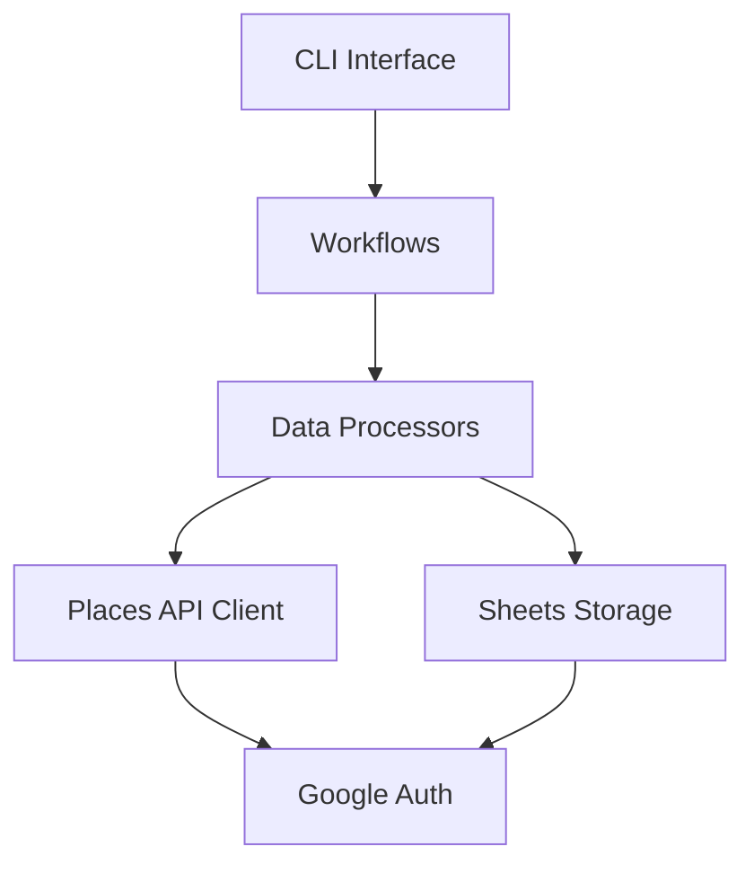

# 🔧 Scraper Tools - 佐渡飲食店マップデータ収集システム

> **Clean Architecture 実装済み**: Google Places API v1 対応・本格運用レディ
> **技術スタック**: Python 3.11+ | Google APIs | Clean Architecture | 依存性注入
> **最終更新**: 2025 年 8 月 28 日

## 🎯 概要

佐渡島の飲食店・施設情報を Google Places API から収集し、Google Sheets に保存する Clean Architecture ベースのデータ収集システムです。

### 主要機能

- 🍽️ **飲食店データ収集**: Google Maps URL・店舗名から詳細情報取得
- 🏪 **多カテゴリ対応**: レストラン・駐車場・トイレ施設
- 📊 **Google Sheets 統合**: 自動的なデータ保存・更新
- 🔧 **Clean Architecture**: 高い保守性・拡張性・テスト容易性
- ⚡ **高性能処理**: レート制限・並列処理・エラーハンドリング

## 🏗️ アーキテクチャ

### レイヤー構成（Clean Architecture）

```text
tools/scraper/
├── 🎭 interface/           # インターフェース層
│   ├── cli/               # コマンドライン実行
│   └── adapters/          # 外部システム連携
├── 📋 application/        # アプリケーション層
│   ├── workflows/         # ワークフロー制御
│   ├── commands/          # コマンドパターン
│   └── dto/              # データ転送オブジェクト
├── 💎 core/              # コア・ビジネスロジック層
│   ├── domain/           # ドメインモデル・インターフェース
│   ├── processors/       # データ処理エンジン
│   └── services/         # ドメインサービス
├── 🔌 infrastructure/    # インフラストラクチャ層
│   ├── external/         # 外部API通信（Google Places）
│   ├── storage/          # データ永続化（Google Sheets）
│   └── auth/            # 認証・権限管理
├── 🛠️ shared/           # 共有ライブラリ
│   ├── types/           # 型定義
│   ├── utils/           # ユーティリティ
│   ├── config.py        # 設定管理
│   ├── logger.py        # ロギング
│   ├── exceptions.py    # 例外定義
│   └── container.py     # 依存性注入コンテナ
├── ⚙️ config/           # 設定・環境ファイル
├── 📊 data/             # データファイル（クエリリスト）
└── 🧪 tests/            # テストスイート
    ├── unit/            # 単体テスト
    └── integration/     # 統合テスト
```

### 依存関係の流れ



## 🚀 クイックスタート

### 1. 環境設定

```bash
# Python仮想環境作成・有効化
cd tools/scraper
python -m venv .venv
.venv\Scripts\Activate.ps1  # Windows PowerShell

# 依存関係インストール
pip install -r config/requirements.txt
```

### 2. 設定ファイル準備

```bash
# 環境変数ファイルをコピー・編集
cp config/.env.example config/.env
# config/.env を編集（下記の設定セクション参照）

# サービスアカウントファイル配置
# config/service-account.json にGoogle Cloud認証情報を配置
```

### 3. 基本実行

```bash
# 設定確認
python interface/cli/main.py --config-check

# API接続テスト
python interface/cli/main.py --test-connections

# ドライラン（処理見積もり）
python interface/cli/main.py --target restaurants --dry-run

# 実際の処理実行
python interface/cli/main.py --target restaurants --mode standard
```

## ⚙️ 設定

### 必須環境変数（config/.env）

```bash
# Google Places API
PLACES_API_KEY=your_places_api_key_here

# Google Sheets API
GOOGLE_SERVICE_ACCOUNT_PATH=config/service-account.json
SPREADSHEET_ID=your_spreadsheet_id_here

# 処理設定
API_DELAY=1.0                    # API呼び出し間隔（秒）
MAX_WORKERS=3                    # 並列処理数
MAX_RETRIES=3                    # リトライ回数
TIMEOUT=30                       # タイムアウト（秒）
BATCH_SIZE=50                    # バッチサイズ
RATE_LIMIT_PER_SECOND=10.0       # レート制限

# ログ設定
LOG_LEVEL=INFO                   # DEBUG, INFO, WARNING, ERROR
LOG_FORMAT=structured            # structured, json, simple
LOG_FILE=logs/scraper.log        # ログファイルパス（オプション）
LOG_CONSOLE=true                 # コンソール出力
```

### Google Cloud 設定

1. **Google Cloud Console**でプロジェクト作成
2. **Places API** と **Sheets API** を有効化
3. **サービスアカウント**作成・認証情報ダウンロード
4. **Google Sheets** でスプレッドシート作成・共有設定

詳細手順: [Google Maps API Setup Guide](../../docs/development/google-maps-api-setup.md)

## 📋 使用方法

### コマンドライン実行

```bash
# 全カテゴリ処理（標準モード）
python interface/cli/main.py --target all --mode standard

# 特定カテゴリのみ処理
python interface/cli/main.py --target restaurants --mode comprehensive

# 高速モード（CID URLのみ）
python interface/cli/main.py --target parkings --mode quick

# ドライラン（見積もりのみ）
python interface/cli/main.py --target all --dry-run
```

### 実行モード

| モード          | 説明       | 処理対象               | 推定時間 |
| --------------- | ---------- | ---------------------- | -------- |
| `quick`         | 高速モード | CID URL のみ           | 短時間   |
| `standard`      | 標準モード | CID URL + 高精度店舗名 | 中程度   |
| `comprehensive` | 包括モード | 全データ + 詳細検証    | 長時間   |

### 処理対象カテゴリ

| カテゴリ      | データファイル                | 説明               |
| ------------- | ----------------------------- | ------------------ |
| `restaurants` | `data/restaurants_merged.txt` | 飲食店情報         |
| `parkings`    | `data/parkings_merged.txt`    | 駐車場情報         |
| `toilets`     | `data/toilets_merged.txt`     | トイレ施設情報     |
| `all`         | 上記すべて                    | 全カテゴリ一括処理 |

## 🧪 テスト

### テスト実行

```bash
# 全テストスイート実行
python -m pytest tests/

# 単体テストのみ
python -m pytest tests/unit/

# 統合テストのみ
python -m pytest tests/integration/

# カバレッジレポート生成
python -m pytest tests/ --cov=. --cov-report=html
```

### テスト構成

```text
tests/
├── unit/                  # 単体テスト
│   ├── test_config.py        # 設定管理テスト
│   ├── test_logger_simple.py # ロギングテスト
│   └── test_exceptions_simple.py # 例外ハンドリングテスト
├── integration/           # 統合テスト
│   ├── test_end_to_end.py    # エンドツーエンドテスト
│   └── test_performance.py  # パフォーマンステスト
└── conftest.py           # テスト設定
```

## 📊 パフォーマンス

### 処理性能目標

| 指標         | 現在値         | 目標値         | 備考                     |
| ------------ | -------------- | -------------- | ------------------------ |
| 処理時間     | 60 秒/カテゴリ | 30 秒/カテゴリ | 並列処理最適化           |
| API 効率     | 50 回/分       | 100 回/分      | バッチ処理実装           |
| エラー率     | 1%             | 0.5%           | 堅牢なエラーハンドリング |
| メモリ使用量 | 256MB          | 128MB          | 効率的なデータ構造       |

### 最適化設定

```bash
# 高性能設定例
API_DELAY=0.5
MAX_WORKERS=5
BATCH_SIZE=100
RATE_LIMIT_PER_SECOND=20.0
```

## 🔧 カスタマイズ・拡張

### 新しいデータソース追加

1. **データファイル作成**: `data/new_category.txt`
2. **カテゴリ型追加**: `shared/types/core_types.py`
3. **プロセッサ拡張**: `core/processors/data_processor.py`
4. **CLI 更新**: `interface/cli/main.py`

### カスタムプロセッサ実装

```python
# core/processors/custom_processor.py
from core.processors.data_processor import DataProcessor

class CustomDataProcessor(DataProcessor):
    def process_custom_data(self, data: Dict) -> Dict:
        # カスタム処理ロジック
        return processed_data
```

### 新しい API クライアント統合

```python
# infrastructure/external/custom_api_client.py
from core.domain.interfaces import APIClient

class CustomAPIClient(APIClient):
    def fetch_place_details(self, place_id: str) -> Optional[Dict]:
        # カスタムAPI実装
        pass
```

## 🛠️ 開発・デバッグ

### ログレベル設定

```bash
# デバッグモード
LOG_LEVEL=DEBUG python interface/cli/main.py --target restaurants

# 詳細ログファイル出力
LOG_FILE=logs/debug.log python interface/cli/main.py --config-check
```

### デバッグ用ユーティリティ

```python
# 設定確認
from shared.config import ScraperConfig
config = ScraperConfig.from_environment()
print(config.get_summary())

# 依存性注入コンテナ確認
from shared.container import create_container
container = create_container(config)
print(container.list_services())
```

## 📚 関連ドキュメント

### アーキテクチャ・設計

- [ADR-003: Scraper Architecture Redesign](../../docs/architecture/ADR-003-scraper-architecture-redesign.md)
- [Clean Architecture Migration Plan](../../docs/planning/SCRAPER_CLEAN_ARCHITECTURE_MIGRATION_PLAN.md)

### 開発ガイド

- [Copilot Instructions](../../docs/development/copilot-instructions.md)
- [Environment Setup Guide](../../docs/development/environment-setup-guide.md)
- [Google Maps API Setup](../../docs/development/google-maps-api-setup.md)

### プロジェクト管理

- [Scraper Migration Executive Summary](../../docs/planning/SCRAPER_MIGRATION_PLAN_EXECUTIVE_SUMMARY.md)

## 🚨 トラブルシューティング

### よくある問題

#### 1. API 認証エラー

```bash
❌ Google Places API: 認証失敗

# 解決策
1. PLACES_API_KEY が正しく設定されているか確認
2. Google Cloud Console でAPIが有効化されているか確認
3. 課金設定が有効になっているか確認
```

#### 2. Google Sheets アクセスエラー

```bash
❌ Google Sheets API: 権限エラー

# 解決策
1. サービスアカウントファイルのパスが正しいか確認
2. スプレッドシートがサービスアカウントと共有されているか確認
3. Sheets API が有効化されているか確認
```

#### 3. レート制限エラー

```bash
⚠️ API Rate Limit Exceeded

# 解決策
1. API_DELAY を大きく設定（例：2.0）
2. MAX_WORKERS を減らす（例：1）
3. RATE_LIMIT_PER_SECOND を下げる（例：5.0）
```

### ログ確認

```bash
# 最新のログ確認
tail -f logs/scraper.log

# エラーログのみ抽出
grep "ERROR" logs/scraper.log

# 特定の処理のログ確認
grep "restaurants" logs/scraper.log
```

## 📊 監視・メトリクス

### パフォーマンス監視

- **処理時間**: 各カテゴリの実行時間
- **API 呼び出し数**: Places API 使用量
- **エラー率**: 失敗したリクエストの割合
- **データ品質**: 取得できた店舗情報の完全性

### ログ分析

- **構造化ログ**: JSON 形式での詳細ログ出力
- **メトリクス収集**: 処理時間・エラー率の自動集計
- **アラート設定**: 異常状態の早期検知

## 🔄 CI/CD・自動化

### 自動テスト

```yaml
# .github/workflows/scraper-tests.yml
name: Scraper Tests
on: [push, pull_request]
jobs:
  test:
    runs-on: ubuntu-latest
    steps:
      - uses: actions/checkout@v4
      - name: Setup Python
        uses: actions/setup-python@v4
        with:
          python-version: "3.11"
      - name: Install dependencies
        run: pip install -r tools/scraper/config/requirements.txt
      - name: Run tests
        run: python -m pytest tools/scraper/tests/
```

### 定期実行

```bash
# crontab設定例（毎日午前3時実行）
0 3 * * * cd /path/to/project/tools/scraper && python interface/cli/main.py --target all --mode standard
```

## 🚀 本番運用

### デプロイ準備

1. **環境変数設定**: 本番用設定値の確認
2. **サービスアカウント**: 本番用認証情報の配置
3. **ログ設定**: 適切なログレベル・出力先設定
4. **監視設定**: エラーアラート・メトリクス収集

### 運用監視

- **ヘルスチェック**: 定期的な接続テスト実行
- **リソース監視**: CPU・メモリ使用量の確認
- **データ品質**: 取得データの整合性チェック
- **コスト監視**: Google API 使用量・課金の確認

---

## 💡 開発 Tips

### 効率的な開発フロー

1. **ドライラン確認**: 実際の処理前に必ず `--dry-run` で確認
2. **小さな単位でテスト**: カテゴリ別に段階的にテスト
3. **ログ活用**: `LOG_LEVEL=DEBUG` で詳細な動作確認
4. **設定確認**: `--config-check` で環境設定の検証

### パフォーマンス最適化

1. **並列処理調整**: `MAX_WORKERS` の適切な設定
2. **API 制限対応**: `API_DELAY` と `RATE_LIMIT_PER_SECOND` の調整
3. **バッチサイズ最適化**: `BATCH_SIZE` による効率化
4. **キャッシュ活用**: 重複リクエストの削減

---

**🎯 このスクレイパーシステムは、Clean Architecture の原則に基づいて設計された高性能・高信頼性のデータ収集システムです。**

**質問・サポートが必要な場合は、プロジェクトの開発ドキュメントを参照するか、開発チームまでお問い合わせください。**
