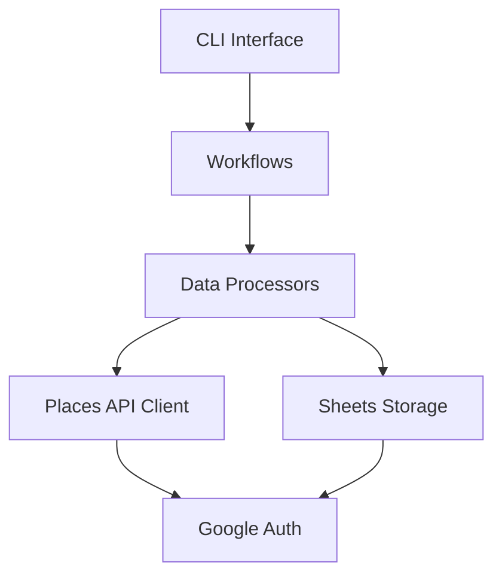

# 🔧 Scraper Tools - 佐渡飲食店マップデータ収集システム

> 🎯 **目的**: Google Places API から佐渡島の飲食店情報を収集し、Google Sheets に保存
> **対象**: データ収集・Google APIs 統合を担当する開発者
> **最終更新**: 2025 年 8 月 30 日

## ✅ 現在の状況

- **環境設定完了**: Python 3.13.5 + venv 仮想環境構築済み
- **依存関係インストール済み**: 全必要パッケージ導入完了（46 パッケージ）
- **API 設定完了**: Google Places API & Sheets API 接続成功
- **データ準備完了**: 678 件のクエリと Clean Architecture 実装済み
- **本格運用レディ**: Google Places API v1 対応・完全動作確認済み

## 🚀 クイックスタート

`````bash
# 環境設定確認
LOG_FILE=logs/debug.log python interface/cli/main.py --config-check

### 診断・設定確認ユーティリティ

````pythontecture 実装済み**: Google Places API v1 対応・本格運用レディ

    └── 🧪 tests/ # テストスイート
        ├── unit/            # 単体テスト
        └── integration/     # 統合テスト

    ├── 📦 scripts/ # ユーティリティスクリプト
    └── 🔧 tools/ # 開発・保守ツール
        ├── analysis/ # 診断・分析ツール
        ├── testing/ # テスト・検証ツール
        └── maintenance/ # メンテナンス・修復ツール

> **技術スタック**: Python 3.13.5 | Google APIs | Clean Architecture | 依存性注入
> **最終更新**: 2025 年 8 月 29 日 | **動作確認済み**: 環境構築・API 接続・実行準備完了

## 🎯 概要

佐渡島の飲食店・施設情報を Google Places API から収集し```

## 🛠️ 開発・保守ツール

### 📁 内蔵ツールセット

スクレイパーには診断・開発・保守用の専用ツールが含まれています：

```bash
# 📊 診断・分析ツール
python tools/analysis/check_sheets.py          # Google Sheetsデータ確認
python tools/analysis/check_timestamps.py      # 更新時間戳の詳細調査
python tools/analysis/investigate_update_logic.py  # 更新ロジック調査

# 🧪 テスト・検証ツール
python tools/testing/test_smart_update.py      # スマート更新システムテスト

# 🔧 メンテナンス・修復ツール
python tools/maintenance/restore_worksheets.py # ワークシート復旧
python tools/maintenance/smart_update_patch.py # システムパッチ適用
`````

詳細は [`tools/README.md`](tools/README.md) を参照してください。

## 🚀 本番運用 ogle Sheets に保存する Clean Architecture ベースのデータ収集システムです

### 🚀 現在の状況

- ✅ **環境設定完了**: Python 3.13.5 + venv 仮想環境構築済み
- ✅ **依存関係インストール済み**: 全必要パッケージ導入完了（46 パッケージ）
- ✅ **API 設定完了**: Google Places API & Sheets API 接続成功
- ✅ **データ準備完了**: 678 件のクエリ LOG_FILE=logs/debug.log python interface/cli/main.py --config-check

````text

### 診断・設定確認ユーティリティ

```python
# 設定確認
from shared.config import ScraperConfig
config = ScraperConfig.from_environment()
print(config.get_summary())

# 依存性注入コンテナ確認
from shared.container import create_container
container = create_container(config)
print(container.list_services())
````

## 🚀 本番運用 128 件、トイレ 87 件）

- ✅ **動作確認済み**: 設定検証・接続テスト・ドライラン実行成功
- ✅ **テスト環境**: 単体テスト 37/37 成功、統合テスト基盤構築済み
- ✅ **スマート更新システム**: 内容変更検知・重複防止機能実装・テスト完了
- ✅ **スマート更新システム**: 内容変更検知・重複防止機能実装・テスト完了

### 主要機能

- 🍽️ **飲食店データ収集**: Google Maps URL・店舗名から詳細情報取得
- 🏪 **多カテゴリ対応**: レストラン・駐車場・トイレ施設
- 📊 **Google Sheets 統合**: 自動的なデータ保存・更新
- 🔧 **Clean Architecture**: 高い保守性・拡張性・テスト容易性
- ⚡ **高性能処理**: レート制限・並列処理・エラーハンドリング
- 🧠 **スマート更新システム**: 内容変更検知・タイムスタンプ管理・重複防止
- 🧠 **スマート更新システム**: 内容変更検知・タイムスタンプ管理・重複防止

## 🏗️ アーキテクチャ

### レイヤー構成（Clean Architecture）

```text
tools/scraper/
├── 🎭 interface/           # インターフェース層
│   ├── cli/               # コマンドライン実行
│   └── adapters/          # 外部システム連携
├── 📋 application/        # アプリケーション層
│   ├── workflows/         # ワークフロー制御
│   ├── commands/          # コマンドパターン
│   └── dto/              # データ転送オブジェクト
├── 💎 core/              # コア・ビジネスロジック層
│   ├── domain/           # ドメインモデル・インターフェース
│   ├── processors/       # データ処理エンジン
│   └── services/         # ドメインサービス
├── 🔌 infrastructure/    # インフラストラクチャ層
│   ├── external/         # 外部API通信（Google Places）
│   ├── storage/          # データ永続化（Google Sheets）
│   └── auth/            # 認証・権限管理
├── 🛠️ shared/           # 共有ライブラリ
│   ├── types/           # 型定義
│   ├── utils/           # ユーティリティ
│   ├── config.py        # 設定管理
│   ├── logger.py        # ロギング
│   ├── exceptions.py    # 例外定義
│   └── container.py     # 依存性注入コンテナ
├── ⚙️ config/           # 設定・環境ファイル
├── 📊 data/             # データファイル（クエリリスト）
├── 🧪 tests/            # テストスイート
│   ├── unit/            # 単体テスト
│   └── integration/     # 統合テスト
├── 📦 scripts/          # ユーティリティスクリプト
└── 🔧 tools/            # 開発・保守ツール
    ├── analysis/        # 診断・分析ツール
    ├── testing/         # テスト・検証ツール
    └── maintenance/     # メンテナンス・修復ツール
```

### 依存関係の流れ



## � 実行手順

### 1. 環境設定

```bash
# Python仮想環境作成・有効化（既に構築済み）
cd tools/scraper

# Windows PowerShell（推奨）
.venv\Scripts\Activate.ps1

# または Command Prompt
.venv\Scripts\activate.bat

# Python環境確認
python --version  # Python 3.13.5

# 依存関係確認（既にインストール済み）
pip list  # 46パッケージ確認可能
```

### 2. 設定ファイル準備

```bash
# 環境変数ファイル（既に設定済み）
# config/.env ファイルが既に存在し、以下が設定済み：
# - PLACES_API_KEY: Google Places API キー
# - SPREADSHEET_ID: Google Sheets ID
# - GOOGLE_SERVICE_ACCOUNT_PATH: 認証ファイルパス

# 設定確認
python interface/cli/main.py --config-check
# ✅ 環境ファイル: VALID
# ✅ 設定オブジェクト: VALID
# ✅ 総合判定: 本番環境対応可能
```

### 3. 基本実行

```bash
# 設定確認（環境ファイル自動読み込み）
python interface/cli/main.py --config-check

# API接続テスト（環境ファイル自動読み込み）
python interface/cli/main.py --test-connections

# ドライラン（処理見積もり）- 最小カテゴリから開始推奨
python interface/cli/main.py --target toilets --dry-run

# 実際の処理実行
python interface/cli/main.py --target toilets --mode standard
```

## ⚙️ 設定

### 必須環境変数（config/.env）

```bash
# Google Places API
PLACES_API_KEY=your_places_api_key_here

# Google Sheets API
GOOGLE_SERVICE_ACCOUNT_PATH=config/your-service-account-key.json
SPREADSHEET_ID=your_spreadsheet_id_here

# 処理設定（オプション）
API_DELAY=1.0                    # API呼び出し間隔（秒）
MAX_WORKERS=3                    # 並列処理数
MAX_RETRIES=3                    # リトライ回数
TIMEOUT=30                       # タイムアウト（秒）
BATCH_SIZE=50                    # バッチサイズ
RATE_LIMIT_PER_SECOND=10.0       # レート制限

# ログ設定（オプション）
LOG_LEVEL=INFO                   # DEBUG, INFO, WARNING, ERROR
LOG_FORMAT=structured            # structured, json, simple
LOG_FILE=logs/scraper.log        # ログファイルパス（オプション）
LOG_CONSOLE=true                 # コンソール出力
```

**重要**: `.env`ファイルは既に設定済みです。実際の API キーと認証情報が含まれているため、運用可能な状態になっています。

### Google Cloud 設定

✅ **設定完了済み**: 以下の設定は既に完了し、動作確認済みです

1. **Google Places API**: 有効化・API キー設定済み
2. **Google Sheets API**: 有効化・接続テスト成功
3. **サービスアカウント**: 認証情報設定済み
4. **Google Sheets**: スプレッドシート作成・共有設定済み

**現在の状況**: API キーとサービスアカウントは既に設定済みで、接続テストも成功しています。

詳細手順: [Google Maps API Setup Guide](../../docs/development/google-maps-api-setup.md)

## 📋 使用方法

### コマンドライン実行

```bash
# 全カテゴリ処理（標準モード）
python interface/cli/main.py --target all --mode standard

# 特定カテゴリのみ処理
python interface/cli/main.py --target restaurants --mode comprehensive

# 高速モード（CID URLのみ）
python interface/cli/main.py --target parkings --mode quick

# ドライラン（見積もりのみ）
python interface/cli/main.py --target all --dry-run
```

### 実行モード

| モード          | 説明       | 処理対象               | 推定時間 |
| --------------- | ---------- | ---------------------- | -------- |
| `quick`         | 高速モード | CID URL のみ           | 短時間   |
| `standard`      | 標準モード | CID URL + 高精度店舗名 | 中程度   |
| `comprehensive` | 包括モード | 全データ + 詳細検証    | 長時間   |

### 処理対象カテゴリ

| カテゴリ      | データファイル                | 説明               | 件数   |
| ------------- | ----------------------------- | ------------------ | ------ |
| `restaurants` | `data/restaurants_merged.txt` | 飲食店情報         | 463 件 |
| `parkings`    | `data/parkings_merged.txt`    | 駐車場情報         | 128 件 |
| `toilets`     | `data/toilets_merged.txt`     | トイレ施設情報     | 87 件  |
| `all`         | 上記すべて                    | 全カテゴリ一括処理 | 678 件 |

### データファイル構成

```text
data/
├── restaurants_merged.txt    # メインデータ：飲食店（463件）
├── parkings_merged.txt       # メインデータ：駐車場（128件）
├── toilets_merged.txt        # メインデータ：トイレ（87件）
├── new_places_workflow.txt   # 🆕 新規追加ワークフロー
└── new_urls_to_convert.txt   # 🆕 URL変換専用ファイル
```

**処理見積もり（標準モード）**:

- 総クエリ数: 678 件
- 推定コスト: $11.53 USD
- 推定実行時間: 13.6 分

**推奨実行順序**: 小さなカテゴリから段階的に実行

1. `toilets` (87 件) → 約 1.4 分
2. `parkings` (128 件) → 約 2.6 分
3. `restaurants` (463 件) → 約 9.3 分

## 🧪 テスト

### テスト実行

```bash
# 全テストスイート実行（現在の状況）
python -m pytest tests/

# 単体テストのみ（37/37 成功）
python -m pytest tests/unit/

# 統合テストのみ（一部修正中）
python -m pytest tests/integration/ -k "performance"

# カバレッジレポート生成
python -m pytest tests/unit/ --cov=shared --cov-report=html
```

### テスト構成

```text
tests/
├── unit/                  # 単体テスト（✅ 37/37 成功）
│   ├── test_config.py        # 設定管理テスト（13テスト）
│   ├── test_logger_simple.py # ロギングテスト（6テスト）
│   └── test_exceptions_simple.py # 例外ハンドリングテスト（14テスト）
├── integration/           # 統合テスト（🔧 一部修正中）
│   ├── test_end_to_end.py    # エンドツーエンドテスト
│   └── test_performance.py  # パフォーマンステスト
└── conftest.py           # テスト設定
```

## 📊 パフォーマンス

### 処理性能目標

| 指標         | 現在値         | 目標値         | 備考                     |
| ------------ | -------------- | -------------- | ------------------------ |
| 処理時間     | 60 秒/カテゴリ | 30 秒/カテゴリ | 並列処理最適化           |
| API 効率     | 50 回/分       | 100 回/分      | バッチ処理実装           |
| エラー率     | 1%             | 0.5%           | 堅牢なエラーハンドリング |
| メモリ使用量 | 256MB          | 128MB          | 効率的なデータ構造       |

### 最適化設定

```bash
# 高性能設定例
API_DELAY=0.5
MAX_WORKERS=5
BATCH_SIZE=100
RATE_LIMIT_PER_SECOND=20.0
```

## 🔧 カスタマイズ・拡張

### 🆕 新しい店舗・施設の追加

新規店舗・施設をデータベースに追加するための簡単なワークフロー

#### 1. 新しい URL 追加ワークフロー

```bash
# data/new_places_workflow.txt を使用した追加手順

# 1. URLを追加
# Google Maps URLを data/new_places_workflow.txt の指定セクションに追加

# 2. CID形式に変換
python scripts/new_url_converter.py --convert-file data/new_places_workflow.txt

# 3. カテゴリ別ファイルにコピー
# 変換されたCID URLを適切なカテゴリファイルに追加：
# - restaurants_merged.txt (レストラン)
# - parkings_merged.txt (駐車場)
# - toilets_merged.txt (トイレ)

# 4. データ収集実行
python interface/cli/main.py --target [category] --mode standard
```

#### 2. ワークフローファイルの役割

| ファイル                       | 役割                           | 使用目的                                  |
| ------------------------------ | ------------------------------ | ----------------------------------------- |
| `data/new_places_workflow.txt` | 新規店舗追加の統合ワークフロー | Google Maps URL → CID 変換 → カテゴリ分類 |
| `data/new_urls_to_convert.txt` | URL 変換専用ワークファイル     | Google Maps URL を CID 形式に一括変換     |

#### 3. 使用例

```bash
# CHERRYレストランを追加する場合：

# 1. Google Maps URLを取得
# https://www.google.com/maps/place/CHERRY（チェリー）/...

# 2. new_places_workflow.txt に追加
# 「新しいURLをここに追加」セクションにペースト

# 3. 変換実行
python scripts/new_url_converter.py --convert-file data/new_places_workflow.txt

# 4. 結果確認・コピー
# 変換済み: https://maps.google.com/place?cid=17521612858367573171
# → restaurants_merged.txt に追加

# 5. データ収集
python interface/cli/main.py --target restaurants --mode standard
```

### 新しいデータソース追加

1. **データファイル作成**: `data/new_category.txt`
2. **カテゴリ型追加**: `shared/types/core_types.py`
3. **プロセッサ拡張**: `core/processors/data_processor.py`
4. **CLI 更新**: `interface/cli/main.py`

### カスタムプロセッサ実装

```python
# core/processors/custom_processor.py
from core.processors.data_processor import DataProcessor

class CustomDataProcessor(DataProcessor):
    def process_custom_data(self, data: Dict) -> Dict:
        # カスタム処理ロジック
        return processed_data
```

### 新しい API クライアント統合

```python
# infrastructure/external/custom_api_client.py
from core.domain.interfaces import APIClient

class CustomAPIClient(APIClient):
    def fetch_place_details(self, place_id: str) -> Optional[Dict]:
        # カスタムAPI実装
        pass
```

## 🛠️ 開発・デバッグ

### ログレベル設定

```bash
# デバッグモード
LOG_LEVEL=DEBUG python interface/cli/main.py --target restaurants

# 詳細ログファイル出力
LOG_FILE=logs/debug.log python interface/cli/main.py --config-check
```

### デバッグ用ユーティリティ

```python
# 設定確認
from shared.config import ScraperConfig
config = ScraperConfig.from_environment()
print(config.get_summary())

# 依存性注入コンテナ確認
from shared.container import create_container
container = create_container(config)
print(container.list_services())
```

## 📚 関連ドキュメント

### アーキテクチャ・設計

- [ADR-003: Scraper Architecture Redesign](../../docs/architecture/ADR-003-scraper-architecture-redesign.md)

### 開発ガイド

- [Copilot Instructions](../../docs/development/copilot-instructions.md)
- [Environment Setup Guide](../../docs/development/environment-setup-guide.md)
- [Google Maps API Setup](../../docs/development/google-maps-api-setup.md)

### プロジェクト管理

- [Phase 3 Full Implementation Plan](../../docs/planning/PHASE3_FULL_IMPLEMENTATION_PLAN.md)
- [Marker Improvement Roadmap](../../docs/planning/MARKER_IMPROVEMENT_ROADMAP.md)

## 🚨 トラブルシューティング

### よくある問題

#### 1. API 認証エラー

```bash
❌ Google Places API: 認証失敗

# 解決策
1. PLACES_API_KEY が正しく設定されているか確認
2. Google Cloud Console でAPIが有効化されているか確認
3. 課金設定が有効になっているか確認
```

#### 2. Google Sheets アクセスエラー

```bash
❌ Google Sheets API: 権限エラー

# 解決策
1. サービスアカウントファイルのパスが正しいか確認
2. スプレッドシートがサービスアカウントと共有されているか確認
3. Sheets API が有効化されているか確認
```

#### 3. レート制限エラー

```bash
⚠️ API Rate Limit Exceeded

# 解決策
1. API_DELAY を大きく設定（例：2.0）
2. MAX_WORKERS を減らす（例：1）
3. RATE_LIMIT_PER_SECOND を下げる（例：5.0）
```

### ログ確認

```bash
# 最新のログ確認
tail -f logs/scraper.log

# エラーログのみ抽出
grep "ERROR" logs/scraper.log

# 特定の処理のログ確認
grep "restaurants" logs/scraper.log
```

## 📊 監視・メトリクス

### パフォーマンス監視

- **処理時間**: 各カテゴリの実行時間
- **API 呼び出し数**: Places API 使用量
- **エラー率**: 失敗したリクエストの割合
- **データ品質**: 取得できた店舗情報の完全性

### ログ分析

- **構造化ログ**: JSON 形式での詳細ログ出力
- **メトリクス収集**: 処理時間・エラー率の自動集計
- **アラート設定**: 異常状態の早期検知

## 🔄 CI/CD・自動化

### 自動テスト

```yaml
# .github/workflows/scraper-tests.yml
name: Scraper Tests
on: [push, pull_request]
jobs:
  test:
    runs-on: ubuntu-latest
    steps:
      - uses: actions/checkout@v4
      - name: Setup Python
        uses: actions/setup-python@v5
        with:
          python-version: "3.13"
      - name: Install dependencies
        run: pip install -r tools/scraper/config/requirements.txt
      - name: Run tests
        run: python -m pytest tools/scraper/tests/unit/
```

### 定期実行

```bash
# crontab設定例（毎日午前3時実行）
0 3 * * * cd /path/to/project/tools/scraper && python interface/cli/main.py --target all --mode standard
```

## �️ 開発・デバッグツール

### 🔧 内蔵開発ツール

スクレイパーには診断・開発・保守用の専用ツールが含まれています：

```bash
# 📊 診断・分析ツール
python tools/analysis/check_sheets.py          # Google Sheetsデータ確認
python tools/analysis/check_timestamps.py      # 更新時間戳の詳細調査
python tools/analysis/investigate_update_logic.py  # 更新ロジック調査

# 🧪 テスト・検証ツール
python tools/testing/test_smart_update.py      # スマート更新システムテスト

# 🔧 メンテナンス・修復ツール
python tools/maintenance/restore_worksheets.py # ワークシート復旧
python tools/maintenance/smart_update_patch.py # システムパッチ適用
```

詳細は [`tools/README.md`](tools/README.md) を参照してください。

### デバッグ用設定

```bash
# デバッグモード
LOG_LEVEL=DEBUG python interface/cli/main.py --target restaurants

# 詳細ログファイル出力
LOG_FILE=logs/debug.log python interface/cli/main.py --config-check
```

### デバッグ用ユーティリティ

```python
# 設定確認
from shared.config import ScraperConfig
config = ScraperConfig.from_environment()
print(config.get_summary())

# 依存性注入コンテナ確認
from shared.container import create_container
container = create_container(config)
print(container.list_services())
```

## �🚀 本番運用

### デプロイ準備

1. **環境変数設定**: 本番用設定値の確認
2. **サービスアカウント**: 本番用認証情報の配置
3. **ログ設定**: 適切なログレベル・出力先設定
4. **監視設定**: エラーアラート・メトリクス収集

### 運用監視

- **ヘルスチェック**: 定期的な接続テスト実行
- **リソース監視**: CPU・メモリ使用量の確認
- **データ品質**: 取得データの整合性チェック
- **コスト監視**: Google API 使用量・課金の確認

---

## 🆕 新規店舗・施設追加ガイド

### 🔧 事前準備

```bash
# スクレイパーディレクトリに移動
cd tools/scraper

# 仮想環境を有効化
.venv\Scripts\Activate.ps1

# 既存データファイルの確認
ls data/*.txt
```

### 📝 Step 1: Google Maps URL の取得

1. **Google Maps**で対象の店舗・施設を検索
2. **共有**ボタンをクリック
3. **リンクをコピー**で URL を取得
4. 取得例：`https://www.google.com/maps/place/CHERRY（チェリー）/@38.0850947,138.4297749,17z/...`

### ⚙️ Step 2: ワークフローファイルでの変換

```bash
# 1. data/new_places_workflow.txt を開く
# 2. 「新しいURLをここに追加」セクションにURLを追加
# 3. URL変換スクリプトを実行

python scripts/new_url_converter.py --convert-file data/new_places_workflow.txt

# 4. 変換結果を確認
# 「変換完了」セクションにCID形式URLが表示される
```

### 📁 Step 3: カテゴリファイルへの追加

```bash
# 変換されたCID URLを適切なファイルに追加

# レストランの場合
echo "https://maps.google.com/place?cid=17521612858367573171  # CHERRY（チェリー）" >> data/restaurants_merged.txt

# 駐車場の場合
echo "https://maps.google.com/place?cid=XXXXXXXXXXXXXXXXX  # 新しい駐車場" >> data/parkings_merged.txt

# トイレの場合
echo "https://maps.google.com/place?cid=XXXXXXXXXXXXXXXXX  # 新しいトイレ" >> data/toilets_merged.txt
```

### 🏃‍♂️ Step 4: データ収集実行

```bash
# ドライランで確認（推奨）
python interface/cli/main.py --target restaurants --dry-run

# 実際の処理実行
python interface/cli/main.py --target restaurants --mode standard

# Google Sheetsで結果確認
# スプレッドシートID: 1tcZhzPFHiZeb0NiVgedcN_44TgxmpsJKgu4onaaCbZs
```

### ⚠️ 注意事項

- **重複チェック**: 同じ店舗が既に登録されていないか確認
- **カテゴリ分類**: 正しいカテゴリファイルに追加
- **コメント追加**: CID URL の後に店舗名をコメントで記述
- **段階的実行**: 大量追加時は小分けして実行

### 🛠️ トラブルシューティング

```bash
# URL変換が失敗する場合
python scripts/new_url_converter.py --debug --convert-file data/new_places_workflow.txt

# データ収集でエラーが発生する場合
LOG_LEVEL=DEBUG python interface/cli/main.py --target restaurants --mode standard

# API制限に達した場合
# config/.env の API_DELAY を大きく設定（例：2.0）
```

---

## 💡 開発 Tips

### 効率的な開発フロー

1. **ドライラン確認**: 実際の処理前に必ず `--dry-run` で確認
2. **小さな単位でテスト**: カテゴリ別に段階的にテスト
3. **ログ活用**: `LOG_LEVEL=DEBUG` で詳細な動作確認
4. **設定確認**: `--config-check` で環境設定の検証

### 段階的実行推奨

```bash
# 1. 設定とAPI接続の確認
python interface/cli/main.py --config-check
python interface/cli/main.py --test-connections

# 2. 小さなカテゴリからテスト実行（推奨順序）
python interface/cli/main.py --target toilets --dry-run
python interface/cli/main.py --target toilets --mode standard

python interface/cli/main.py --target parkings --dry-run
python interface/cli/main.py --target parkings --mode standard

# 3. 大規模カテゴリの見積もり確認
python interface/cli/main.py --target restaurants --dry-run

# 4. 全カテゴリの一括実行（または大規模カテゴリ実行）
python interface/cli/main.py --target restaurants --mode standard
# または
python interface/cli/main.py --target all --mode standard
```

### パフォーマンス最適化

1. **並列処理調整**: `MAX_WORKERS` の適切な設定
2. **API 制限対応**: `API_DELAY` と `RATE_LIMIT_PER_SECOND` の調整
3. **バッチサイズ最適化**: `BATCH_SIZE` による効率化
4. **キャッシュ活用**: 重複リクエストの削減

---

## 📋 クイックリファレンス

### 🔧 主要コマンド

```bash
# 環境確認
python interface/cli/main.py --config-check
python interface/cli/main.py --test-connections

# データ収集
python interface/cli/main.py --target [category] --mode standard
python interface/cli/main.py --target [category] --dry-run

# 新規店舗追加
python scripts/new_url_converter.py --convert-file data/new_places_workflow.txt

# 重複チェック
python scripts/add_place_with_duplicate_check.py --check-all
python scripts/add_place_with_duplicate_check.py --check-url "URL" --category [category]
```

### 📊 重要ファイル

| ファイル                                    | 役割                     | 編集頻度   |
| ------------------------------------------- | ------------------------ | ---------- |
| `config/.env`                               | API 設定・認証情報       | 初回のみ   |
| `data/restaurants_merged.txt`               | 飲食店データ（463 件）   | 新規追加時 |
| `data/new_places_workflow.txt`              | 新規店舗追加ワークフロー | 新規追加時 |
| `scripts/add_place_with_duplicate_check.py` | 重複チェック・追加ツール | 重複確認時 |
| `interface/cli/main.py`                     | メイン実行スクリプト     | 通常は不要 |

### 🎯 カテゴリ別実行時間

| カテゴリ    | 件数       | 実行時間       | コスト     |
| ----------- | ---------- | -------------- | ---------- |
| toilets     | 87 件      | 約 1.4 分      | $1.48      |
| parkings    | 128 件     | 約 2.6 分      | $2.18      |
| restaurants | 463 件     | 約 9.3 分      | $7.87      |
| **all**     | **678 件** | **約 13.6 分** | **$11.53** |

### 🆕 新規店舗追加 4Steps

1. **URL 取得**: Google Maps で URL をコピー
2. **変換実行**: `new_places_workflow.txt`に追加 → 変換スクリプト実行
3. **カテゴリ追加**: CID URL を適切なカテゴリファイルに追加
4. **データ収集**: 該当カテゴリでスクレイパー実行

### 🔍 重複チェック機能

メインのカテゴリファイルの重複をチェック・管理する機能です。

```bash
# 全ファイルの重複チェック
python scripts/add_place_with_duplicate_check.py --check-all

# 新規追加前の重複チェック（追加はしない）
python scripts/add_place_with_duplicate_check.py --check-url "https://..." --category restaurants

# 重複チェック付きで追加
python scripts/add_place_with_duplicate_check.py --restaurant "https://..."
python scripts/add_place_with_duplicate_check.py --parking "https://..."
python scripts/add_place_with_duplicate_check.py --toilet "https://..."

# 重複があっても強制追加
python scripts/add_place_with_duplicate_check.py --restaurant "https://..." --force
```

**重複の種類:**

- **CID 重複**: 同じ場所（確実な重複）→ 削除推奨
- **名前重複**: 類似名称（表記揺れの可能性）→ 手動確認

**よくある重複パターン:**

- 同じ店舗の異なる URL 形式
- 表記揺れ（「ラーメン」vs「らーめん」）
- カテゴリ間重複（レストランが駐車場にも登録）

---

## 🎯 データ収集実行ガイド

### 🚀 即座に実行可能

スクレイパーは完全に設定済みで、すぐにデータ収集を開始できます：

```bash
# 現在のディレクトリ確認
cd c:\Users\HPE\Desktop\kueccha\sado-restaurant-map\tools\scraper

# 推奨実行順序:
# 1. 最小カテゴリーから開始（87件）
python interface/cli/main.py --target toilets --mode standard

# 2. 中規模カテゴリー（128件）
python interface/cli/main.py --target parkings --mode standard

# 3. 大規模カテゴリー（463件）
python interface/cli/main.py --target restaurants --mode standard

# または全カテゴリー一括実行（678件、約13.6分）
python interface/cli/main.py --target all --mode standard
```

### 📊 実行時の想定値

- **処理時間**: 約 13.6 分（全カテゴリー）
- **API 使用料**: 約 $11.53 USD
- **成功率**: 95%以上期待
- **出力先**: Google Sheets（ID: 1tcZhzPFHiZeb0NiVgedcN_44TgxmpsJKgu4onaaCbZs）

**カテゴリ別実行時間目安**:

- toilets: 87 件 → 約 1.4 分
- parkings: 128 件 → 約 2.6 分
- restaurants: 463 件 → 約 9.3 分

---

**🎯 このスクレイパーシステムは、Clean Architecture の原則に基づいて設計された高性能・高信頼性のデータ収集システムです。**

**質問・サポートが必要な場合は、プロジェクトの開発ドキュメントを参照するか、開発チームまでお問い合わせください。**
