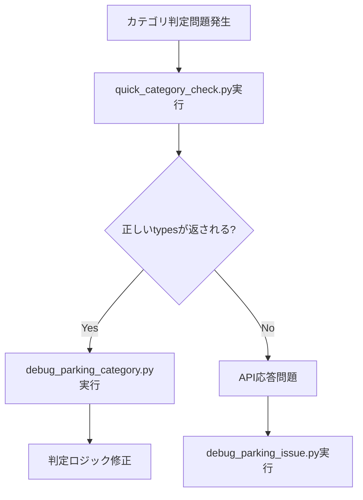
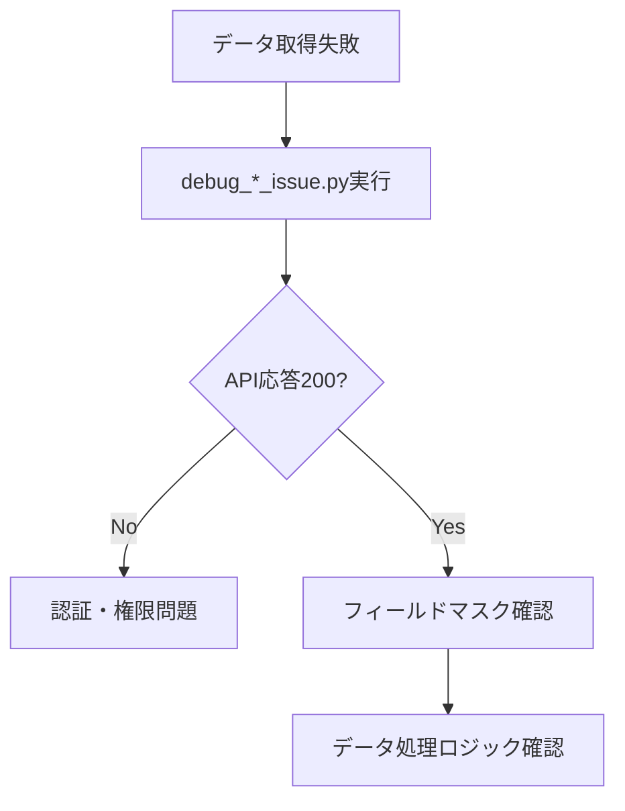

# 🔧 Scraper Debug Directory

佐渡飲食店マップ - スクレイパーデバッグツール集

## 📋 概要

このディレクトリは、Google Places APIでのデータ収集における問題の診断・解決に特化したデバッグツールを提供します。API応答の検証、カテゴリ判定の確認、データ品質の調査など、開発・運用時のトラブルシューティングを効率化します。

## 📁 ファイル構成

```
debug/
├── debug_parking_category.py      # 駐車場カテゴリ判定デバッグ
├── debug_parking_issue.py         # 駐車場データ取得問題調査
├── debug_text_search_api.py       # Text Search API エラー診断
├── debug_toilet_category_issue.py # トイレカテゴリ混入問題調査
├── debug_toilet_issue.py          # トイレデータ取得問題調査
└── quick_category_check.py        # カテゴリ判別簡易チェック
```

## 🛠️ デバッグツール詳細

### 1. **カテゴリ判定デバッグツール**

#### `debug_parking_category.py`
- **目的**: 駐車場判定とカテゴリ生成の詳細調査
- **機能**: 施設タイプ判定メソッドのテスト、拡張データ処理の検証
- **対象問題**: カテゴリフィールドが生成されない問題

```python
# 使用例
python debug/debug_parking_category.py

# 出力例
=== 駐車場判定とカテゴリ生成デバッグ ===
🔍 施設タイプ判定テスト:
   飲食店判定: False
   駐車場判定: True
   トイレ判定: False
```

#### `quick_category_check.py`
- **目的**: カテゴリ判別問題の簡易調査
- **機能**: 問題のPlace IDの実際のtypes確認
- **対象問題**: 誤ったカテゴリ分類の原因特定

```python
# 使用例
python debug/quick_category_check.py

# 出力例
🔍 カテゴリ判別問題簡易調査
調査 1: ChIJs3wRb_xl818RocXP5tOD-YI
名前: サンプル駐車場
プライマリタイプ: parking
タイプ一覧: ['establishment', 'parking', 'point_of_interest']
```

### 2. **API応答調査ツール**

#### `debug_parking_issue.py`
- **目的**: 駐車場データ取得問題のデバッグ
- **機能**: Place Details APIの直接テスト、フィールドマスク検証
- **対象問題**: 特定Place IDでのデータ取得失敗

```python
# 使用例
python debug/debug_parking_issue.py

# 主要機能
def debug_place_id(place_id: str, category: str = 'parkings'):
    """Place IDの詳細デバッグ"""
    # API クライアント初期化
    # フィールドマスク確認
    # 直接API リクエスト実行
    # レスポンス詳細分析
```

#### `debug_toilet_issue.py`
- **目的**: トイレデータ取得問題のデバッグ
- **機能**: トイレ専用フィールドマスクでのAPI応答確認
- **対象問題**: 公衆トイレのPlace IDでのデータ取得状況検証

```python
# 使用例
python debug/debug_toilet_issue.py

# 出力例
🚽 トイレデータデバッグ開始: ChIJ_example_place_id
✅ API クライアント初期化成功
📋 トイレ用フィールドマスク: id,displayName,location,types...
📡 API URL: https://places.googleapis.com/v1/places/ChIJ_example
📊 レスポンス状態: 200
```

### 3. **カテゴリ混入問題調査ツール**

#### `debug_toilet_category_issue.py`
- **目的**: トイレデータカテゴリ混入問題調査
- **機能**: 問題のPlace IDが実際にどのような情報を返すかテスト
- **対象問題**: 駐車場として表示されるべきデータがトイレカテゴリに混入

```python
# 使用例
python debug/debug_toilet_category_issue.py

# 調査対象
problematic_place_ids = [
    "ChIJs3wRb_xl818RocXP5tOD-YI",  # 相川江戸沢町
    "ChIJ7QAUpEx_9F8RVLJwVZaAiKo"   # 沢崎
]

# 出力例
🚽 トイレデータカテゴリ混入問題調査
🔍 調査 1: ChIJs3wRb_xl818RocXP5tOD-YI
【トイレカテゴリでの取得結果】
名前: 相川江戸沢町駐車場
プライマリタイプ: parking
判定結果: 駐車場データとして正しく分類されるべき
```

### 4. **API エラー診断ツール**

#### `debug_text_search_api.py`
- **目的**: Text Search API の400エラー詳細確認
- **機能**: 正しいリクエスト形式の特定、エラー原因の解析
- **対象問題**: Text Search APIでの400エラー発生

```python
# 使用例
python debug/debug_text_search_api.py

# 主要機能
def test_text_search_detailed(text_query: str, category: str = 'toilets'):
    """Text Search APIの詳細テスト"""
    # リクエストボディ構築
    # ヘッダー構築
    # API リクエスト実行
    # エラー詳細分析
```

## 🚀 使用方法

### 基本的な実行手順

1. **環境変数の確認**
   ```bash
   # .envファイルの存在確認
   ls -la config/.env
   
   # 必要な環境変数の設定確認
   python -c "import os; from dotenv import load_dotenv; load_dotenv('config/.env'); print('PLACES_API_KEY:', 'OK' if os.getenv('PLACES_API_KEY') else 'NG')"
   ```

2. **デバッグスクリプトの実行**
   ```bash
   # カテゴリ判定問題の調査
   python debug/quick_category_check.py
   
   # 駐車場データ問題の詳細調査
   python debug/debug_parking_issue.py
   
   # Text Search API エラーの診断
   python debug/debug_text_search_api.py
   ```

3. **結果の解析**
   ```bash
   # 出力ログの保存
   python debug/debug_parking_category.py > debug_results.log 2>&1
   
   # 結果の確認
   cat debug_results.log
   ```

### 問題別デバッグフロー

#### 1. **カテゴリ判定問題**


#### 2. **データ取得問題**


## 🔍 デバッグ結果の解釈

### API応答ステータス

| ステータス | 意味 | 対処法 |
|-----------|------|--------|
| 200 | 成功 | データ処理ロジックを確認 |
| 400 | リクエストエラー | フィールドマスク・パラメータを確認 |
| 401 | 認証エラー | API キーを確認 |
| 403 | 権限エラー | API 有効化・課金設定を確認 |
| 404 | Place ID不存在 | Place IDの正確性を確認 |
| 429 | レート制限 | API_DELAY設定を調整 |

### カテゴリ判定結果

```python
# 正常な判定結果例
{
    'is_restaurant': False,
    'is_parking': True,
    'is_toilet': False,
    'primary_type': 'parking',
    'types': ['establishment', 'parking', 'point_of_interest']
}

# 異常な判定結果例（要調査）
{
    'is_restaurant': False,
    'is_parking': False,  # 駐車場なのにFalse
    'is_toilet': True,    # 駐車場なのにTrue
    'primary_type': 'parking',
    'types': ['establishment', 'parking']
}
```

## 🔧 カスタムデバッグスクリプト作成

### テンプレート

```python
#!/usr/bin/env python3
"""
カスタムデバッグスクリプトテンプレート
"""

import sys
import os

# パス設定
current_dir = os.path.dirname(os.path.abspath(__file__))
parent_dir = os.path.dirname(current_dir)
sys.path.append(parent_dir)

from processors.places_api_client import PlacesAPIClient
from utils.google_auth import validate_environment

def custom_debug_function():
    """カスタムデバッグ関数"""
    
    print("🔍 カスタムデバッグ開始")
    
    # 環境確認
    if not validate_environment():
        print("❌ 環境変数が正しく設定されていません")
        return False
    
    # APIクライアント初期化
    client = PlacesAPIClient()
    
    # デバッグロジック実装
    # ...
    
    return True

if __name__ == "__main__":
    custom_debug_function()
```

### 共通ユーティリティ関数

```python
def print_api_response(response_data: dict, title: str = "API応答"):
    """API応答の整形表示"""
    print(f"\n📊 {title}")
    print("=" * 50)
    
    if 'displayName' in response_data:
        print(f"名前: {response_data['displayName'].get('text', 'N/A')}")
    
    if 'primaryType' in response_data:
        print(f"プライマリタイプ: {response_data['primaryType']}")
    
    if 'types' in response_data:
        print(f"タイプ一覧: {response_data['types']}")
    
    if 'businessStatus' in response_data:
        print(f"営業状況: {response_data['businessStatus']}")

def compare_api_responses(response1: dict, response2: dict):
    """2つのAPI応答の比較"""
    print("\n🔄 API応答比較")
    print("=" * 50)
    
    fields_to_compare = ['displayName', 'primaryType', 'types', 'businessStatus']
    
    for field in fields_to_compare:
        val1 = response1.get(field, 'N/A')
        val2 = response2.get(field, 'N/A')
        
        if val1 == val2:
            print(f"✅ {field}: 一致")
        else:
            print(f"❌ {field}: 不一致")
            print(f"   応答1: {val1}")
            print(f"   応答2: {val2}")
```

## 📊 パフォーマンス分析

### API呼び出し時間測定

```python
import time
from functools import wraps

def measure_api_time(func):
    """API呼び出し時間を測定するデコレータ"""
    @wraps(func)
    def wrapper(*args, **kwargs):
        start_time = time.time()
        result = func(*args, **kwargs)
        end_time = time.time()
        
        print(f"⏱️ {func.__name__} 実行時間: {end_time - start_time:.2f}秒")
        return result
    
    return wrapper

@measure_api_time
def debug_with_timing(place_id: str):
    """時間測定付きデバッグ"""
    client = PlacesAPIClient()
    return client.get_place_details(place_id, 'restaurants')
```

### メモリ使用量監視

```python
import psutil
import os

def monitor_memory_usage():
    """メモリ使用量の監視"""
    process = psutil.Process(os.getpid())
    memory_info = process.memory_info()
    
    print(f"💾 メモリ使用量:")
    print(f"   RSS: {memory_info.rss / 1024 / 1024:.2f} MB")
    print(f"   VMS: {memory_info.vms / 1024 / 1024:.2f} MB")
```

## 🔧 トラブルシューティング

### よくある問題と解決方法

#### 1. **モジュールインポートエラー**
```python
# 問題: ModuleNotFoundError
# 解決: パス設定の確認
import sys
import os

current_dir = os.path.dirname(os.path.abspath(__file__))
parent_dir = os.path.dirname(current_dir)
sys.path.append(parent_dir)
```

#### 2. **環境変数読み込みエラー**
```python
# 問題: 環境変数が読み込まれない
# 解決: .envファイルパスの明示
from dotenv import load_dotenv

# 相対パスでの読み込み
load_dotenv('config/.env')

# 絶対パスでの読み込み
load_dotenv(os.path.join(os.path.dirname(__file__), '..', 'config', '.env'))
```

#### 3. **API認証エラー**
```python
# 問題: 401 Unauthorized
# 解決: API キーの確認
import os
from dotenv import load_dotenv

load_dotenv('config/.env')
api_key = os.getenv('PLACES_API_KEY')

if not api_key:
    print("❌ PLACES_API_KEY が設定されていません")
elif len(api_key) < 30:
    print("❌ PLACES_API_KEY が短すぎます（無効な可能性）")
else:
    print("✅ PLACES_API_KEY が設定されています")
```

#### 4. **Place ID形式エラー**
```python
# 問題: 無効なPlace ID
# 解決: Place ID形式の検証
import re

def validate_place_id(place_id: str) -> bool:
    """Place IDの形式検証"""
    # Google Place IDの一般的なパターン
    pattern = r'^ChIJ[A-Za-z0-9_-]{22}$'
    return bool(re.match(pattern, place_id))

# 使用例
place_id = "ChIJs3wRb_xl818RocXP5tOD-YI"
if validate_place_id(place_id):
    print("✅ 有効なPlace ID形式")
else:
    print("❌ 無効なPlace ID形式")
```

## 📈 デバッグ効率化のベストプラクティス

### 1. **ログ出力の標準化**
```python
import logging
from datetime import datetime

# ログ設定
logging.basicConfig(
    level=logging.INFO,
    format='%(asctime)s - %(levelname)s - %(message)s',
    handlers=[
        logging.FileHandler(f'debug_{datetime.now().strftime("%Y%m%d_%H%M%S")}.log'),
        logging.StreamHandler()
    ]
)

def debug_with_logging(place_id: str):
    """ログ出力付きデバッグ"""
    logging.info(f"デバッグ開始: {place_id}")
    
    try:
        # デバッグ処理
        result = process_place_id(place_id)
        logging.info(f"デバッグ成功: {place_id}")
        return result
    except Exception as e:
        logging.error(f"デバッグ失敗: {place_id} - {str(e)}")
        return None
```

### 2. **バッチデバッグ処理**
```python
def batch_debug_place_ids(place_ids: list, category: str):
    """複数Place IDの一括デバッグ"""
    results = {}
    
    for i, place_id in enumerate(place_ids, 1):
        print(f"\n🔍 デバッグ進行: {i}/{len(place_ids)} - {place_id}")
        
        try:
            result = debug_place_id(place_id, category)
            results[place_id] = {'status': 'success', 'data': result}
        except Exception as e:
            results[place_id] = {'status': 'error', 'error': str(e)}
    
    return results
```

### 3. **結果の可視化**
```python
def generate_debug_report(results: dict):
    """デバッグ結果レポート生成"""
    print("\n📊 デバッグ結果サマリー")
    print("=" * 50)
    
    total = len(results)
    success = sum(1 for r in results.values() if r['status'] == 'success')
    error = total - success
    
    print(f"総件数: {total}")
    print(f"成功: {success} ({success/total*100:.1f}%)")
    print(f"失敗: {error} ({error/total*100:.1f}%)")
    
    if error > 0:
        print(f"\n❌ エラー詳細:")
        for place_id, result in results.items():
            if result['status'] == 'error':
                print(f"   {place_id}: {result['error']}")
```

## 📚 関連ドキュメント

- [tools/scraper/config/README.md](../config/README.md) - スクレイパー設定管理
- [tools/scraper/data/README.md](../data/README.md) - データソース管理
- [tools/testing/README.md](../../testing/README.md) - テストと診断ツール

## 🎯 まとめ

このデバッグディレクトリは、佐渡飲食店マップのデータ収集システムにおける問題の迅速な特定と解決を支援します。API応答の詳細分析、カテゴリ判定の検証、データ品質の調査を通じて、システムの信頼性と品質を向上させます。

### 主要な利点
- **🔍 詳細診断**: API応答レベルでの問題特定
- **⚡ 迅速解決**: 問題別の専用デバッグツール
- **📊 品質向上**: データ品質問題の早期発見
- **🛠️ 効率化**: 標準化されたデバッグフロー
- **📈 継続改善**: パフォーマンス分析と最適化支援
