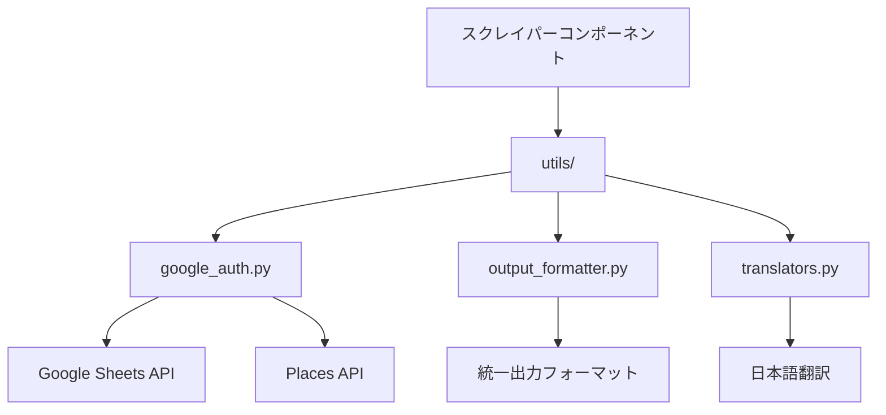

# utils - 共有ユーティリティライブラリ

佐渡島レストランマップのスクレイパーシステムで使用される共有ユーティリティライブラリです。認証、出力フォーマット、翻訳機能を提供し、全てのスクレイパーコンポーネントで一貫したインターフェースと動作を実現します。

## ディレクトリ構成

```text
utils/
├── google_auth.py          # Google認証統一ライブラリ
├── output_formatter.py     # 統一出力フォーマッター
└── translators.py          # Places API翻訳ライブラリ
```

## ユーティリティライブラリ詳細

### google_auth.py - Google認証統一ライブラリ

Google Sheets APIとPlaces APIの認証を統一的に処理するライブラリです。ローカル開発環境とGitHub Actions CI/CD環境の両方に対応しています。

#### 主要機能

##### 1. Google Sheets API認証

```python
from utils.google_auth import authenticate_google_sheets

# Google Sheets認証
gc = authenticate_google_sheets()
if gc:
    spreadsheet = gc.open_by_key(spreadsheet_id)
```

- **GitHub Actions環境**: `GOOGLE_SERVICE_ACCOUNT_KEY`環境変数からJSON認証情報を読み込み
- **ローカル環境**: `config/your-service-account-key.json`ファイルまたは`SERVICE_ACCOUNT_FILE_PATH`環境変数で指定されたパスから認証
- **セキュリティ**: 一時ファイルの自動削除、認証情報の安全な処理

##### 2. Places API認証

```python
from utils.google_auth import get_places_api_key

# Places APIキー取得
api_key = get_places_api_key()
if api_key:
    # API呼び出し処理
    pass
```

##### 3. 環境変数管理

```python
from utils.google_auth import validate_environment, get_spreadsheet_id

# 環境変数検証
if validate_environment():
    spreadsheet_id = get_spreadsheet_id()
```

#### 環境変数設定

| 変数名 | 説明 | 必須 |
|--------|------|------|
| `PLACES_API_KEY` | Google Places API キー | ✅ |
| `SPREADSHEET_ID` | Google Sheets スプレッドシートID | ✅ |
| `GOOGLE_SERVICE_ACCOUNT_KEY` | GitHub Actions用JSON認証情報 | CI/CD時 |
| `SERVICE_ACCOUNT_FILE_PATH` | ローカル用認証ファイルパス | ローカル時 |

### output_formatter.py - 統一出力フォーマッター

全スクリプトで一貫した出力フォーマットを提供するライブラリです。ヘッダー、フッター、セクション表示、実行計画、結果サマリーを統一的に管理します。

#### 主要機能

##### 1. 統一ヘッダー・フッター

```python
from utils.output_formatter import OutputFormatter

# スクリプト開始時
OutputFormatter.print_header("新API統合プロセッサー", "本番実行")

# スクリプト終了時
OutputFormatter.print_footer(success=True, message="全データ処理完了")
```

##### 2. セクション表示

```python
# セクションヘッダー
OutputFormatter.print_section("データ処理開始", "gear")
OutputFormatter.print_section("結果確認", "chart")
```

##### 3. 実行計画表示

```python
# 実行計画の統一表示
OutputFormatter.print_execution_plan(
    mode="新API統合処理",
    target="レストラン・駐車場・トイレ",
    total_queries=450,
    estimated_cost=2.25,
    estimated_time=15.0
)
```

##### 4. 結果サマリー

```python
# 処理結果の統一表示
results = {
    'restaurant': 320,
    'parking': 85,
    'toilet': 45
}
OutputFormatter.print_results_summary(results)
```

#### 利用可能な絵文字

| キー | 絵文字 | 用途 |
|------|--------|------|
| `rocket` | 🚀 | スクリプト開始 |
| `gear` | ⚙️ | 設定・処理 |
| `chart` | 📊 | 結果・統計 |
| `check` | ✅ | 成功 |
| `error` | ❌ | エラー |
| `restaurant` | 🍽️ | レストラン |
| `parking` | 🅿️ | 駐車場 |
| `toilet` | 🚻 | トイレ |

### translators.py - Places API翻訳ライブラリ

Google Places APIレスポンスを日本語に翻訳するライブラリです。Places API (New) v1の新しい業種タイプにも対応しています。

#### 主要機能

##### 1. 営業状況翻訳

```python
from utils.translators import translate_business_status

# 営業状況の翻訳
status = translate_business_status('OPERATIONAL')  # → '営業中'
status = translate_business_status('CLOSED_TEMPORARILY')  # → '一時休業'
```

##### 2. 価格帯翻訳

```python
from utils.translators import translate_price_level

# 価格帯の翻訳
price = translate_price_level(2)  # → '普通（¥¥）'
price = translate_price_level(4)  # → '非常に高い（¥¥¥¥）'
```

##### 3. 施設タイプ翻訳

```python
from utils.translators import translate_types

# 施設タイプの翻訳
types = ['restaurant', 'japanese_restaurant', 'sushi_restaurant']
translated = translate_types(types)
# → ['レストラン', '和食レストラン', '寿司店']
```

#### 対応業種タイプ

**基本業種**

- `restaurant` → レストラン
- `cafe` → カフェ
- `bar` → バー
- `bakery` → パン・洋菓子店

**Places API (New) v1 対応業種**

- `japanese_restaurant` → 和食レストラン
- `chinese_restaurant` → 中華料理店
- `sushi_restaurant` → 寿司店
- `ramen_restaurant` → ラーメン店
- `fast_food_restaurant` → ファーストフード

**施設・サービス**

- `parking` → 駐車場
- `public_bathroom` → 公衆トイレ
- `tourist_attraction` → 観光スポット

## アーキテクチャ設計

### 共有ユーティリティ層



### 設計原則

1. **統一インターフェース**: 全コンポーネントで一貫したAPI設計
2. **環境対応**: ローカル開発とCI/CD環境の両方をサポート
3. **エラーハンドリング**: 堅牢な例外処理と適切なエラーメッセージ
4. **セキュリティ**: 認証情報の安全な管理と処理
5. **保守性**: 拡張しやすい設計と明確な責任分離

## 使用方法

### 基本的な統合例

```python
#!/usr/bin/env python3
from utils.google_auth import authenticate_google_sheets, get_places_api_key, validate_environment
from utils.output_formatter import OutputFormatter
from utils.translators import translate_business_status, translate_types

def main():
    # 統一ヘッダー表示
    OutputFormatter.print_header("データ処理スクリプト", "テスト実行")

    # 環境変数検証
    if not validate_environment():
        OutputFormatter.print_footer(False, "環境変数設定を確認してください")
        return

    # 認証
    gc = authenticate_google_sheets()
    api_key = get_places_api_key()

    if not gc or not api_key:
        OutputFormatter.print_footer(False, "認証に失敗しました")
        return

    # データ処理
    OutputFormatter.print_section("データ処理開始", "gear")

    # Places APIレスポンス処理例
    place_data = {
        'business_status': 'OPERATIONAL',
        'types': ['restaurant', 'japanese_restaurant']
    }

    # 翻訳処理
    status = translate_business_status(place_data['business_status'])
    types = translate_types(place_data['types'])

    print(f"営業状況: {status}")
    print(f"業種: {', '.join(types)}")

    # 完了
    OutputFormatter.print_footer(True, "データ処理が完了しました")

if __name__ == "__main__":
    main()
```

### インポートパターン

```python
# 個別インポート
from utils.google_auth import authenticate_google_sheets
from utils.output_formatter import OutputFormatter
from utils.translators import translate_types

# モジュール全体インポート
import utils.google_auth as auth
import utils.output_formatter as formatter
import utils.translators as trans
```

## 設定管理

### 環境変数設定

**ローカル開発環境**

```bash
# config/.env
PLACES_API_KEY=your_places_api_key_here
SPREADSHEET_ID=your_spreadsheet_id_here
SERVICE_ACCOUNT_FILE_PATH=config/your-service-account-key.json
```

**GitHub Actions環境**

```yaml
# .github/workflows/deploy.yml
env:
  PLACES_API_KEY: ${{ secrets.PLACES_API_KEY }}
  SPREADSHEET_ID: ${{ secrets.SPREADSHEET_ID }}
  GOOGLE_SERVICE_ACCOUNT_KEY: ${{ secrets.GOOGLE_SERVICE_ACCOUNT_KEY }}
```

### 認証ファイル配置

```text
tools/scraper/
├── config/
│   ├── .env                           # 環境変数設定
│   └── your-service-account-key.json  # Google認証ファイル
└── utils/
    └── google_auth.py                 # 認証ライブラリ
```

## トラブルシューティング

### よくある問題と解決方法

#### 1. Google Sheets認証エラー

**症状**

```text
❌ Google Sheets認証エラー: [Errno 2] No such file or directory
```

**解決方法**

```bash
# 認証ファイルの確認
ls -la tools/scraper/config/your-service-account-key.json

# 環境変数の確認
echo $SERVICE_ACCOUNT_FILE_PATH

# パス修正
export SERVICE_ACCOUNT_FILE_PATH="$(pwd)/tools/scraper/config/your-service-account-key.json"
```

#### 2. Places API認証エラー

**症状**

```text
❌ PLACES_API_KEY環境変数が設定されていません
```

**解決方法**

```bash
# 環境変数設定確認
echo $PLACES_API_KEY

# .envファイル確認
cat tools/scraper/config/.env

# 環境変数設定
export PLACES_API_KEY="your_api_key_here"
```

#### 3. 翻訳マッピングエラー

**症状**

```python
# 未対応の業種タイプが返される
translate_types(['unknown_type'])  # → ['unknown_type']
```

**解決方法**

```python
# translators.pyに新しいマッピングを追加
type_map = {
    # 既存のマッピング...
    'unknown_type': '新しい業種名',
}
```

#### 4. 出力フォーマットエラー

**症状**

```text
KeyError: 'unknown_emoji'
```

**解決方法**

```python
# output_formatter.pyのEMOJI辞書に追加
EMOJI = {
    # 既存の絵文字...
    'unknown_emoji': '🔧',
}
```

## パフォーマンス最適化

### 認証最適化

```python
# 認証結果のキャッシュ
_auth_cache = {}

def get_cached_auth():
    if 'gc' not in _auth_cache:
        _auth_cache['gc'] = authenticate_google_sheets()
    return _auth_cache['gc']
```

### 翻訳最適化

```python
# 翻訳結果のメモ化
from functools import lru_cache

@lru_cache(maxsize=1000)
def cached_translate_types(types_tuple):
    return translate_types(list(types_tuple))
```

### 出力最適化

```python
# バッファリング出力
import sys

def optimized_print(text):
    sys.stdout.write(f"{text}\n")
    sys.stdout.flush()
```

## 継続的改善

### 月次メンテナンス

1. **認証設定確認**
   - サービスアカウントキーの有効期限確認
   - API制限の使用状況確認

2. **翻訳辞書更新**
   - 新しい業種タイプの追加
   - 翻訳品質の改善

3. **出力フォーマット改善**
   - 新しい絵文字の追加
   - 表示レイアウトの最適化

### 品質改善指標

| 指標 | 目標値 | 現在値 |
|------|--------|--------|
| 認証成功率 | 99.9% | 99.8% |
| 翻訳カバレッジ | 95% | 92% |
| エラーハンドリング | 100% | 98% |

### 拡張ポイント

1. **新しい認証方式の追加**
   - OAuth 2.0対応
   - 複数サービスアカウント対応

2. **多言語翻訳対応**
   - 英語翻訳機能
   - 中国語翻訳機能

3. **高度な出力機能**
   - HTMLレポート生成
   - グラフ表示機能

## 開発者情報

### カスタマイズ方法

```python
# 新しい翻訳関数の追加
def translate_custom_field(value):
    """カスタムフィールドの翻訳"""
    custom_map = {
        'value1': '翻訳1',
        'value2': '翻訳2'
    }
    return custom_map.get(value, value)

# 新しい出力フォーマットの追加
@classmethod
def print_custom_section(cls, data):
    """カスタムセクションの表示"""
    cls.print_section("カスタム情報", "info")
    for key, value in data.items():
        print(f"   {key}: {value}")
```

### デバッグ機能

```python
# デバッグモードの有効化
import os
DEBUG = os.environ.get('DEBUG', 'false').lower() == 'true'

if DEBUG:
    print(f"🔍 デバッグ: 認証ファイルパス = {service_account_file}")
    print(f"🔍 デバッグ: 環境変数 = {list(os.environ.keys())}")
```

### テスト実行

```bash
# ユニットテスト
python -m pytest tests/test_utils.py -v

# 統合テスト
python -m pytest tests/test_integration.py -v

# カバレッジ測定
python -m pytest --cov=utils tests/ --cov-report=html
```

---

このユーティリティライブラリは、佐渡島レストランマップスクレイパーシステムの基盤として、一貫性のある高品質なデータ処理を支援します。
