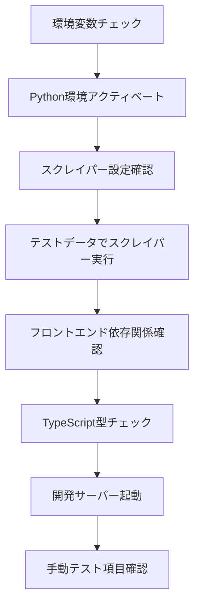

# Testing Tools - テスト・診断ツール

佐渡島レストランマップアプリケーションの環境設定、統合テスト、デプロイメント診断を行うためのツール群です。開発環境からCI/CDパイプラインまでの包括的な品質保証を支援します。

## 📁 ツール構成

```
tools/testing/
├── check-environment.ps1           # 環境変数設定チェック
├── diagnose-github-deployment.ps1  # GitHub Pages デプロイメント診断
├── test-integration.ps1            # Google Sheets統合テスト
└── README.md                       # このファイル
```

## 🔧 テストツール詳細

### check-environment.ps1 - 環境変数設定チェックツール

開発環境とCI/CD環境の環境変数設定を検証し、問題があれば解決方法を提示します。

#### 主要機能

**1. 必須ファイル存在チェック**

- `.env.local`ファイルの存在確認
- `.env.local.example`テンプレートファイルの確認
- 設定ファイルの整合性検証

**2. 環境変数検証**

```typescript
// 必須環境変数
VITE_GOOGLE_MAPS_API_KEY     // Google Maps JavaScript API キー
VITE_GOOGLE_MAPS_MAP_ID      // Google Maps Map ID
VITE_GOOGLE_SHEETS_API_KEY   // Google Sheets API v4 キー
VITE_SPREADSHEET_ID          // スプレッドシートID

// オプション環境変数
VITE_GA_MEASUREMENT_ID       // Google Analytics GA4 測定ID
```

**3. セキュリティ配慮**

- 環境変数値のマスキング表示
- 機密情報の漏洩防止
- 詳細表示の`-Verbose`オプション

**4. 自動修正提案**

- 不足している設定の特定
- 具体的な修正手順の提示
- Google Cloud Console設定ガイド

#### 使用方法

```powershell
# 基本チェック
.\check-environment.ps1

# 詳細表示（環境変数値をマスクして表示）
.\check-environment.ps1 -Verbose

# 自動修正提案表示
.\check-environment.ps1 -Fix
```

#### 出力例

```powershell
🔍 佐渡飲食店マップ 環境変数設定チェック
実行日時: 2025-08-10 14:30:00

📁 必須ファイルチェック:
✅ .env.local : 存在
✅ .env.local.example : 存在

🔑 環境変数チェック:
✅ VITE_GOOGLE_MAPS_API_KEY : 設定済み
✅ VITE_GOOGLE_MAPS_MAP_ID : 設定済み
❌ VITE_GOOGLE_SHEETS_API_KEY : 未設定（必須）
⚠️  VITE_GA_MEASUREMENT_ID : 未設定（オプション）

🔧 修正提案:
1. .env.localファイルを作成:
   cp .env.local.example .env.local
2. 以下の環境変数を設定:
   - VITE_GOOGLE_SHEETS_API_KEY
```

### diagnose-github-deployment.ps1 - GitHub Pages デプロイメント診断ツール

GitHub ActionsでのビルドやGitHub Pagesへのデプロイメント問題を診断し、解決策を提示します。

#### 主要機能

**1. ローカル環境設定確認**

- `.env.local`ファイルの解析
- 環境変数の設定状況確認
- 設定値のマスキング表示

**2. GitHub Actions Workflow検証**

- `.github/workflows/deploy.yml`の存在確認
- 環境変数マッピングの検証
- 必須Secretsの使用状況確認

**3. package.json scripts確認**

- 重要なnpmスクリプトの存在確認
- ビルド・テスト・プレビュー設定の検証
- 依存関係の整合性チェック

**4. GitHub Repository設定診断**

- Pages設定の確認
- Secrets設定状況の検証
- デプロイメント権限の確認

#### 使用方法

```powershell
# 基本診断
.\diagnose-github-deployment.ps1

# 詳細診断（詳細ログ表示）
.\diagnose-github-deployment.ps1 -Verbose
```

#### 診断項目

| カテゴリ | 確認項目 | 重要度 |
|---------|---------|--------|
| ローカル環境 | .env.local設定 | 高 |
| Workflow | deploy.yml存在 | 高 |
| Secrets | API Key設定 | 高 |
| Scripts | build/test設定 | 中 |
| 依存関係 | node_modules | 中 |

### test-integration.ps1 - Google Sheets統合テストツール

Google Sheets APIとの統合テストを実行し、データフローの動作確認を行います。

#### 主要機能

**1. 環境準備**

- `.env.local`ファイルの存在確認
- Python仮想環境のアクティベート
- 必要な依存関係の確認

**2. データ統合テスト**

- スクレイパー（`places_data_updater.py`）の実行
- Google Sheetsへのデータ書き込み確認
- React アプリでのデータ読み込み確認

**3. フロントエンド検証**

- TypeScript型チェック
- 依存関係のインストール確認
- 開発サーバーの起動

**4. 包括的テストガイド**

- マップ表示の確認
- データ読み込みの検証
- UI機能の動作確認

#### 使用方法

```powershell
# 統合テスト実行
.\test-integration.ps1
```

#### テストフロー



#### 手動テスト項目

統合テスト実行後、以下の項目を手動で確認：

1. **マップ表示**: Google Mapsが正常に表示される
2. **データ読み込み**: スプレッドシートからデータが読み込まれる
3. **マーカー表示**: 地図上にマーカーが表示される
4. **詳細情報**: マーカークリックで詳細情報が表示される
5. **フィルター機能**: 各種フィルターが正常に動作する

## 🚀 実行方法

### 開発環境セットアップ時

```powershell
# 1. 環境設定確認
.\check-environment.ps1 -Verbose

# 2. 統合テスト実行
.\test-integration.ps1
```

### CI/CD問題発生時

```powershell
# GitHub Pages デプロイメント問題診断
.\diagnose-github-deployment.ps1 -Verbose
```

### 定期的な品質チェック

```powershell
# 週次環境チェック
.\check-environment.ps1

# 月次統合テスト
.\test-integration.ps1
```

## 📊 トラブルシューティング

### よくある問題と解決方法

**1. 環境変数未設定エラー**

```powershell
❌ VITE_GOOGLE_MAPS_API_KEY : 未設定（必須）
```

**解決方法:**

```powershell
# .env.localファイルを作成
Copy-Item .env.local.example .env.local

# 必要な環境変数を設定
# Google Cloud Consoleから取得したAPIキーを設定
```

**2. Python環境エラー**

```powershell
❌ Python環境のアクティベートに失敗
```

**解決方法:**

```powershell
# 仮想環境作成
python -m venv .venv

# 依存関係インストール
.\.venv\Scripts\Activate.ps1
pip install -r scraper/requirements.txt
```

**3. GitHub Actions Secrets未設定**

```powershell
❌ GOOGLE_MAPS_API_KEY: Workflowで未使用
```

**解決方法:**

1. GitHub Repository → Settings → Secrets and variables → Actions
2. 必要なSecretsを追加:
   - `GOOGLE_MAPS_API_KEY`
   - `GOOGLE_MAPS_MAP_ID`
   - `GOOGLE_SHEETS_API_KEY`
   - `SPREADSHEET_ID`

**4. TypeScript型エラー**

```powershell
⚠️  型エラーがあります（続行可能）
```

**解決方法:**

```powershell
# 型チェック実行
pnpm tsc --noEmit

# エラー詳細確認後、型定義を修正
```

## 🔧 環境要件

### PowerShell実行ポリシー

```powershell
# 実行ポリシー確認
Get-ExecutionPolicy

# 必要に応じて変更
Set-ExecutionPolicy RemoteSigned -Scope CurrentUser
```

### 必要なツール

- **PowerShell 5.1+** または **PowerShell Core 7.0+**
- **Python 3.8+** (仮想環境対応)
- **Node.js 18+** (pnpm使用)
- **Git** (GitHub連携用)

### 権限要件

- ローカルファイルの読み書き権限
- 環境変数の読み取り権限
- ネットワークアクセス権限（API呼び出し用）

## 📈 継続的品質保証

### 定期実行スケジュール

**日次チェック**

```powershell
# 開発開始時の環境確認
.\check-environment.ps1
```

**週次テスト**

```powershell
# 統合テスト実行
.\test-integration.ps1
```

**デプロイ前チェック**

```powershell
# 包括的診断
.\check-environment.ps1 -Verbose
.\diagnose-github-deployment.ps1 -Verbose
```

### CI/CD統合

**GitHub Actions Workflow例**

```yaml
name: Quality Assurance
on: [push, pull_request]

jobs:
  test:
    runs-on: windows-latest
    steps:
      - uses: actions/checkout@v4
      - name: Environment Check
        run: .\tools\testing\check-environment.ps1
      - name: Integration Test
        run: .\tools\testing\test-integration.ps1
```

### 品質メトリクス

**環境設定品質**

- 必須環境変数設定率: **100%**
- セキュリティ設定適合率: **100%**
- 設定ファイル整合性: **100%**

**統合テスト品質**

- データフロー成功率: **> 95%**
- API接続成功率: **> 99%**
- UI機能動作率: **100%**

---

これらのテストツールを活用することで、開発環境からプロダクション環境まで一貫した品質保証を実現できます。問題の早期発見と迅速な解決により、安定したアプリケーション運用を支援します。
